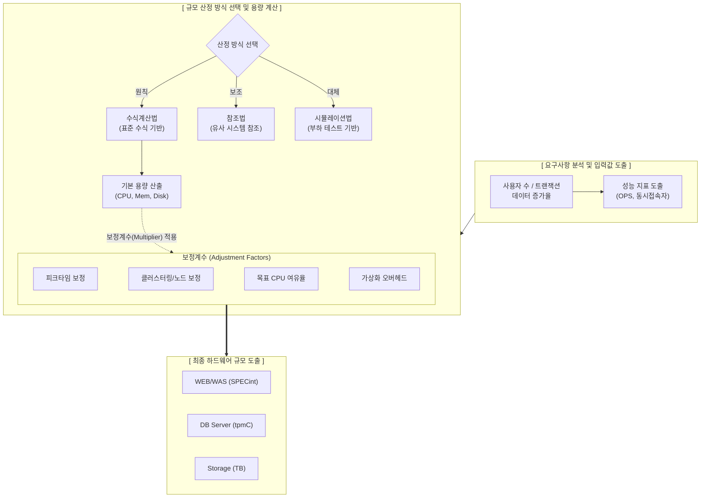

# 정보시스템 하드웨어 규모산정 지침

---

## I. 공공 IT 인프라의 적정 투자 기준, HW 규모산정 지침 개요

* **정의**: 정보시스템 구축 시 요구되는 업무량 및 성능 목표를 분석하여 서버(WEB/WAS/DB), 스토리지 등 하드웨어의 적정 용량을 객관적이고 정량적으로 산정하는 표준 가이드라인 (TTA 표준 기반)
* **등장배경**: 시스템 과다 산정으로 인한 예산 낭비 및 과소 산정으로 인한 성능 저하 방지, 공공 정보화 사업 예산 편성 및 발주의 투명성/객관성 확보 요구
* **특징**: 수식계산법 원칙(tpmC, SPECint 활용), 목표 여유율/피크타임 등 보정계수 적용, 최근 클라우드 [[가상화]] 오버헤드 기준 반영

---

## II. 하드웨어 규모산정의 개념도 및 핵심 기술 요소

### 가. 하드웨어 규모산정의 프로세스 및 동작 원리

* 사용자 수 및 [[트랜잭션]] 요구사항을 바탕으로 수식계산법을 적용하여 기본 용량을 도출하고, 시스템 안정성 확보를 위한 피크타임, 여유율 등의 보정계수를 곱하여 최종 규모를 확정함

### 나. 하드웨어 규모산정의 핵심 구성 요소

| 분류 | 요소기술(키워드) | 세부 설명 |
| --- | --- | --- |
| **산정 방식** | 수식계산법 | 업무량, 동시접속자 수 등을 수식에 대입하여 용량을 산출하는 가장 객관적인 원칙 방식 |
| **산정 방식** | 참조법/시뮬레이션법 | 수식 적용이 어려울 경우 유사 사업 데이터를 참조하거나(참조법), 부하 테스트(시뮬레이션)로 산정 |
| **측정 지표** | SPECint_rate | 정수 연산 성능을 측정하는 지표로 주로 **WEB, WAS 서버의 [[CPU]] 규모 산정**에 활용 |
| **측정 지표** | tpmC | 분당 트랜잭션 처리 건수(TPC-C 표준)로 주로 **DB 서버의 CPU 규모 산정**에 활용 |
| **보정 계수** | 피크타임 계수 | 평상시 대비 특정 시간대의 최대 부하(Peak Time)를 감당하기 위해 할당하는 가중치 |
| **보정 계수** | 목표 CPU 여유율 | 예상치 못한 부하 증가에 대비한 여유 공간 (통상 70% 목표 시 $\frac{1}{0.7}$의 보정계수 적용) |
| **보정 계수** | 시스템 아키텍처 보정 | 클러스터링(Active-Active 등) 구성 시 노드 장애를 대비하여 부하를 분산하기 위한 보정 |
| **스토리지** | 포맷/[[RAID]] 여유율 | 물리 디스크에서 포맷에 따른 손실율과 RAID(1, 5 등) 구성에 따른 오버헤드를 반영한 물리 용량 산정 |

---

## III. 규모산정 환경의 변화 및 향후 동향

### 가. 온프레미스 vs 클라우드 환경의 규모산정 비교

| 비교 항목 | 온프레미스 (물리 서버) 규모산정 | 클라우드 (가상화/IaaS) 규모산정 |
| --- | --- | --- |
| **기준 자원 단위** | 물리적 CPU Core, 메모리 용량 | **vCPU, [[가상 메모리]](vRAM)** |
| **아키텍처 특성 반영** | 물리적 클러스터링, [[다중화]] 장비 보정 | **하이퍼바이저 오버헤드 보정 (통상 10~20% 할당)** |
| **산정 주안점** | 최대 피크타임(Peak) 기준 **정적 [[프로비저닝]]** | 평균 부하량 기반 산정 후 **오토스케일링(Auto-scaling) 연계** |
| **비용 관점** | 초기 도입 투자비용 (CAPEX) 중심 | 운영 종량제 비용 (OPEX) 중심 |

### 나. 하드웨어 규모산정 지침의 향후 고도화 전망

* **[[인공지능]](AI) 및 빅데이터 특화 가이드라인 제정 필요성**: 기존 RDBMS 중심의 tpmC 산정 방식을 넘어, [[딥러닝]] 학습 및 초거대 AI 추론을 위한 [[GPU]]/[[NPU]] 연산량(TFLOPS 등) 기준의 산정 수식 및 지표가 공공 지침에 추가로 편입되는 추세
* **[[MSA (Micro Service Architecture)|MSA]] 환경의 동적 규모산정(Dynamic Sizing) 기준 마련**: [[클라우드 네이티브]] 아키텍처 확산에 따라 [[컨테이너]](K8s) 기반의 Pod 오토스케일링 임계치 설정 및 초기 베이스라인(Baseline) 산정을 융합한 차세대 유연 규모산정 지침으로 발전 중

---

### 🔗 연관 토픽

- **소속 도메인**: [[00_경영전략_MOC|📈 경영전략]]
- **세부 분류**: `4. 기업 핵심 정보시스템 (ERP · CRM · SCM)`
- **핵심 연관 토픽**:
  - [[CPU]]
  - [[MSA (Micro Service Architecture)]]
  - [[딥러닝]]
  - [[인공지능]]
  - [[GPU]]
