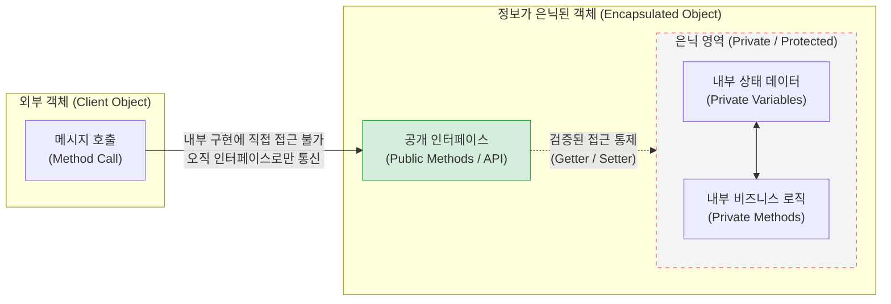

# 정보은닉 (Information Hiding)

---

## I. 소프트웨어 결합도 최소화와 유연성 확보의 핵심, 정보은닉의 개요

* **정의**: 모듈이나 객체의 내부 구현 원리(데이터 구조, [[알고리즘]])를 외부로부터 감추고, 오직 사전에 정의된 공개 인터페이스(Public Interface)만을 통해 상호작용하도록 통제하는 소프트웨어 설계 원칙
* **배경 및 특징**:
* **등장 배경**: 시스템 규모 증대에 따른 복잡도 통제, 모듈 간 파급 효과(Ripple Effect) 최소화 필요 (David Parnas 제안)
* **특징**: 낮은 [[결합도]](Loose Coupling)와 높은 [[응집도]](High Cohesion) 달성, 병렬 개발 지원, 코드 재사용성 및 유지보수성 극대화

---

## II. 정보은닉의 개념도 및 핵심 기술 요소

### 가. 정보은닉의 구조 및 동작 원리

* 객체 내부의 상태 데이터와 처리 로직은 접근 제어자로 은닉(Black-box)하고, 외부에서는 오직 공개된 인터페이스를 통해 메시지를 전달하여 결합도를 낮춤

### 나. 정보은닉의 핵심 구현 기술 및 구성 요소

| 구분 | 요소기술(키워드) | 세부 설명 |
| --- | --- | --- |
| **핵심 기법** | [[캡슐화]] (Encapsulation) | 관련 있는 데이터(속성)와 메서드(행위)를 하나의 단위([[클래스]] 등)로 묶어 정보은닉을 물리적으로 실현 |
| **가시성 제어** | 접근 제어자 (Access Modifier) | 객체 지향 언어에서 가시성을 제한 (Private, Protected, Default, Public)하여 외부 접근 원천 차단 |
| **통신 명세** | 인터페이스 (Interface) | 객체 간 상호작용을 위해 내부 구현을 배제하고 오직 메시지 규격(Method Signature)만 정의 |
| **상태 접근** | Getter / Setter | 은닉된 Private 변수에 직접 접근하는 것을 막고, [[무결성]] 검증 로직이 포함된 우회 접근 메서드 제공 |
| **[[추상화]]** | 추상 데이터 타입 (ADT) | 데이터의 물리적 구현 세부사항을 숨기고 논리적 속성과 연산의 명세만을 외부로 노출 |
| **설계 패턴** | 퍼사드 패턴 (Facade) | 복잡한 내부 서브시스템의 클래스들을 은닉하고, 클라이언트에게는 단순화된 단일 인터페이스 제공 |
| **구조 통제** | 패키지 및 모듈 시스템 | Java Module System(JPMS), C# Namespace 등을 통해 클래스를 넘어선 컴포넌트 단위의 은닉 통제 |
| **원칙 연계** | 데메테르 법칙 (Law of Demeter) | "낯선 이와 말하지 말라"는 원칙으로, 객체의 내부 구조를 알지 못하도록 하여 정보은닉 강제 |

---

## III. 정보은닉과 캡슐화의 비교 및 아키텍처 관점의 확장 전망

### 가. 정보은닉과 캡슐화(Encapsulation)의 차이점 비교

| 비교 항목 | 정보은닉 (Information Hiding) | 캡슐화 (Encapsulation) |
| --- | --- | --- |
| **핵심 개념** | 내부 구현의 변경 유발 요소를 숨기는 **설계 원칙** | 데이터와 이를 조작하는 행위를 하나로 묶는 **구현 기법** |
| **주요 목적** | 모듈 간 **결합도(Coupling) 최소화** 및 복잡도 통제 | 모듈 내 **응집도(Cohesion) 극대화** 및 구조화 |
| **구현 수단** | 캡슐화, 접근 제어자, 인터페이스, [[다형성]] | 클래스(Class), 객체(Object), 레코드(Record) |
| **상호 관계** | 캡슐화가 추구하는 **궁극적인 목적 (Why)** | 정보은닉을 달성하기 위한 **필요 수단 (How)** |

### 나. 정보은닉의 최신 아키텍처 관점 확장 및 동향

* **마이크로서비스 아키텍처([[MSA (Micro Service Architecture)|MSA]]) 단위의 정보은닉**: 클래스 수준에 머물던 정보은닉 개념이 아키텍처 수준으로 확장되어, '[[API Gateway]]'를 통한 백엔드 서비스 은닉 및 'Database-per-Service' 패턴을 통한 타 서비스의 DB 직접 접근 통제(정보은닉)가 현대 [[클라우드 네이티브]] 설계의 핵심으로 안착함
* **도메인 주도 설계([[DDD (Domain Driven Design)|DDD]])와의 결합**: 비즈니스 도메인의 복잡성을 다루기 위해 집재(Aggregate) 패턴을 활용, 루트 [[엔티티]](Root Entity)만을 외부 인터페이스로 노출하고 내부 도메인 로직과 상태를 은닉하여 도메인 무결성을 보장하는 추세임

---

### 🔗 연관 토픽

- **소속 도메인**: [[00_소프트웨어공학_MOC|🏗️ 소프트웨어공학]]
- **세부 분류**: `4. 아키텍처 스타일 & 객체지향 설계 원리`
- **핵심 연관 토픽**:
  - [[결합도]]
  - [[MSA (Micro Service Architecture)]]
  - [[캡슐화|캡슐화 (encapsulation)]]
  - [[DDD (Domain Driven Design)]]
  - [[응집도]]
