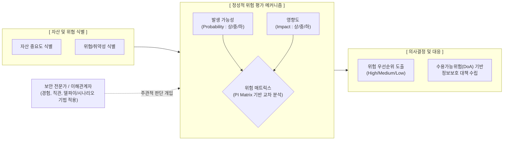

# 정성적 위험 분석

---

## I. 주관적 경험 기반의 신속한 의사결정, 정성적 위험 분석의 개요

* **정의**: 정보보호 위험 평가 시, 방대한 과거 데이터나 객관적 수치(화폐 가치) 대신 평가자의 지식, 경험, 직관을 활용하여 위험의 우선순위를 서열화(상/중/하)하는 위험 분석 기법
* **등장배경**: [[정량적 데이터]](과거 보안 사고 이력 등) 부족 문제 극복, 신속한 위험 우선순위 도출 필요, 위험 분석에 소요되는 시간 및 비용 절감 요구
* **특징**: 신속성 및 경제성 확보, 평가자의 주관성 내재, 복잡한 수식 배제, 서열화 및 매트릭스 기반의 직관적 우선순위 식별

---

## II. 정성적 위험 분석의 개념도 및 핵심 평가 기법

### 가. 정성적 위험 분석의 프로세스 및 동작 원리

* 전문가의 직관을 바탕으로 발생 가능성(P)과 영향도(I)를 등급화하고, 이를 위험 매트릭스(PI Matrix)에 매핑하여 대응이 시급한 위험의 우선순위를 신속하게 도출함

### 나. 정성적 위험 분석의 핵심 기술 및 구성 요소

| 분류 | 요소기술(키워드) | 세부 설명 |
| --- | --- | --- |
| **평가 기법** | 델파이 기법 (Delphi) | 시스템 지식을 가진 다수의 전문가 그룹을 대상으로 익명의 반복적 설문을 거쳐 합의된 의견을 도출 |
| **평가 기법** | 시나리오법 (Scenario) | 발생 가능한 위협 사건을 시나리오로 작성하고, 그에 따른 시스템 파급 효과와 결과를 논리적으로 추론 |
| **평가 기법** | 순위결정법 (Ranking) | 식별된 다양한 위험 요소들을 상호 비교하여 가장 위험한 것부터 순서대로 서열화(우선순위화) |
| **평가 기법** | 체크리스트법 (Checklist) | 과거 경험을 바탕으로 사전에 준비된 위험 요인 목록을 활용하여 신속하게 취약점 및 위험 여부 식별 |
| **시각화 도구** | PI 매트릭스 (위험 매트릭스) | 발생 가능성(X축)과 영향도(Y축)를 교차시켜 위험 수준(색상/등급)을 시각화하는 2차원 그리드 |
| **판단 기준** | DoA (Degree of Assurance) | 조직이 비즈니스 목표 달성을 위해 감내하고 수용할 수 있는 목표 위험 수준 (위험 수용 한계점) |
| **장점 요인** | 신속성 및 경제성 | 통계적 데이터 수집이나 복잡한 수학적 연산이 불필요하여 단기간 내 저비용으로 평가 가능 |
| **단점 요인** | 주관성 내재 | 평가자의 편견(Bias) 개입 우려가 높으며, 경영진 설득을 위한 재무적 투자대비효과(ROI) 입증 곤란 |

---

## III. 정성적 위험 분석과 정량적 분석 비교 및 최근 동향

### 가. 정성적 위험 분석 vs 정량적 위험 분석 비교

| 비교 항목 | 정성적 위험 분석 (Qualitative) | [[정량적 위험 분석]] (Quantitative) |
| --- | --- | --- |
| **평가 기준/척도** | **주관적 직관, 경험** / 등급, 서열 (상/중/하) | **객관적 데이터** / 화폐 가치 금액 ($, ₩) |
| **주요 활용 기법** | 델파이 기법, 시나리오법, PI 매트릭스 | 과거 자료 분석, 몬테카를로, 기대화폐가치(EMV) |
| **평가 소요 자원** | **적음** (단기, 저비용) | **많음** (장기, 데이터 수집/수식 연산 고비용) |
| **주요 산출 결과** | 조치가 시급한 **위험 우선순위 리스트** | 연간 손실 예상액(ALE), 투자대비효과(ROI) 지표 |
| **장/단점** | (장) 빠른 의사결정 / (단) 평가자 편견 개입 | (장) 객관적 경영진 보고 / (단) 과거 데이터 필수 |

### 나. 위험 분석 패러다임의 최신 동향 및 향후 전망

* **하이브리드(Semi-Quantitative) 방식의 표준화**: 자원과 시간이 제한된 실무([[ISMS-P]] 인증 등) 환경에서는, 1차적으로 '정성적 분석(PI Matrix)'을 수행하여 수많은 위험 중 조치가 시급한 핵심 위험(High Risk)을 식별하고, 해당 핵심 위험에 대해서만 '정량적 분석(FAIR [[프레임워크]] 기반 CRQ)'을 적용하여 ROI를 산출하는 상호 보완적 접근법이 주류로 부상함
* **생성형 AI 기반 정성적 시나리오 고도화**: [[초거대 언어 모델|LLM]](거대언어모델)에 방대한 글로벌 위협 인텔리전스([[CTI]]) 리포트를 학습시켜, 기업의 도메인 특성에 맞는 현실적이고 구체적인 '위험 시나리오'를 자동 생성함으로써 정성적 분석의 주관적 한계를 극복하는 추세임

---

### 🔗 연관 토픽

- **소속 도메인**: [[00_소프트웨어공학_MOC|🏗️ 소프트웨어공학]]
- **세부 분류**: `3. 요구사항 공학 & UML 객체지향 분석/설계`
- **핵심 연관 토픽**:
  - [[정량적 위험 분석]]
  - [[CTI]]
  - [[프레임워크]]
  - [[추상화|추상화 (Abstraction)]]
  - [[ISMS-P]]
