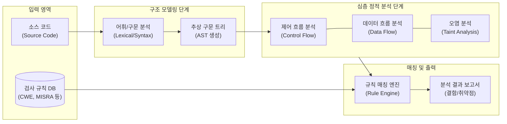

# 정적 분석 도구 (Static Analysis Tools)

---

## I. Shift-Left 보안 및 코드 품질 확보의 핵심, 정적 분석 도구의 개요

* **정의**: 소프트웨어를 실행하지 않은 상태에서 소스 코드, 바이트 코드의 구조와 흐름을 분석하여 잠재적 런타임 결함, 보안 취약점, 코딩 표준 위배 여부를 자동으로 식별하는 테스트 도구
* **필요성/등장배경**: [[SDLC]] 초기 단계의 결함 발견을 통한 수정 비용 최소화(Shift-Left), 규제 및 코딩 표준(MISRA, CERT, [[CWE]]) 준수 의무화, [[DevSecOps]] 환경의 지속적 통합(CI) 파이프라인 내재화 요구
* **특징**: 비실행 기반 [[화이트박스 테스트]], 100%에 가까운 높은 [[코드 커버리지]] 보장, 구문 분석(AST) 및 흐름 분석 기반 결함 탐지

---

## II. 정적 분석 도구의 개념도 및 핵심 기술 요소

### 가. 정적 분석 도구의 분석 아키텍처 및 동작 프로세스

* 입력된 소스 코드를 파싱하여 AST(추상 구문 트리)를 생성한 후, 제어/데이터 흐름 모델을 구축하고 사전에 정의된 보안 및 품질 룰셋과 매칭하여 잠재적 결함을 도출함

### 나. 정적 분석 도구의 핵심 기술 요소

| 분류 | 요소기술(키워드) | 세부 설명 |
| --- | --- | --- |
| **모델링/전처리** | 추상 구문 트리 (AST) | 소스 코드의 구조를 프로그래밍 언어 문법에 따라 계층적인 트리 형태로 변환 (의미적 구조화) |
| **심층 분석** | 제어 흐름 분석 (CFG) | 프로그램의 모든 가능한 실행 경로를 그래프 형태로 모델링하여 도달 불가능 코드(Dead Code) 등 식별 |
| **심층 분석** | 데이터 흐름 분석 (DFA) | 변수의 정의, 참조, 소멸(할당 해제)의 생명주기를 추적하여 초기화 오류, 메모리 누수(Memory Leak) 탐지 |
| **보안 분석** | 오염 분석 (Taint Analysis) | 외부 입력값(Source)이 적절한 검증 없이 중요 함수(Sink)로 전달되는 경로를 추적 (SQLi, [[XSS]] 탐지) |
| **정형 검증** | 심볼릭 실행 (Symbolic Execution) | 입력값을 실제 값이 아닌 기호(Symbol)로 처리하여, 모든 분기 경로의 상태를 논리식/수학적으로 검증 |
| **매칭 기술** | 패턴 매칭 엔진 | 시그니처 및 정규표현식을 활용하여 하드코딩된 패스워드 등 기지(Known)의 코드 안티패턴 고속 탐지 |
| **규칙 및 지표** | 코딩 표준 룰셋 | 안전한 소프트웨어 개발을 위한 표준 가이드라인 (CWE, CERT C/C++, MISRA, 행안부 보안약점 47개) |
| **품질 고도화** | 오탐지(False Positive) 필터링 | 단순 패턴 매칭으로 인한 비정상적 경고(오탐)를 문맥 분석을 통해 억제하여 분석 결과의 [[신뢰성]] 향상 |

---

## III. 정적 분석 도구(SAST) vs 동적 분석 도구(DAST) 비교 및 향후 동향

### 가. SAST(정적 분석)와 DAST(동적 분석) 비교

| 비교 항목 | [[SAST]] (정적 분석 / Static Analysis) | [[DAST]] (동적 분석 / Dynamic Analysis) |
| --- | --- | --- |
| **분석 방식** | 소스 코드 또는 바이너리 내부 구조 분석 | 애플리케이션 실제 실행 환경에서 외부 공격 시뮬레이션 |
| **테스트 시점** | 코딩(Coding) 및 빌드(Build) 단계 (**초기**) | 테스트(Testing) 및 운영(Staging/Prod) 단계 (**후기**) |
| **테스트 관점** | 내부 로직 중심의 **화이트박스(White-Box)** | 외부 인터페이스 중심의 **블랙박스(Black-Box)** |
| **장점** | 근본 원인(소스 코드 라인) 정확한 식별, 높은 커버리지 | 실행 시점에만 발견 가능한 결함(인증 우회 등) 식별 |
| **단점** | 실제 실행 환경의 구성 요소 결함 파악 불가, 높은 오탐률 | 대상 시스템 부하 발생, 코드상 정확한 취약점 위치 파악 곤란 |

### 나. 정적 분석 도구의 한계 극복 및 최신 발전 동향

* **[[초거대 언어 모델|LLM]] 기반 지능형 코드 수정 제안(Auto-Remediation)**: 정적 분석 도구의 고질적인 한계인 과다한 위양성(False Positive)을 필터링하고, 도출된 취약점에 대해 LLM(거대언어모델)이 안전하게 수정된 소스 코드 패치를 즉각적으로 제안 및 자동 커밋(Commit)하는 지능형 도구(AI-SAST)로 진화
* **DevSecOps 파이프라인에 완전한 내재화(CI/CD 통합)**: [[형상 관리]](Git)의 Pull Request 단계나 지속적 통합(CI) 도구(Jenkins, GitLab CI)의 파이프라인 내에 정적 분석 자동화 훅(Hook)을 연동하여, 품질 및 보안 기준 미달 시 빌드를 강제 차단하는 Shift-Left 체계의 핵심 인프라로 정착

---

### 🔗 연관 토픽

- **소속 도메인**: [[00_소프트웨어공학_MOC|🏗️ 소프트웨어공학]]
- **세부 분류**: `1. 소프트웨어 개발 생명주기(SDLC) & 방법론`
- **핵심 연관 토픽**:
  - [[SDLC]]
  - [[형상 관리]]
  - [[코드 커버리지|코드 커버리지(Code Coverage)]]
  - [[DevSecOps]]
  - [[SAST]]
