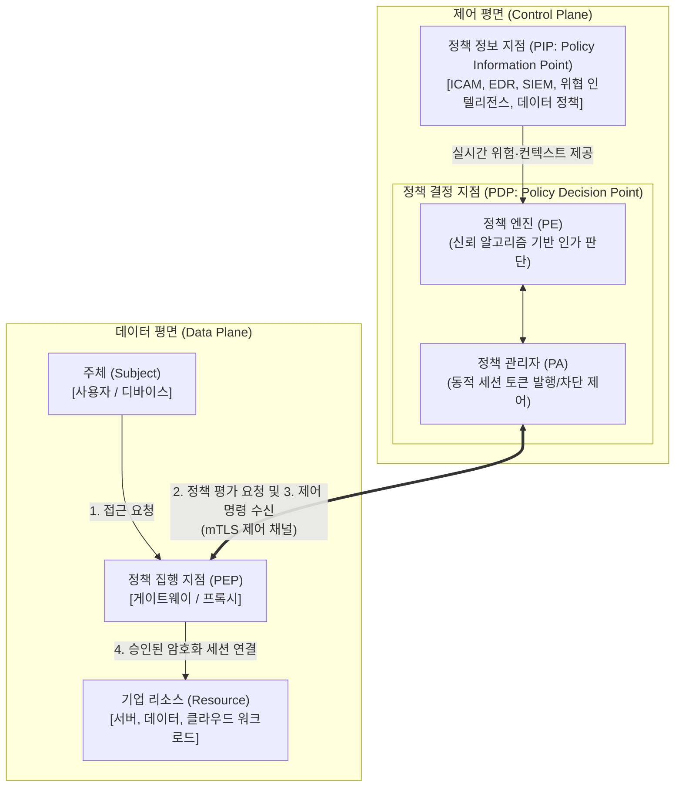

# 제로 트러스트 (Zero Trust)

---

## I. 경계 소멸 환경의 차세대 보안 패러다임, 제로 트러스트의 개요

### 가. 제로 트러스트(Zero Trust)의 정의

* "결코 신뢰하지 말고, 항상 검증하라(Never Trust, Always Verify)"는 기본 철학 하에, 내부/외부 네트워크 경계 구분 없이 모든 사용자, 단말, 세션에 대해 최소 권한을 부여하고 지속적으로 동적 인증·인가를 수행하는 보안 아키텍처 모델

### 나. 제로 트러스트의 등장 배경 및 3대 핵심 원칙

* **등장 배경**: 하이브리드 클라우드 확산 및 원격 근무 일상화로 인한 네트워크 경계 소멸, 내부자 계정 탈취 및 APT 공격에 따른 횡적 이동(Lateral Movement) 위협 급증
* **3대 핵심 철학**: 침해 가정(Assume Breach), 명시적 검증(Verify Explicitly), 최소 권한 부여(Least Privilege)
* **과기정통부 3대 핵심 원칙**: 강화된 인증, 마이크로 [[세그멘테이션]], 소프트웨어 정의 경계(SDP)

---

## II. 제로 트러스트 아키텍처(NIST SP 800-207) 및 핵심 기술 요소

### 가. 제로 트러스트 참조 아키텍처 및 동작 메커니즘

* 주체의 리소스 접근 요청 시 데이터 평면의 PEP가 트래픽을 가로채고, 제어 평면의 PDP가 PIP의 실시간 맥락(신원, 단말 상태, 위협 인텔리전스)을 분석하여 동적으로 세션별 접근을 인가함

### 나. 제로 트러스트 핵심 기술 및 구성 요소

| 구분 | 요소기술(키워드) | 세부 설명 |
| --- | --- | --- |
| **신원/인증** | **ICAM / 적응형 MFA** | 컨텍스트 기반 동적 인증, FIDO2/WebAuthn 기반 패스워드리스 인증 및 지속적 위험 평가 |
| **단말 보안** | **[[EDR(Endpoint Detection and Response)|EDR]] / ZTNA Agent** | 단말 [[무결성]] 검증, 패치 수준 및 악성코드 감염 여부 점검(Posture Check) 및 실시간 격리 |
| **정책 통제** | **PDP (PE / PA)** | NIST SP 800-207 표준 통제 모듈; PE의 [[알고리즘]] 평가 및 PA의 동적 제어 명령 하달 |
| **정책 집행** | **PEP (Gateway/Proxy)** | 리소스 전단에 배치되어 비인가 접근을 물리/논리적으로 차단하고 인가된 트래픽만 라우팅 |
| **네트워크** | **SDP ([[SDP(Software Defined Perimeter)|Software Defined Perimeter]])** | "선인증 후접속" 메커니즘을 통해 인프라를 외부 스캔으로부터 은닉(Black Cloud 구현) |
| **네트워크** | **마이크로 세그멘테이션** | 방화벽을 워크로드/[[컨테이너]] 단위로 세분화하여 악의적 침입자의 내부 횡적 이동 원천 차단 |
| **클라우드 연계** | **[[SASE(Secure Access Service Edge)|SASE]] / SSE** | ZTNA, SWG, CASB, FWaaS를 단일 클라우드 에지 서비스로 통합 제공하는 분산 보안 구조 |
| **가시성/분석** | **[[XDR]] / [[SIEM]] / [[SOAR (Security Orchestration, Automation and Response)|SOAR]]** | 엔드포인트부터 클라우드 전반의 텔레메트리 데이터를 통합 수집·분석하고 AI 기반 침해 대응 자동화 |

---

## III. 경계 기반 보안 vs 제로 트러스트 비교 및 실무 추진 전략

### 가. 경계 기반 보안과 제로 트러스트 보안 비교

| 비교 항목 | 전통적 경계 기반 보안 (Perimeter Security) | 제로 트러스트 보안 (Zero Trust Security) |
| --- | --- | --- |
| **기본 철학** | 신뢰 기반 접근 허용 (Trust but Verify) | 절대 불신 및 지속적 검증 (Never Trust, Always Verify) |
| **신뢰 영역** | 내부망(Trusted) vs 외부망(Untrusted) | 모든 영역을 불신 구역(Untrusted Zone)으로 간주 |
| **인증/인가 방식** | 1회성 로그인(Static, 경계선 통과 시 신뢰) | [[세션]]/[[트랜잭션]] 단위 지속적 동적 인증 |
| **접근 제어 단위** | 서브넷, IP/Port 대역 기반 접근 통제 | 사용자 속성, 디바이스 보안 상태, 맥락 기반 통제 |
| **침해 발생 영향** | 내부 침투 시 자유로운 횡적 이동(위험 반경 광범위) | 마이크로 세그멘테이션으로 위험 반경(Blast Radius) 국소화 |
| **대표 기술** | [[VPN]], 레거시 [[방화벽]](FW), IPS, 망분리 | ZTNA, SDP, PDP/PEP, EDR, 마이크로 세그멘테이션 |

### 나. 성숙도 모델(CISA ZTMM 2.0) 기반의 단계적 도입 전략

* **5대 핵심 기둥**: 신원(Identity), 단말(Device), 네트워크(Network), 애플리케이션 및 워크로드(Applications & Workloads), 데이터(Data)
* **3대 공통 역량**: 거버넌스(Governance), 가시성 및 분석(Visibility & Analytics), 자동화 및 오케스트레이션(Automation & Orchestration) 결합
* **성숙도 발전 단계**: 전통(Traditional) $\rightarrow$ 초기(Initial) $\rightarrow$ 고도화(Advanced) $\rightarrow$ 최적화(Optimal)의 4단계 점진적 전환 추진
* **기술사적 제언**: 단일 솔루션 도입이 아닌 전사 거버넌스 수립이 핵심이며, 과기정통부 제로트러스트 가이드라인 2.0을 준용하여 기존 레거시 인프라를 보호하면서 단계별 PoC 및 ZTNA 우선 전환을 병행하는 마이그레이션 로드맵 수립이 필수적임

---

### 🔗 연관 토픽

- **소속 도메인**: [[00_보안_MOC|🛡️ 보안]]
- **세부 분류**: `1. 정보보안 원칙 & 거버넌스 · 인증`
- **핵심 연관 토픽**:
  - [[VPN|VPN(Virtual Private Network)]]
  - [[XDR|XDR(eXtended Detection Response)]]
  - [[SDP(Software Defined Perimeter)]]
  - [[SASE(Secure Access Service Edge)]]
  - [[기밀성]]
