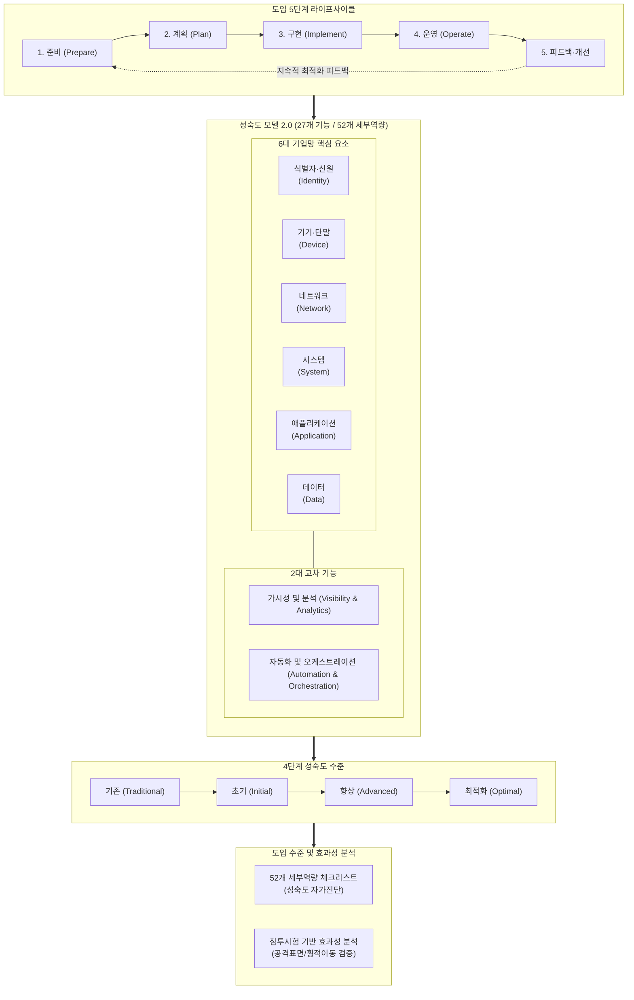

# 제로트러스트 가이드라인 2.0

---

## I. 실증 기반 실무 구현 및 진단 체계, 제로트러스트 가이드라인 2.0의 개요

### 가. 제로트러스트 가이드라인 2.0의 정의

* 과학기술정보통신부와 한국인터넷진흥원(KISA)이 1.0의 개념적 한계를 넘어 기업 현장의 실질적 구현을 지원하기 위해, **4단계 성숙도 모델, 6+2 핵심 요소 기반 52개 세부역량, [[PMBOK 프로세스 그룹 (5단계)|5단계]] 도입 절차 및 침투시험 기반 평가 방법론**을 구체화하여 2024년 12월 발표한 국가 보안 가이드라인

### 나. 제로트러스트 가이드라인 2.0의 등장배경 및 핵심 특징

* **실무 구현 중심 전환**: 1.0의 개념·철학 중심 안내에서 탈피하여 기업의 실제 망 설계, 구축, 운영을 위한 구체적 실행 지침 제공
* **글로벌 표준 정합(CISA ZTMM 2.0)**: 기존 3단계에서 '초기(Initial)' 단계를 신설한 4단계 성숙도 모델로 개편하여 단계적 전환 경로 명확화
* **정량적 효과성 검증**: 도입 전·후의 보안성을 객관적으로 측정하는 성숙도 체크리스트 및 침투시험 기반 효과성 분석 체계 신설

---

## II. 제로트러스트 가이드라인 2.0의 프레임워크 및 핵심 기술 요소

### 가. 제로트러스트 가이드라인 2.0의 프레임워크 및 메커니즘

* 도입 준비부터 개선까지의 5단계 수명주기 동안 6대 핵심 요소와 2대 교차 기능에 걸친 52개 역량을 4단계 성숙도 모델에 매핑하여 진단하고, 체크리스트와 모의침투 시험을 통해 보안 유효성을 정량 검증함

### 나. 제로트러스트 가이드라인 2.0의 핵심 기술 및 구성 요소

| 구분 | 요소기술(키워드) | 세부 설명 |
| --- | --- | --- |
| **성숙도 모델** | **4단계 성숙도 수준** | 기존(Traditional) $\rightarrow$ 초기(Initial) $\rightarrow$ 향상(Advanced) $\rightarrow$ 최적화(Optimal)로 세분화하여 미 CISA ZTMM 2.0과 정합 |
| **핵심 기둥** | **6대 기업망 핵심 요소** | 식별자·신원, 기기, 네트워크, 시스템, 애플리케이션, 데이터 등 보호 대상 영역을 명확히 분할 정의 |
| **교차 역량** | **2대 교차 기능** | 전 영역을 횡단 지원하는 '가시성 및 분석'과 '자동화 및 오케스트레이션'을 필수 기능으로 통합 |
| **기능 체계** | **27개 기능 / 52개 세부역량** | 6+2 구조 하에 실무 구현 스펙을 27개 기능(Function) 및 52개 세부 보안역량(Capability)으로 구체화 |
| **도입 수명주기** | **5단계 추진 절차** | 준비(자산식별) $\rightarrow$ 계획(아키텍처 설계) $\rightarrow$ 구현(PoC/구축) $\rightarrow$ 운영(통합모니터링) $\rightarrow$ 피드백·개선의 선순환 체계 |
| **자가 진단** | **성숙도 체크리스트** | 52개 세부역량별 성숙도 기준 체크리스트를 제공하여 조직의 현 수준(As-Is)과 목표(To-Be) 갭 분석 지원 |
| **실효성 검증** | **침투시험 기반 분석** | 모의 침투 시나리오를 통해 공격 표면(Attack Surface) 축소율 및 내부 횡적 이동(Lateral Movement) 차단율 검증 |
| **제도 연계** | **[[ISMS-P]] 연계 프레임** | 가이드라인 2.0의 성숙도 요구사항을 국내 ISMS-P 인증기준 통제항목과 연계하여 컴플라이언스 수검 지원 |

---

## III. 제로트러스트 가이드라인 1.0 vs 2.0 비교 및 실무 추진 전략

### 가. 가이드라인 1.0 대비 2.0 핵심 변경사항 비교

| 비교 항목 | 가이드라인 1.0 (2023.07) | 가이드라인 2.0 (2024.12) |
| --- | --- | --- |
| **주요 목적** | 개념 전파, 기본 원칙 정립, 인식 제고 중심 | 기업 실무 도입, 아키텍처 구현, 효과성 평가 중심 |
| **성숙도 체계** | 3단계 (기존 $\rightarrow$ 향상 $\rightarrow$ 최적화) | **4단계 (기존 $\rightarrow$ 초기 $\rightarrow$ 향상 $\rightarrow$ 최적화)** (초기 단계 신설) |
| **핵심/교차 요소** | 기업망 6대 핵심 요소 | **6대 핵심 요소 + 2대 교차 기능 (가시성·분석, 자동화·통합)** |
| **세부 기능/역량** | 20개 기능 정의 | **27개 기능 및 52개 보안 세부역량**으로 고도화 |
| **도입 절차** | 원칙 및 초기 전략 위주 제시 | **5단계 순환 절차 (준비 $\rightarrow$ 계획 $\rightarrow$ 구현 $\rightarrow$ 운영 $\rightarrow$ 개선)** |
| **평가 방법론** | 도입 후 정량적 평가 방안 부재 | **52개 역량 체크리스트 + 침투시험 기반 효과성 분석** 신설 |
| **레퍼런스** | 해외 표준(NIST SP 800-207) 번역 위주 | **국내 2023 실증사업 결과 반영 + ISMS-P 연계 매핑** |

### 나. 실무 추진 전략 및 기술사적 제언

* **단계적 마이그레이션(As-Is 진단 우선)**: 빅뱅(Big Bang) 방식 도입을 지양하고, 2.0 체크리스트 기반 자가진단을 통해 '초기(Initial)' 수준의 핵심 자산 우선 적용 후 '최적화'로 점진적 확장 필요
* **ZTNA/[[SDP(Software Defined Perimeter)|SDP]] 선행 적용**: 외부 노출 접점을 은닉(Black Cloud)하는 SDP/ZTNA를 1차 적용하여 공격 표면을 즉각 축소하고, 이후 마이크로 세그멘테이션으로 내부 횡적 이동 차단 구현
* **자동화된 오케스트레이션([[SOAR (Security Orchestration, Automation and Response)|SOAR]]) 연계**: 식별자/단말/네트워크 이벤트를 통합 수집하는 [[XDR]]과 정책결정지점(PDP) 간 연동을 구축하여 수동 대응의 한계를 극복하고 실시간 인가 철회 체계 완성 필요

---

### 🔗 연관 토픽

- **소속 도메인**: [[00_보안_MOC|🛡️ 보안]]
- **세부 분류**: `1. 정보보안 원칙 & 거버넌스 · 인증`
- **핵심 연관 토픽**:
  - [[ISMS-P]]
  - [[제로 트러스트 보안모델|제로 트러스트 (Zero Trust) 보안모델]]
  - [[XDR|XDR(eXtended Detection Response)]]
  - [[SOAR (Security Orchestration, Automation and Response)]]
  - [[SDP(Software Defined Perimeter)]]
