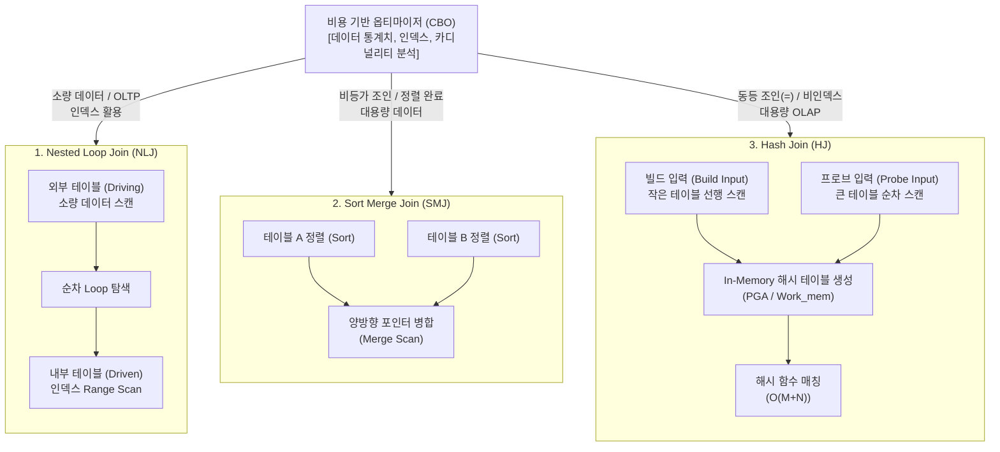

# 조인 (Join)

---

## I. 관계 대수 기반 데이터 결합 연산, 조인(Join)의 개요

* **정의**: 관계형 [[데이터베이스]](RDBMS) 및 분산 질의 엔진에서 두 개 이상의 릴레이션(테이블)을 공통 속성(Join Predicate)을 매개로 결합하여 단일 결과 튜플 집합을 생성하는 핵심 관계 대수(Relational Algebra) 연산
* **필요성 및 특징**:
* **데이터 정규화 한계 극복**: 이상 현상([[Anomaly(이상현상)|Anomaly]]) 제거를 위해 분할된 정규화 테이블 간의 논리적 [[무결성]] 복원
* **질의 최적화 핵심(CBO)**: 테이블 스캔 비용, 데이터 적재량, 인덱스 유무에 따른 비용 기반 옵티마이저의 실행 계획(Plan) 분기 기준
* **특징**: 직적곱(Cartesian Product)과 선택(Selection)의 결합 연산, 등가(=) 및 비등가 조건 지원, 논리적 조인과 물리적 엔진 실행 알고리즘의 명확한 분리

---

## II. 조인의 개념도 및 핵심 기술 요소

### 가. 물리적 조인(Physical Join) 실행 메커니즘

* 옵티마이저는 데이터 카디널리티, 인덱스 보유 여부, 메모리 가용량에 따라 세 가지 물리적 [[알고리즘]](NLJ, SMJ, HJ) 중 최적 경로를 판별하여 동적으로 실행 계획 수립

### 나. 조인의 핵심 기술 및 최적화 요소

| 구분 | 요소기술(키워드) | 세부 설명 |
| --- | --- | --- |
| **물리적 알고리즘** | **Nested Loop Join (NLJ)** | 선행(Driving) 테이블의 각 행마다 후행(Driven) 테이블의 인덱스를 반복 탐색하는 [[OLTP]] 최적화 방식 |
| **물리적 알고리즘** | **Sort Merge Join (SMJ)** | 조인 키 기준으로 양쪽 데이터를 정렬 후 투 포인터(Two-pointer)로 일치 항목을 병합하는 비등가/대용량 방식 |
| **물리적 알고리즘** | **Hash Join (HJ)** | 작은 테이블로 메모리 해시 테이블을 생성(Build)하고 큰 테이블을 스캔(Probe)하여 매칭하는 $O(M+N)$ 연산 기법 |
| **런타임 최적화** | **Adaptive Join (적응형 조인)** | 런타임 수집 로우 수가 임계치 이하일 때 NLJ, 초과 시 Hash Join으로 실행 경로를 동적 전환하는 기법 |
| **분산 처리** | **Broadcast Hash Join** | 분산 환경(Spark/Trino)에서 소형 테이블을 모든 워커 노드로 복제(Broadcast)하여 네트워크 셔플을 제거하는 최적화 |
| **분산 처리** | **Shuffle Hash Join** | 대용량-대용량 결합 시 조인 키 해시값을 기준으로 네트워크를 통해 데이터를 재분배(Partition Shuffle) 후 결합 |
| **I/O 프루닝** | **Bloom Filter Pushdown** | 조인 키 집합 기반의 비트 배열 필터를 하위 스캔 노드로 전달하여 불필요한 디스크 I/O 및 셔플 트래픽 조기 제거 |
| **하드웨어 가속** | **Vectorized Join (SIMD)** | 컬럼형 인메모리 엔진(DuckDB, ClickHouse)에서 SIMD 명령어를 활용해 단일 사이클에 다중 레코드 해시 매칭 수행 |

---

## III. 물리적 조인 3대 알고리즘 비교 및 최신 동향

### 가. 물리적 조인 알고리즘(NLJ vs SMJ vs HJ) 비교

| 비교 항목 | Nested Loop Join (NLJ) | Sort Merge Join (SMJ) | Hash Join (HJ) |
| --- | --- | --- | --- |
| **시간 복잡도** | $O(M \times N)$ (인덱스 시 $O(M \log N)$) | $O(M \log M + N \log N)$ | $O(M + N)$ |
| **조인 [[연산자]]** | 동등(=) 및 비등가($>, <, \le$) | 동등(=) 및 비등가($>, <, \le$) | **동등 조인(=)만 지원** |
| **인덱스 의존도** | 후행(Driven) 테이블 인덱스 필수 | 인덱스 정렬 시 정렬 비용 생략 가능 | **인덱스 무관** |
| **메모리 요구량** | 극소 (버퍼 풀 캐시 활용) | 정렬 공간 (Sort Area Size) 소모 | **해시 영역(PGA/Work_mem) 소모** |
| **처리 데이터 규모** | 소량 중심 (결과 집합이 작은 경우) | 대용량 중심 (연속 범위/비등가) | 대용량 집계 중심 (인덱스 부재 시) |
| **최적 업무 환경** | OLTP (단건·소량 [[트랜잭션]]) | 배치/정렬 필요 보고서 업무 | [[OLAP]] / DW / [[데이터 레이크하우스]] |

### 나. 최신 기술 동향 및 기술사적 제언

* **엔진 레벨 현대화**: MySQL 8.0.18 이후 BNLJ(Block Nested Loop)를 완전 폐기하고 Hash Join으로 대체하는 등 현대적 DB 엔진의 인메모리 해시 가속 표준화 추세
* **분산 쿼리 및 하드웨어 결합**: 레이크하우스 분산 질의 최적화를 위한 Dynamic Partition Pruning(DPP)과 [[GPU]] 가속 조인(RAPIDS cuDF) 적용이 심화되고 있어, CBO 통계 [[신뢰성]] 확보와 워크로드 특성에 맞춘 메모리 사이징이 시스템 튜닝의 핵심 관건임

---

### 🔗 연관 토픽

- **소속 도메인**: [[00_데이터베이스_MOC|🗄️ 데이터베이스]]
- **세부 분류**: `1. 데이터 모델링 & 관계형 DB 설계`
- **핵심 연관 토픽**:
  - [[Anomaly(이상현상)]]
  - [[데이터베이스]]
  - [[OLAP]]
  - [[데이터베이스 정규화|데이터베이스 정규화(Normalization)]]
  - [[데이터베이스 반정규화|데이터베이스 반정규화(De-Normalization)]]
