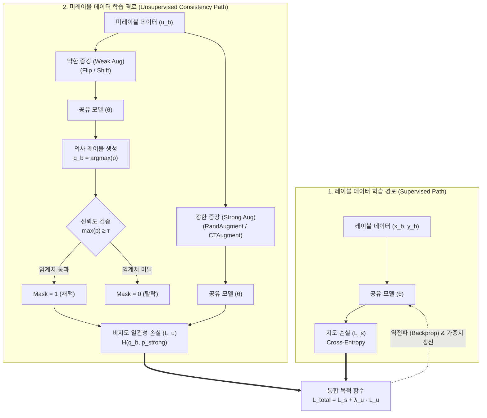

# 준지도학습 (Semi-supervised Learning)

---

## I. 소량의 레이블과 대규모 미분류 데이터 결합, 준지도학습의 개요

### 가. 준지도학습(Semi-supervised Learning)의 정의

* 소량의 레이블 데이터($D_L$)와 대량의 미레이블 데이터($D_U$)를 결합 학습하여 데이터 어노테이션 비용을 최소화하고 모델의 [[일반화]](Generalization) 성능을 극대화하는 머신러닝 기법

### 나. 준지도학습의 등장배경 및 3대 기본 가설

* **등장배경**: 대규모 원시 데이터 수집은 용이하나 도메인 전문가 기반 라벨링의 고비용·시간 지연 병목([[Annotation]] Bottleneck) 극복 필요
* **3대 기본 가설**:
* **평활성 가설 (Smoothness)**: 특징 공간에서 서로 인접한 입력 벡터들은 동일한 레이블을 가질 확률이 높음
* **군집 가설 (Cluster)**: 데이터 결정 경계(Decision Boundary)는 데이터 분포가 희박한 저밀도 영역(Low-density Region)을 통과함
* **매니폴드 가설 (Manifold)**: 고차원의 데이터는 실제 저차원의 매니폴드 구조상에 임베딩되어 존재함

---

## II. 준지도학습의 개념도 및 핵심 기술 요소

### 가. 준지도학습(FixMatch 기반)의 아키텍처 및 동작 메커니즘

* 미레이블 데이터에 약한 증강을 적용하여 고신뢰도($\ge \tau$) 의사 레이블(Pseudo-label)을 동적 생성하고, 강한 증강을 거친 출력과 일관성(Consistency)을 유지하도록 역전파를 수행하여 판별 경계를 최적화함

### 나. 준지도학습의 핵심 기술 및 구성 요소

| 구분 | 요소기술(키워드) | 세부 설명 |
| --- | --- | --- |
| **기본 가설** | **3대 핵심 가설** | 평활성(Smoothness), 군집(Cluster), 매니폴드(Manifold) 가설 기반 데이터 공간 구조화 |
| **의사 레이블** | **Self-Training (Pseudo-Labeling)** | 모델 자체 예측 확률이 사전 정의된 임계치($\tau$)를 초과할 때 하드 레이블로 변환하여 재학습 |
| **정규화 기법** | **일관성 정규화 (Consistency)** | 동일 미레이블 데이터에 서로 다른 섭동(Perturbation/Augmentation)을 가해도 예측 분포 일관성 유지 |
| **앙상블 기법** | **Mean Teacher / Temporal Ensembling** | 가중치 이동평균(EMA)을 적용한 교사 모델(Teacher)을 통해 학생 모델(Student)의 예측 일관성 가이드 |
| **복합 아키텍처** | **FixMatch / MixMatch** | MixUp 데이터 혼합 및 약한/강한 증강 기반 고신뢰도 마스킹을 결합한 엔드투엔드 파이프라인 |
| **동적 임계치** | **FlexMatch (CPL) / FreeMatch** | 학습 난이도별 [[클래스]] 편향을 해소하기 위한 커리큘럼 기반 클래스별 동적 임계치(CPL) 자동 산출 |
| **그래프 기법** | **Label Propagation / GCN** | [[유사도]] 그래프(K-NN)를 형성하고 인접 행렬을 통해 레이블 정보를 비지도 노드로 전파(Diffusion) |
| **손실 함수 설계** | **통합 손실 함수 ($\mathcal{L}_{total}$)** | 지도 교차 엔트로피 손실($\mathcal{L}_s$)과 램프업 가중치($\lambda$) 기반 비지도 일관성 손실($\mathcal{L}_u$)의 결합 수렴 |

---

## III. 머신러닝 학습 패러다임 비교 및 최신 동향

### 가. 지도학습 vs 준지도학습 vs 비지도학습 비교

| 비교 항목 | [[지도학습]] (Supervised) | 준지도학습 (Semi-supervised) | 비지도학습 (Unsupervised) |
| --- | --- | --- | --- |
| **데이터 구성** | 레이블 데이터만 사용 ($D_L$) | 소량의 레이블 + 대량의 미레이블 ($D_L + D_U$) | 레이블 없는 데이터만 사용 ($D_U$) |
| **라벨링 비용** | 매우 높음 (전체 데이터 어노테이션) | 낮음 (핵심 소량 데이터만 어노테이션) | 전무 (어노테이션 불필요) |
| **학습 메커니즘** | 정답(Ground Truth) 오차 최소화 | 의사 라벨링 및 일관성 정규화 결합 | 데이터 잠재 표현 및 군집/분포 학습 |
| **결정 경계** | 레이블 데이터 간격 최대화 | 데이터 밀도가 낮은 영역으로 경계 유도 | 데이터 간 거리/밀도 기반 군집화 |
| **주요 한계점** | 과적합 위험, 라벨링 비용 병목 | 확인 [[편향]](Confirmation Bias) 에러 누적 | 평가 지표 부재, 직접 분류 태스크 한계 |
| **적용 분야** | 정형 데이터 분류, 정밀 객체 검출 | 의료 영상 진단, 보안 관제 로그, 결함 탐지 | [[차원 축소]]([[PCA(Principal Component Analysis)|PCA]]), 군집화(Clustering), 이상 탐지 |

### 나. 최신 동향 및 기술사적 제언

* **[[자기지도학습]](SSL) 및 Foundation Model 연계**: Masked Autoencoder(MAE) 또는 Contrastive Learning(CLIP) 기반 대규모 비지도 사전학습(Pre-training) 후 다운스트림 태스크에 준지도 방식으로 파인튜닝하는 결합 패러다임 표준화
* **Human-in-the-loop 및 능동학습([[Active Learning]]) 결합**: 모델 불확실성(Uncertainty)이 높은 샘플만 선별하여 전문가가 라벨링하고, 나머지는 준지도학습으로 흡수하는 지능형 [[MLOps]] 파이프라인 구축이 실무 도입의 핵심 전략임

---

### 🔗 연관 토픽

- **소속 도메인**: [[00_인공지능_MOC|🤖 인공지능]]
- **세부 분류**: `1. 수학 · 통계학 & 데이터 전처리`
- **핵심 연관 토픽**:
  - [[Active Learning]]
  - [[PCA(Principal Component Analysis)]]
  - [[차원 축소|차원 축소(Dimensionality Reduction)]]
  - [[MLOps]]
  - [[유사도|유사도(Similarity)]]
