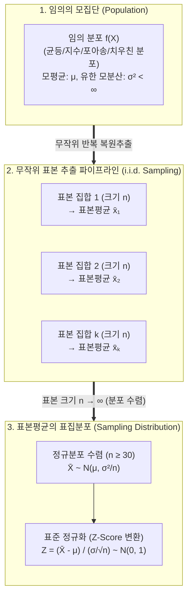

# 중심극한정리 (Central Limit Theorem)

---

## I. 표본 통계 기반 모집단 추론의 수학적 토대, 중심극한정리의 개요

* **정의**: 모집단의 [[확률분포]] 형태와 관계없이, 독립항등분포(i.i.d.)를 따르는 표본의 크기($n$)가 충분히 클 때 표본평균($\bar{X}$)들의 표집분포가 [[정규분포]] $\mathcal{N}(\mu, \frac{\sigma^2}{n})$에 근사한다는 확률 통계 이론
* **필요성 및 등장배경**:
* **비모수 환경의 모수 추정**: 미지의 모집단 분포를 정규분포로 근사화하여 신뢰구간 추정 및 모수적 가설검정 수행 가능
* **표본조사 비용 최적화**: 전수조사가 불가능한 대규모 빅데이터 환경에서 소표본 샘플링만으로 전체 통계량 오차 한계 산출

* **핵심 특징**: 분포 무관성(Distribution-free), 표본오차의 자승근 감쇄($SE = \frac{\sigma}{\sqrt{n}}$), 분포수렴($\xrightarrow{d}$)

---

## II. 중심극한정리의 개념도 및 핵심 기술 요소

### 가. 중심극한정리의 표집 메커니즘 및 분포 수렴 원리

* 모집단이 어떤 비대칭·비정규 형태를 띠더라도, 표본 크기 $n$이 증가함에 따라 표본평균들의 집합은 모평균 $\mu$를 중심으로 대칭을 이루는 종 모양의 정규분포로 수렴하며 산포도(표준오차)는 $\sqrt{n}$ 비율로 축소됨

### 나. 중심극한정리의 핵심 구성요소 및 이론적 기반

| 구분 | 요소기술(키워드) | 세부 설명 |
| --- | --- | --- |
| **전제 조건** | **독립항등분포 (i.i.d.)** | 추출된 확률변수들이 서로 독립적이며 동일한 확률분포를 따라야 한다는 린데베르크-레비(Lindeberg-Lévy) 기본 가정 |
| **제약 조건** | **유한 분산 ($\sigma^2 < \infty$)** | 모분산이 유한한 실수로 존재해야 성립하며, 코시(Cauchy)나 파레토(Pareto) 등 두꺼운 꼬리(Fat-tail) 분포는 예외 |
| **표본 기준** | **표본 크기 임계치 ($n \ge 30$)** | 모집단 왜도(Skewness)가 크지 않은 일반 환경에서 정규분포 근사가 유효하다고 판단하는 통계학적 경험적 기준 |
| **통계량** | **표본평균 ($\bar{X}$)** | 모평균 $\mu$의 대표적 [[불편추정량]](Unbiased Estimator)으로, 기대치 $E(\bar{X}) = \mu$를 유지하며 모평균으로 결집 |
| **[[변동성]] 척도** | **표준오차 ($SE = \frac{\sigma}{\sqrt{n}}$)** | 표본평균 분포의 표준편차; 표본 크기 $n$이 4배 증가할 때 오차 범위는 절반($1/2$)으로 수렴하여 추정 정확도 향상 |
| **수학적 극한** | **분포수렴 ($\xrightarrow{d}$)** | $n \to \infty$일 때 정규화된 통계량의 누적분포함수(CDF)가 표준정규분포 함수 $\Phi(z)$와 일치하는 극한 성질 |
| **정규화** | **Z-변환 ($Z = \frac{\bar{X} - \mu}{\sigma/\sqrt{n}}$)** | 표본평균과 모평균의 편차를 표준오차로 나누어 평균 0, 분산 1의 표준정규분포 $\mathcal{N}(0, 1)$ 상에서 확률 계산 지원 |
| **확장 이론** | **랴푸노프 / 린데베르크 조건** | 동일한 분포가 아니더라도 확률변수 간 독립성과 특정 적률 조건을 만족할 경우 정규분포로 수렴함을 입증한 확장 정리 |

---

## III. 대수의 법칙(LLN) vs 중심극한정리(CLT) 비교 및 실무 적용

### 가. 대수의 법칙(LLN) vs 중심극한정리(CLT) 비교

| 비교 항목 | 대수의 법칙 (Law of Large Numbers, LLN) | 중심극한정리 (Central Limit Theorem, CLT) |
| --- | --- | --- |
| **수렴 대상** | 표본평균의 **단일 값 (값 자체의 수렴)** | 표본평균들의 **확률분포 (분포의 수렴)** |
| **수렴 형태** | 확률수렴(WLLN) / 거의 확실한 수렴(SLLN) | **분포수렴 ($\xrightarrow{d}$, Convergence in Distribution)** |
| **수학적 명제** | $n \to \infty$ 일 때 $\bar{X}_n \xrightarrow{P} \mu$ | $n \to \infty$ 일 때 $\frac{\bar{X}_n - \mu}{\sigma/\sqrt{n}} \xrightarrow{d} \mathcal{N}(0, 1)$ |
| **알려주는 정보** | 표본 수가 많아지면 표본평균이 모평균과 같아짐 | 표본평균이 모평균 주변에 **어떤 형태(오차 분포)로 흩어지는가** |
| **통계적 역할** | **점 추정(Point Estimation)**의 일치성 보장 | **구간 추정(Confidence Interval) 및 가설검정(Z/[[t-검정 (t-test)|t-test]])**의 근간 |

### 나. 빅데이터 및 AI/데이터 사이언스 분야의 실무 활용 및 기술사적 제언

* **A/B 테스트 및 실험 플랫폼**: 웹/앱 전환율 분석 시 사용자 클릭 분포 형태와 무관하게 대규모 트래픽($n \gg 30$) 기반 [[Z-검정]] 수행 및 유의수준([[유의확률|p-value]]) 신속 산출
* **머신러닝 미니배치 [[경사하강법]](Mini-batch SGD)**: 전체 데이터셋 대신 미니배치 샘플들의 그래디언트 평균이 전체 그래디언트 기댓값 근처에 정규분포 형태로 수렴함을 보장하여 학습 안정성 제공
* **[[몬테카를로 시뮬레이션]] 및 MCMC**: 고차원 적분, 금융 리스크 평가, [[강화학습]] 보상 추정 시 난수 샘플링 반복 평균을 통해 점진적 신뢰구간 도출
* **기술사적 제언**: 금융 사기 탐지(FDS), 네트워크 패킷 트래픽 등 [[이상치]](Outlier)가 극단적인 'Heavy-tailed' 데이터셋은 $\sigma^2 < \infty$ 가정이 성립하지 않아 CLT가 붕괴될 수 있으므로, 레비 안정 분포 기반 [[일반화]] 중심극한정리(GCLT)를 채택하거나 비모수 부트스트래핑(Bootstrapping) 기법을 상호 병행하여 통계적 신뢰성을 확보해야 함

---

### 🔗 연관 토픽

- **소속 도메인**: [[00_인공지능_MOC|🤖 인공지능]]
- **세부 분류**: `1. 수학 · 통계학 & 데이터 전처리`
- **핵심 연관 토픽**:
  - [[정규분포|정규분포(Normal Distribution)]]
  - [[몬테카를로 시뮬레이션]]
  - [[불편추정량|불편추정량 (Unbiased Estimator)]]
  - [[Z-검정|Z-검정 (Z-test)]]
  - [[t-검정 (t-test)]]
