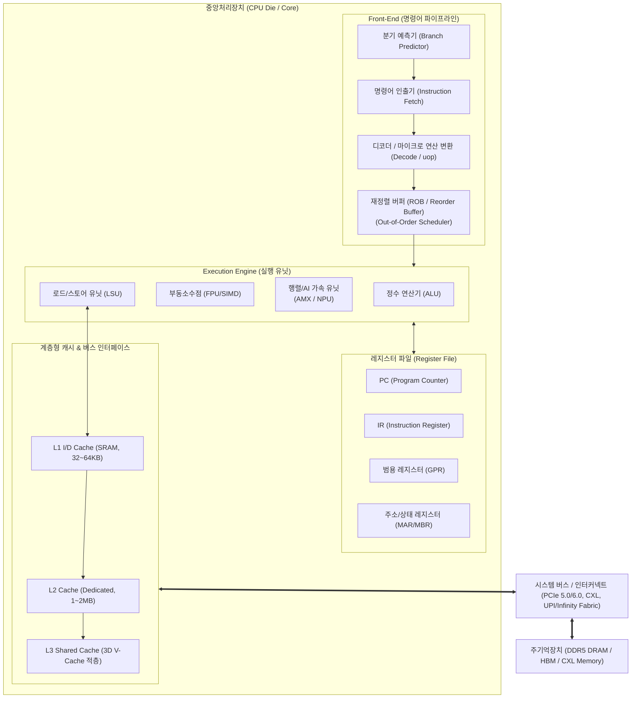

# 중앙처리장치 (CPU)

---

## I. 컴퓨터 시스템의 두뇌이자 직렬 제어·연산의 핵심, 중앙처리장치(CPU)의 개요

### 가. 중앙처리장치(CPU)의 정의

* 컴퓨터 시스템의 가장 핵심적인 하드웨어로서, 주 기억장치로부터 명령어(Instruction)를 인출(Fetch)·해독(Decode)하고, 산술·논리 연산 및 시스템 전반의 데이터 흐름을 총괄 제어하는 직렬 연산 중심의 프로세서

### 나. 중앙처리장치의 필요성 및 핵심 특징

* **범용 제어의 중추**: 복잡한 제어 흐름(Branching, Context Switching)과 OS [[커널]] 동작을 전담하는 시스템 오케스트레이터
* **저지연 직렬 처리**: 대용량 초고속 [[캐시 메모리]] 및 정교한 비순차 실행(OoO)을 통한 싱글 스레드 레이턴시 최소화
* **최신 아키텍처 진화**: 단일 칩 성능 한계(무어의 법칙 둔화, 전력 장벽) 극복을 위한 칩렛(Chiplet), 이종 하이브리드 코어, 온칩 AI/[[CXL]] 가속 구조로 전환

---

## II. CPU의 아키텍처 및 핵심 구성요소

### 가. CPU의 논리적 아키텍처 및 파이프라인 동작 원리

* PC가 가리키는 주소에서 명령어를 Fetch $\rightarrow$ 마이크로 오퍼레이션(uop)으로 Decode $\rightarrow$ 분기예측 및 Out-of-Order 스케줄러를 거쳐 Execution Unit에서 병렬 연산 후 레지스터 및 캐시에 결과를 Write-Back하는 구조

### 나. CPU의 핵심 기술 및 구성 요소

| 구분 | 요소기술(키워드) | 세부 설명 |
| --- | --- | --- |
| **제어/연산** | **CU & ALU** | 프로그램 제어 흐름(F-D-E-W)을 총괄하는 제어장치(CU) 및 산술·논리 연산을 처리하는 연산장치(ALU) |
| **기억/저장** | **레지스터 파일 (Register)** | PC(명령어 주소 계수), IR(현재 실행 명령어 저장), MAR/MBR, 누산기(AC) 등 초고속 내부 기억 셀 |
| **메모리 계층** | **Multi-level Cache & 3D V-Cache** | L1/L2/L3 계층적 SRAM 캐시 및 TSV 하이브리드 본딩 기반의 3D 캐시 수직 적층으로 메모리 병목(폰 노이만 병목) 완화 |
| **명령어 처리** | **ILP (명령어 수준 병렬성)** | 파이프라이닝(Pipelining), 슈퍼스칼라(Superscalar), 비순차적 실행(OoO), 분기 예측(Branch Prediction)으로 IPC 극대화 |
| **코어 아키텍처** | **하이브리드 이종 코어** | 고성능 빅코어(P-Core)와 고효율 리틀코어(E-Core)의 조합 및 OS 연계 하드웨어 [[스케줄러]](Thread Director) 적용 |
| **AI 연산 확장** | **온칩 [[NPU]] / AMX** | INT8/FP16/BF16 행렬 연산 가속을 위한 Intel AMX, ARM SME 명령어 확장 및 온디바이스 NPU 융합 탑재 |
| **모듈/패키징** | **[[칩렛|칩렛 (Chiplet)]] & UCIe** | 단일 다이 한계를 넘어 연산 코어와 I/O 다이를 분리 제작 후 결합하는 2.5D/3D 패키징 및 다이 간 표준 규격(UCIe) |
| **인터커넥트** | **CXL & PCIe 5.0/6.0** | 이종 가속기 간 [[캐시 일관성]](Cache Coherency) 및 메모리 풀링을 지원하는 차세대 고속 인터커넥트 [[프로토콜]] |
| **반도체 공정** | **BSPDN (후면 전력 공급망)** | 신호선과 전력선을 웨이퍼 앞뒤로 분리(Intel PowerVia, TSMC A16)하여 전압 강하(IR-Drop) 최소화 및 클럭 향상 |

---

## III. CPU vs GPU 비교 및 최신 기술 동향

### 가. CPU vs GPU 비교

| 비교 항목 | 중앙처리장치 ([[CPU]]) | 그래픽처리장치 ([[GPU]]) |
| --- | --- | --- |
| **설계 철학** | **지연 시간 최소화 (Low Latency)** | **[[처리량]] 극대화 (High Throughput)** |
| **연산 모델** | SISD, SIMD (단일/소수 스레드 초고속 처리) | SIMT (수천 개 이상의 대규모 스레드 동시 처리) |
| **코어 구조** | 소수의 고성능 대형 코어 (4~128 Cores) | 수천~수만 개의 소형 병렬 연산 코어 (ALU 위주) |
| **캐시 및 제어** | 칩 면적의 상당 부분을 캐시 메모리와 제어 유닛(CU)에 할당 | 칩 면적의 대부분을 연산 유닛(ALU)에 집중 배치 |
| **주요 작업 부하** | OS 커널, [[데이터베이스]] 쿼리, 직렬 비즈니스 로직 | 행렬 연산, 그래픽 렌더링, [[딥러닝]]([[초거대 언어 모델|LLM]]) 학습 및 추론 |
| **메모리 규격** | DDR5, LPDDR5X (낮은 지연시간 중심) | HBM3e/HBM4, GDDR7 (초고대역폭 중심) |

### 나. 최신 동향 및 기술사적 제언

* **Post-Von Neumann 전환 가속**: 데이터 이동에 따른 전력 낭비를 억제하기 위해 DPU(Data Processing Unit)로 네트워크/스토리지 오프로드를 수행하고, 메모리 내부에서 연산하는 [[PIM|PIM(Processing-In-Memory)]] 결합 확산
* **SoC 기반 XPU 통합 플랫폼화**: CPU 단독 발전 한계를 극복하기 위해 CPU+GPU+NPU를 단일 패키지 내 초고속 버스로 묶는 이종 컴퓨팅(Heterogeneous Computing) 가속
* **기술사적 제언**: 서버 및 클라우드 인프라 설계 시 순수 클럭 속도 중심의 스케일업(Scale-up) 관점을 탈피하고, CXL 기반 메모리 풀링 아키텍처와 워크로드 특성(직렬 제어 vs 대규모 행렬 병렬)에 최적화된 프로세서 배치(Workload-aware Placement) 전략 수립이 필수적임

---

### 🔗 연관 토픽

- **소속 도메인**: [[00_컴퓨터구조_MOC|💻 컴퓨터구조]]
- **세부 분류**: `1. CPU 프로세서 & 마이크로아키텍처`
- **핵심 연관 토픽**:
  - [[CPU]]
  - [[GPU]]
  - [[NPU|NPU(Neural Processing Unit)]]
  - [[CXL|CXL (Compute Express Link)]]
  - [[캐시 메모리]]
