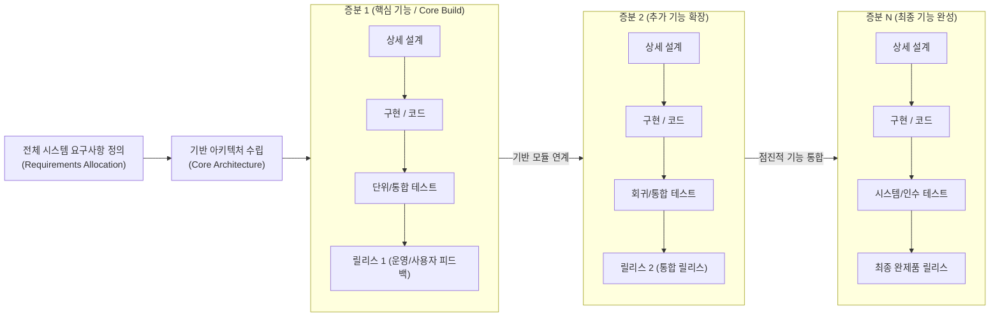

# 증분형 개발 모델 (Incremental Model)

---

## I. 점진적 가치 인도와 위험 분산, 증분형 개발 모델의 개요

### 가. 증분형 개발 모델(Incremental Model)의 정의

* 시스템의 전체 요구사항을 기능 단위의 독립적인 빌드(Increment)로 분할하고, 각 증분마다 분석·설계·구현·테스트를 순차 수행하여 동작 가능한 제품을 점진적으로 릴리스하는 소프트웨어 생명주기([[SDLC]]) 모델

### 나. 증분형 개발 모델의 등장배경 및 핵심 특징

* **등장배경**: [[워터폴|폭포수]] 모델의 빅뱅(Big-Bang) 통합 방식에 따른 납기 지연, 초기 요구사항 검증 실패, 프로젝트 후반부 리스크 누적 한계 극복
* **3대 핵심 특징**:
* **점진적 가치 인도(Staged Delivery)**: 각 증분 완료 시마다 동작 가능한 소프트웨어(Working Software)를 조기 출시하여 Time-to-Market 단축
* **선형 순차 모델의 중첩**: 각 증분 내부에서 폭포수 프로세스를 독립적으로 수행하거나 병렬(Concurrent) 파이프라인 적용
* **초기 아키텍처 의존성**: 후속 증분의 안정적인 결합을 위해 초기 단계에 견고한 기반 아키텍처(Core Framework) 확립 필수

---

## II. 증분형 개발 모델의 개념도 및 핵심 기술 요소

### 가. 증분형 개발 모델의 프로세스 및 릴리스 메커니즘

* 전체 요구사항을 기반으로 핵심 골격 아키텍처를 우선 수립한 뒤, 기능 단위 증분을 순차·병렬 개발하여 회귀 테스트를 거쳐 기존 릴리스에 점진적으로 통합·인도하는 메커니즘

### 나. 증분형 개발 모델의 핵심 기술 및 구성 요소

| 구분 | 요소기술(키워드) | 세부 설명 |
| --- | --- | --- |
| **계획/분할** | **기능 분할 (Decomposition)** | 전체 요구사항을 상호 독립적이고 점진적 통합이 가능한 모듈 단위의 증분으로 식별 및 우선순위화 |
| **아키텍처** | **코어 아키텍처 (Baseline)** | 후속 증분의 지속적인 누적 결합에도 구조적 붕괴가 발생하지 않도록 개방성과 확장성을 보장하는 뼈대 설계 |
| **인도 관리** | **단계적 인도 (Staged Delivery)** | 각 증분 주기마다 고객이 직접 검증하고 즉시 비즈니스에 활용할 수 있는 동작 제품 인도 |
| **품질 검증** | **[[리그레션 테스트|회귀 테스트]] (Regression Testing)** | 신규 증분 추가로 인해 이미 검증된 기존 증분의 정상 기능에 결함(Side-effect)이 발생하는지 검증 |
| **통합 체계** | **지속적 통합 (Continuous Integration)** | 증분 간 소스 코드 병합 충돌을 조기에 방지하기 위한 자동화된 빌드, [[단위 테스트]] 및 [[형상 관리]] 파이프라인 |
| **인터페이스** | **계약 기반 인터페이스 (API Contract)** | 증분 간 및 병렬 개발 팀 간 결합도를 낮추고 데이터 호환성을 유지하기 위한 엄격한 인터페이스 규격화 |
| **위험 통제** | **조기 위험 완화 (Early Risk Mitigation)** | 기술적 불확실성이 크고 비즈니스 기여도가 가장 높은 핵심 기능을 1차 증분으로 전진 배치하여 실패 위험 조기 해소 |
| **릴리스 제어** | **기능 토글 (Feature Flag/Toggle)** | 코드가 메인 브랜치에 배포되더라도 미완성 증분의 노출을 런타임 환경에서 동적으로 제어하는 배포 전략 |

---

## III. 증분형 vs 진화형 vs 폭포수 모델 비교 및 최신 동향

### 가. 전통적 SDLC 및 반복 모델 비교

| 비교 항목 | [[폭포수 모델]] (Waterfall) | 증분형 모델 (Incremental) | 진화형 모델 (Evolutionary) |
| --- | --- | --- | --- |
| **기본 개념** | 전체 단계를 일괄 순차 진행 | **기능 단위로 분할하여 단계적 추가** | **핵심 시제품을 만들고 점진적 고도화** |
| **요구사항 확정** | 프로젝트 초기에 100% 확정 전제 | **초기에 전체 확정 후 증분별 배정** | 초기에 불명확, 반복 과정에서 정제 |
| **개발/인도 방식** | 최종 단일 인도 (Single Delivery) | **동작 가능한 부분 릴리스 다중 인도** | 프로토타입 기반 점진적 성숙화 인도 |
| **접근 시각** | 전체 일괄 완성 (Big-Bang) | 기능의 수평적 추가 (Additive) | 완성도의 수직적 심화 (Refinement) |
| **위험 발생 시점** | 통합/배포 단계에 위험 집중 | **초기 핵심 증분 검증으로 위험 분산** | 프로토타이핑을 통한 불확실성 상시 해소 |
| **주요 취약점** | 요구 변경 수용 불가, 지연 시 치명적 | **아키텍처 침식(Erosion), 통합 비용** | 프로젝트 범위 통제(Scope Creep) 난항 |

### 나. 최신 동향 및 기술사적 제언

* **현대적 애자일/[[DevOps]]로의 진화**: 전통적 증분형 모델은 현대 소프트웨어 공학에서 [[스크럼]]([[SCRUM|Scrum]])의 스프린트 주기 및 CI/CD 기반 지속적 배포(CD) 파이프라인으로 융합 발전
* **마이크로서비스([[MSA (Micro Service Architecture)|MSA]]) 기반 독립 증분**: 모놀리식 구조에서의 [[결합도]] 문제(인터페이스 충돌)를 극복하기 위해 도메인 주도 설계([[DDD (Domain Driven Design)|DDD]])를 접목, 서비스 단위의 독립적 증분 배포 및 카나리(Canary) 릴리스 적용
* **기술사적 제언**: 증분형 모델 적용 시 반복적인 기능 추가로 인해 시스템 구조가 퇴행하는 '아키텍처 부패(Architectural Decay)' 현상을 방지하기 위해, 진화적 아키텍처(Evolutionary Architecture) 원칙과 테스트 피라미드 기반 회귀 자동화 체계를 개발 착수 전 반드시 확보해야 함

---

### 🔗 연관 토픽

- **소속 도메인**: [[00_소프트웨어공학_MOC|🏗️ 소프트웨어공학]]
- **세부 분류**: `1. 소프트웨어 개발 생명주기(SDLC) & 방법론`
- **핵심 연관 토픽**:
  - [[SDLC]]
  - [[폭포수 모델]]
  - [[형상 관리]]
  - [[단위 테스트]]
  - [[MSA (Micro Service Architecture)]]
