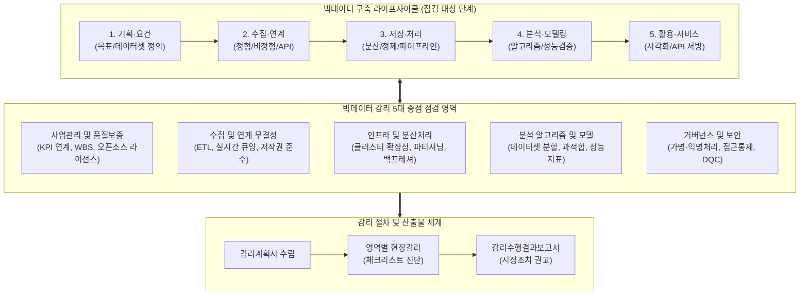

# 지능정보기술 감리 실무 가이드 (빅데이터 중심)

---

## I. 빅데이터 구축 사업 품질·신뢰성 보증, 지능정보기술 감리 실무 가이드(빅데이터)의 개요

### 가. 지능정보기술 감리 실무 가이드(빅데이터)의 정의

* 대규모 정형·비정형 데이터의 수집, 저장·처리, 분석·모델링, 서비스 전 생명주기에 걸쳐 사업 목표 부합성, 데이터 품질, 분산 아키텍처 안정성 및 법제도(가명처리) 준수 여부를 체계적으로 점검하기 위해 한국지능정보사회진흥원(NIA)이 수립한 감리 기준 [[프레임워크]]

### 나. 지능정보기술 감리 실무 가이드의 등장배경 및 특징

* **전통 SI 감리 한계 극복**: 응용 소프트웨어 기능 검증 중심의 전통적 [[워터폴|폭포수]] 감리 체계로는 데이터 흐름 파이프라인, 모델링 반복(Iteration), 품질 오염 진단 불가
* **복합 분산 인프라 검증 필요**: 대용량 분산 파일시스템([[HDFS]], Object Storage), 실시간 스트리밍(Kafka), 람다/카파 아키텍처의 확장성 및 [[HA(High Availability)|가용성]] 검증 요구
* **데이터 법제도 준수성 검증**: 개인정보보호법상 가명정보 처리 적정성, [[비식별화]] 수준 및 공공·민간 데이터 수집에 따른 저작권 침해 리스크 사전 예방

---

## II. 빅데이터 감리 프레임워크 및 단계별 핵심 점검 요소

### 가. 빅데이터 라이프사이클 기반 감리 개념도 및 점검 흐름

* 빅데이터 라이프사이클 [[PMBOK 프로세스 그룹 (5단계)|5단계]] 전반에 걸쳐 5대 중점 영역을 매핑하고, 세부 점검항목 체크리스트를 통해 인프라 성능·데이터 품질·[[알고리즘]] 적정성을 다차원 진단·개선하는 체계

### 나. 빅데이터 감리의 핵심 기술 및 점검 구성 요소

| 구분 | 요소기술(키워드) | 세부 설명 |
| --- | --- | --- |
| **사업관리/요건** | **데이터 요구정의서** | 구축 목적에 부합하는 데이터셋(출처, 주기, 규격, 포맷) 정의의 명확성 및 사업 KPI 연계성 점검 |
| **수집/연계** | **ETL / CDC 파이프라인** | 배치 및 실시간 데이터 수집 시 데이터 유실·누락 방지, 통신 병목 제어 및 결손 대응책 확인 |
| **수집/연계** | **데이터 라이선스/저작권** | 외부 웹 스크래핑/크롤링의 적법성, 공공·민간 API 사용 승인 및 오픈소스 라이선스 충돌 여부 점검 |
| **저장/처리** | **분산 스토리지/컴퓨팅** | HDFS, Object Storage 복제 계수(Replication), 노드 장애 복구, [[샤딩]](Sharding) 및 [[파티셔닝]] 설계 적합성 |
| **저장/처리** | **스트림 아키텍처** | 람다(Lambda)·카파(Kappa) 구조에서 실시간/배치 레이어 간 정합성 및 백프레셔(Backpressure) 처리 점검 |
| **분석/모델링** | **데이터셋 분할 및 누수** | Train / Validation / Test 셋 분리 적정성 및 타깃 정보가 사전 주입되는 데이터 누수(Data Leakage) 검증 |
| **분석/모델링** | **알고리즘 및 평가지표** | F1-Score, AUC-ROC, RMSE 등 목표 성능 지표 달성도, [[일반화]] 성능 및 과적합(Overfitting) 제어 확인 |
| **보안/컴플라이언스** | **가명·익명화 처리** | 개인정보보호법에 따른 식별자 제거, 범주화, [[차분 프라이버시]](DP) 적용 및 비식별 적정성 평가 검증 |
| **[[데이터 거버넌스]]** | **[[데이터 품질관리(ISO 8000)|데이터 품질관리]] (DQC)** | DQC-V/M 기반 도메인 규칙 준수, [[결측치]]·[[이상치]] 정제 적정성, 유효성·완전성·일관성 지표 진단 |

---

## III. 전통 SI 감리 vs 빅데이터 감리 비교 및 향후 발전 전망

### 가. 전통 정보시스템(SI) 감리 vs 빅데이터 감리 비교

| 비교 항목 | 전통 정보시스템(SI) 감리 | 지능정보기술 감리 (빅데이터 중심) |
| --- | --- | --- |
| **감리 대상 중심** | [[프로세스]] 및 응용 소프트웨어 (기능 단위) | **데이터 파이프라인 및 분석 모델 (데이터+알고리즘)** |
| **품질 검증 기준** | 요구사항 추적표, 테스트 케이스 커버리지 | **데이터 품질(DQC), 정합성, 모델 평가지표(F1/AUC)** |
| **개발 라이프사이클** | 선형 폭포수(Waterfall) 및 V-Model 중심 | **탐색적 데이터 분석([[EDA]]) 및 모델 반복([[CRISP-DM]])** |
| **인프라 구조** | 단일/이중화 서버 가용성, RDBMS 정규화 | **대규모 분산 클러스터(Scale-out), 람다/카파 아키텍처** |
| **법적·보안 통제** | 접근통제, DB [[암호화]], 개인정보 유출 방지 | **가명정보 결합 적정성, 재식별 위험도 평가, 저작권 검증** |

### 나. 향후 발전 전망 및 기술사적 제언

* **[[MLOps]]/DataOps 기반 상시 지속적 감리(Continuous Audit)**: 구축 시점 1회성 점검의 한계를 넘어, 데이터 드리프트(Data Drift) 및 모델 성능 저하를 지속 모니터링하는 MLOps 파이프라인 통합 감리 체계로 전환 필요
* **생성형 AI 및 합성데이터 검증 지침 확립**: [[초거대 언어 모델|LLM]] 연계 RAG 파이프라인의 환각(Hallucination) 억제 및 프라이버시 보호 목적의 합성데이터(Synthetic Data) 품질 검증 지표를 감리 실무 프레임워크에 선제적 반영 필수

---

### 🔗 연관 토픽

- **소속 도메인**: [[00_소프트웨어공학_MOC|🏗️ 소프트웨어공학]]
- **세부 분류**: `1. 소프트웨어 개발 생명주기(SDLC) & 방법론`
- **핵심 연관 토픽**:
  - [[데이터 거버넌스|데이터 거버넌스 (Data Governance)]]
  - [[PMBOK 프로세스 그룹 (5단계)]]
  - [[결측치]]
  - [[데이터 품질관리(ISO 8000)]]
  - [[CRISP-DM|CRISP-DM(Cross Industry Standard Process for Data Mining)]]
