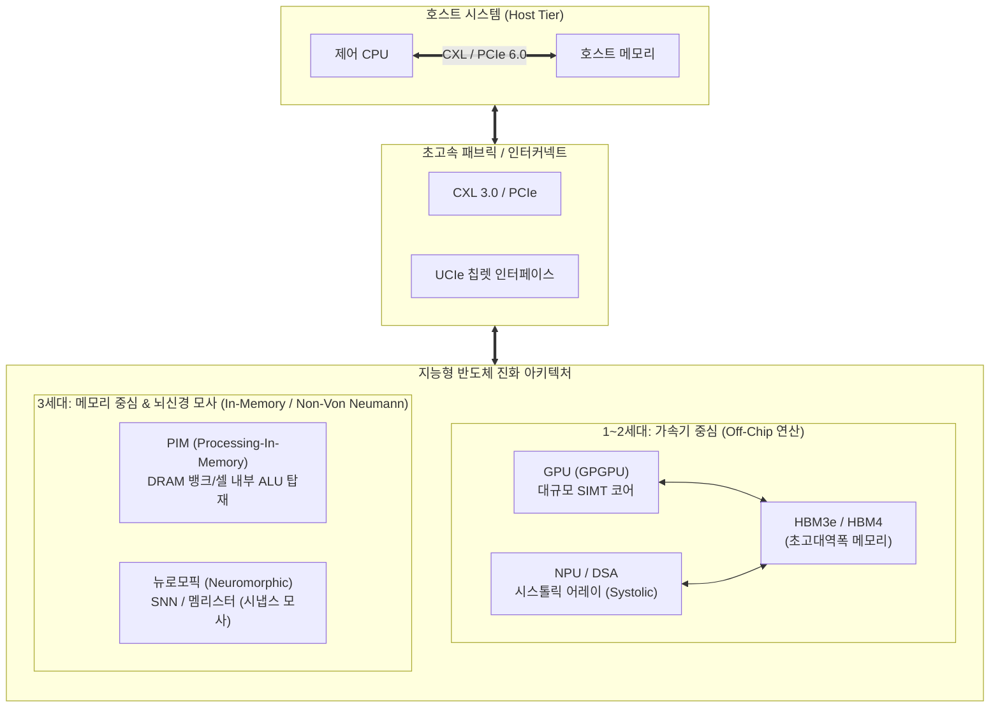

# 지능형 반도체 (AI Semiconductor)

---

## I. 폰 노이만 병목 극복과 초저전력·초고속 AI 연산의 핵심, 지능형 반도체의 개요

### 가. 지능형 반도체의 정의

* [[인공지능]](AI) 알고리즘의 대규모 다차원 행렬(Tensor) 연산을 초고속·초저전력으로 처리하기 위해 연산 장치와 메모리를 통합·최적화하거나 인간의 뇌신경망 구조를 모방한 특화 프로세서

### 나. 지능형 반도체의 등장배경 및 핵심 특징

* **폰 노이만 병목(Memory Wall) 해소**: 연산 유닛(ALU)과 주 기억장치 간 데이터 전송 지연 및 버스 대역폭 한계 극복
* **전력 장벽(Power Wall) 및 TCO 절감**: 거대언어모델([[초거대 언어 모델|LLM]]) 학습·추론 급증에 따른 데이터센터 전력 소비 억제 및 와트당 연산 성능(TOPS/W) 극대화
* **비(非) 폰 노이만 컴퓨팅으로의 진화**: 단순 가속기([[GPU]]/[[NPU]])를 넘어 연산-메모리 통합([[PIM]]) 및 생체 신경망 모사(Neuromorphic)로 아키텍처 패러다임 전환

---

## II. 지능형 반도체의 개념도 및 핵심 기술 요소

### 가. 지능형 반도체의 아키텍처 및 진화 메커니즘

* 호스트 오프로드 방식(GPU/NPU)에서 출발하여, 데이터 전송 경로를 칩 내부로 격리하는 PIM과 이벤트 기반 비동기 스파이크 연산을 수행하는 뉴로모픽으로 데이터 국소성(Data Locality)을 극대화하는 메커니즘

### 나. 지능형 반도체의 핵심 기술 및 구성 요소

| 분류 | 요소기술(키워드) | 세부 설명 |
| --- | --- | --- |
| **연산 코어** | **[[시스톨릭 어레이]] (Systolic Array)** | NPU의 핵심 구조; 처리 셀 격자망 간 데이터를 직접 전달하여 레지스터 I/O를 최소화하고 행렬 곱셈·누산([[MAC]]) 가속 |
| **연산 패러다임** | **스파이크 신경망 (SNN)** | [[뉴로모픽 칩]] 구동 방식; 생체 신경계처럼 임계치 이상의 스파이크 신호 발생 시에만 희소(Sparse) 연산을 수행하여 극저전력 구현 |
| **신소자 기술** | **[[멤리스터]] (Memristor)** | 전하 흐름에 따라 저항 상태가 가변되는 차세대 2단자 소자; 시냅스의 가중치 기억과 아날로그 행렬 연산을 동시 처리 |
| **인메모리 연산** | **PIM (Processing-In-Memory)** | 메모리 뱅크 및 셀 내부에 연산 유닛(ALU)을 집적하여 [[CPU]]-메모리 간 병목 현상 및 데이터 전송 에너지 80% 절감 |
| **메모리 기술** | **HBM4 (High Bandwidth Memory)** | TSV 기반 16단 적층 DRAM과 최선단 파운드리 로직 베이스 다이(Base Die)를 결합하여 인터페이스 대역폭 극대화 |
| **시스템 확장** | **[[CXL]] 3.0 (Compute Express Link)** | 프로세서와 지능형 가속기 간 [[캐시 일관성]](Cache Coherency)을 보장하고 메모리 풀링(Memory Pooling) 지원 |
| **첨단 패키징** | **2.5D/3D [[칩렛]] (UCIe)** | 모놀리식 다이 한계를 넘어 연산 코어와 메모리 다이를 실리콘 인터포저로 결합하는 이종 집적 표준 패키징 |
| **소프트웨어 스택** | **AI 전용 컴파일러 (MLIR / TVM)** | 상위 [[프레임워크]](PyTorch 등)의 연산 그래프를 분석하여 특정 NPU/PIM 하드웨어 명령어에 맞춤 최적화 및 양자화 변환 |

---

## III. 지능형 반도체 주요 기술 유형 비교 및 향후 전망

### 가. 지능형 반도체 유형별(GPU vs NPU vs PIM vs 뉴로모픽) 비교

| 비교 항목 | GPU (1세대) | NPU (2세대) | PIM (3세대) | 뉴로모픽 (3세대) |
| --- | --- | --- | --- | --- |
| **컴퓨팅 구조** | SIMT (폰 노이만) | [[DSA]] / Systolic Array | Near/In-Memory Computing | SNN (완전 비-폰 노이만) |
| **설계 목표** | 대규모 병렬 학습 범용 가속 | [[딥러닝]] 추론·학습 효율 가속 | 메모리 병목 및 데이터 이동 제거 | 인간 뇌신경(뉴런·시냅스) 모사 |
| **에너지 효율** | 보통 ($1 \sim 5\text{ TOPS/W}$) | 높음 ($5 \sim 20\text{ TOPS/W}$) | 매우 높음 ($20 \sim 40\text{ TOPS/W}$) | 극대화 ($100+\text{ TOPS/W}$) |
| **데이터 이동** | 메모리 $\rightarrow$ 코어 다량 전송 | 온칩 SRAM 활용 [[재사용]] | **메모리 내부 직접 연산 수행** | **스파이크 발생 시 비동기 전송** |
| **적용 영역** | 거대 AI 모델 사전 학습 | [[온디바이스 AI]], 추론 서버 | LLM 서빙, 대규모 추천시스템 | 초저전력 엣지 인지, 로보틱스 |
| **상용화 수준** | 시장 지배적 성숙 단계 | 데이터센터 및 단말 확산 | 양산 초기 (GDDR6-AiM, [[HBM]]-PIM) | 시제품 및 연구 단계 (PoC) |

### 나. 최신 동향 및 기술사적 제언

* **추론 시장 개편과 온디바이스 NPU 확산**: 초거대 AI 중심의 학습 인프라 구축 이후 추론(Inference) 비용 절감이 핵심 과제로 부상함에 따라, ASIC 기반 저전력 NPU 및 모바일 AP 내 통합 NPU 탑재 가속화
* **풀스택(Full-[[Stack]]) 생태계 결합 필수**: 하드웨어 가속기 자체 성능뿐만 아니라 PyTorch·Triton 연계 최적화 컴파일러(SW 스택) 및 CXL 기반 메모리 확장 표준을 포괄하는 산학연 에코시스템 구축이 기술 주도권 확보의 결정적 요소임

---

### 🔗 연관 토픽

- **소속 도메인**: [[00_컴퓨터구조_MOC|💻 컴퓨터구조]]
- **세부 분류**: `1. CPU 프로세서 & 마이크로아키텍처`
- **핵심 연관 토픽**:
  - [[CPU]]
  - [[GPU]]
  - [[NPU|NPU(Neural Processing Unit)]]
  - [[CXL|CXL (Compute Express Link)]]
  - [[캐시 일관성|캐시 일관성(Cache Coherence)]]
