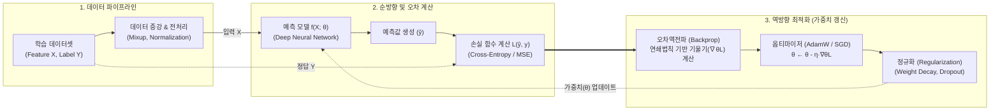

# 지도학습 (Supervised Learning)

---

## I. 레이블 기반 함수 근사와 최신 SFT로의 진화, 지도학습의 개요

### 가. 지도학습(Supervised Learning)의 정의

* 입력 데이터($X$)와 그에 대응하는 정답 레이블($Y$)로 구성된 훈련 데이터셋($D = \{(x_i, y_i)\}_{i=1}^N$)으로부터 입력과 출력 간의 관계를 매핑하는 최적의 함수 $f: X \to Y$를 도출하는 기계학습 방법론

### 나. 지도학습의 필요성 및 핵심 특징

* **명확한 목표 지향성**: 정답(Ground Truth) 오차를 기반으로 손실 함수(Loss Function)를 직접 정의하여 분류(Classification) 및 회귀(Regression) 문제의 예측 정확도 극대화
* **[[편향]]-분산 트레이드오프(Bias-Variance Trade-off)**: 모델 복잡도에 따른 과소적합(Underfitting)과 과적합(Overfitting) 간의 균형 최적화 필수
* **최신 패러다임 전환**: 전통적 [[알고리즘]] 튜닝(Model-Centric)에서 데이터 품질을 고도화하는 **Data-Centric AI** 및 거대언어모델([[초거대 언어 모델|LLM]])에 지시 준수 능력을 부여하는 지도 미세조정(SFT, Supervised [[Fine-Tuning]])으로 확장

---

## II. 지도학습의 개념도 및 핵심 기술 요소

### 가. 지도학습의 파이프라인 및 동작 메커니즘

* 입력 데이터($X$)의 순방향 연산으로 예측값($\hat{y}$)을 도출한 후, 정답($y$)과의 오차를 손실함수로 측정하고 연쇄법칙 기반 [[역전파]](Backpropagation)와 옵티마이저를 통해 파라미터($\theta$)를 반복 갱신하여 [[일반화]] 성능을 확보하는 구조

### 나. 지도학습의 핵심 기술 및 구성 요소

| 구분 | 요소기술(키워드) | 세부 설명 |
| --- | --- | --- |
| **문제 유형** | **분류 및 회귀 (Classification & Regression)** | 이산형 [[클래스]] 확률을 추정하는 분류(Softmax, Cross-Entropy)와 연속형 수치값을 도출하는 회귀(MSE, L1 Loss) |
| **손실 함수** | **Focal Loss / Label Smoothing** | [[클래스 불균형]] 완화를 위한 손실 가중치 동적 조절(Focal) 및 과잉 확신(Overconfidence) 방지용 레이블 평활화 |
| **최적화 기법** | **AdamW / Cosine LR Scheduler** | 모멘텀과 RMSprop을 결합하고 L2 가중치 감쇠를 독립 적용(AdamW)하며, 학습률을 점진적으로 감쇄하여 최적점 수렴 |
| **역전파/학습** | **Backpropagation (연쇄 법칙)** | 출력층의 오차를 입력층 방향으로 미분 전파하여 각 가중치의 기울기($\nabla_\theta \mathcal{L}$)를 산출하는 심층망 학습 알고리즘 |
| **과적합 제어** | **정규화 ([[Dropout]], Weight Decay)** | 학습 중 일부 뉴런을 무작위 비활성화하거나 가중치 크기를 제한하여 훈련 데이터 암기(Memorization) 방지 |
| **데이터 증강** | **Mixup / CutMix** | 입력 이미지 및 레이블을 선형 결합(Mixup)하거나 영역을 패치 치환(CutMix)하여 결정 경계 평활화 및 강건성 확보 |
| **데이터 엔지니어링** | **Data-Centric AI (Cleanlab)** | 모델 코드를 고정하고 신뢰 학습(Confident Learning) 알고리즘을 통해 잘못 라벨링된 레이블 노이즈(Label Noise)를 식별·정제 |
| **LLM 미세조정** | **SFT (Supervised Fine-Tuning)** | 사전학습된 파운데이션 모델에 지시-응답(Instruction-Response) 쌍을 지도학습시켜 도메인 정밀성 확보 |
| **경량화 학습** | **[[PEFT]] ([[LoRA(Low-rank adaptation)|LoRA]] / QLoRA)** | 사전학습 가중치를 동결(Freeze)하고 저랭크 분해 행렬(Rank Decomposition)만을 지도학습하여 [[GPU]] 메모리 비용 70% 이상 절감 |

---

## III. 머신러닝 3대 패러다임 비교 및 최신 기술 동향

### 가. 머신러닝 3대 학습 패러다임 비교

| 비교 항목 | 지도학습 (Supervised) | 비지도학습 (Unsupervised) | [[강화학습]] (Reinforcement) |
| --- | --- | --- | --- |
| **학습 데이터** | 입력 데이터 + 정답 레이블 ($X, Y$) | 레이블이 없는 원시 데이터 ($X$) | 환경(Environment) 상태 데이터 ($S$) |
| **학습 메커니즘** | **정답 오차 최소화 (Loss Minimization)** | **데이터 내재 패턴·분포 학습** | **시행착오를 통한 누적 보상(Reward) 극대화** |
| **목적 함수** | Cross-Entropy, MSE, Huber Loss | KL-Divergence, Reconstruction Error | 누적 기대 할인 보상 ($E[\sum \gamma^t R_t]$) |
| **대표 알고리즘** | ResNet, XGBoost, Transformer(SFT) | K-Means, [[PCA(Principal Component Analysis)|PCA]], [[VAE]], Masked Autoencoder | PPO, DQN, SAC, DPO/RLHF |
| **주요 적용처** | 질병 판독, 금융 사기 탐지, 문서 요약 | 고객 군집화, 이상 거래 감지, [[차원 축소]] | [[Smart Car(자율주행)|자율주행]] 경로 제어, 로보틱스, LLM 정렬 |
| **데이터 구축 비용** | **매우 높음 (전문가 라벨링 비용 발생)** | **매우 낮음 (대량 원시 데이터 즉시 활용)** | 환경 모델링 및 보상 함수 설계 비용 소요 |

### 나. 최신 동향 및 기술사적 제언

* **사전학습-지도미세조정(Pretrain-SFT) 파이프라인 표준화**: 대규모 비지도/[[자기지도학습]](SSL)으로 범용 표현을 획득한 후, 양질의 도메인 특화 Instruction 데이터셋을 통한 SFT로 최종 서비스를 완성하는 2단계 파이프라인이 산업계 표준으로 정착
* **인간 피드백 정렬(Alignment)과의 연계**: SFT 모델을 베이스라인으로 하여 인간 선호도를 반영하는 RLHF 및 직접 선호 최적화(DPO, Direct Preference Optimization)로 이어지는 정렬 엔지니어링이 필수화됨
* **기술사적 제언**: 모델 파라미터 확장 경쟁(Scale-up)이 물리적 연산 비용의 한계에 봉착함에 따라, 무조건적인 데이터 증량보다는 [[합성 데이터|합성 데이터(Synthetic Data)]] 생성 기술과 Data-Centric AI 기반의 고순도(High-purity) 정답 레이블 검증 프레임워크를 수립하는 것이 엔터프라이즈 AI 구축 성공의 결정적 척도임

---

### 🔗 연관 토픽

- **소속 도메인**: [[00_인공지능_MOC|🤖 인공지능]]
- **세부 분류**: `2. 머신러닝 기초 & 핵심 알고리즘`
- **핵심 연관 토픽**:
  - [[강화학습]]
  - [[자기지도학습]]
  - [[역전파|역전파(Backpropagation)]]
  - [[Active Learning]]
  - [[MNIST]]
