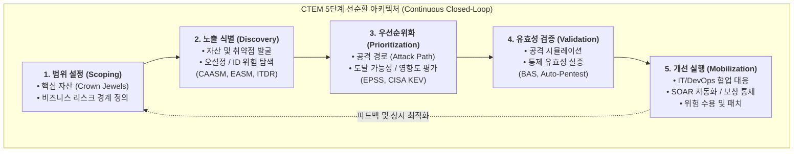

# 지속적인 위협 노출 관리 (CTEM)

---

## I. 능동적·지속적 사이버 회복력 확보 체계, CTEM의 개요

### 가. 지속적인 위협 노출 관리(CTEM)의 정의

* 공격자의 관점에서 조직의 온프레미스, 클라우드, SaaS 등 전방위 디지털 자산에 대한 취약점, 오설정, 신원(Identity) 위협을 식별하고, 실제 악용 가능성을 검증하여 비즈니스 위험을 지속적으로 완화하는 [[PMBOK 프로세스 그룹 (5단계)|5단계]] 순환형 보안 운영 [[프레임워크]]

### 나. 지속적인 위협 노출 관리(CTEM)의 등장배경 및 특징

* **전통적 취약점 관리(VM)의 한계**: 주기적 스캔 기반의 단순 [[CVE]] 나열로 인한 보안팀 피로도 급증 및 비(非) CVE 보안 위협(클라우드 오설정, 과도한 계정 권한 등) 식별 불가
* **공격 표면의 폭발적 확장 및 무기화 가속**: 멀티 클라우드, 공급망 확대, 섀도우 IT 증가 및 취약점 공개 후 48시간 이내 무기화(Weaponization)에 대응할 상시 통제 필요
* **핵심 특징**: 5단계 폐루프(Closed-loop) 라이프사이클, 위협 악용 가능성 검증(Validation) 중심, 비즈니스 리스크 기반 우선순위화

---

## II. CTEM의 개념도 및 핵심 기술 요소

### 가. CTEM의 5단계 순환 프레임워크 및 동작 원리

* 단순 취약점 스캔에 그치지 않고, 비즈니스 영향도와 도달 가능성을 평가한 후 실제 공격 시뮬레이션(BAS)으로 침해 성립 여부를 입증하며, IT·보안·운영 조직 간 협업 및 자동화([[SOAR (Security Orchestration, Automation and Response)|SOAR]])로 개선 조치까지 완결하는 능동적 선순환 구조

### 나. CTEM의 핵심 기술 및 구성 요소

| 구분 | 요소기술(키워드) | 세부 설명 |
| --- | --- | --- |
| **자산 가시성** | **CAASM (사이버 자산 관리)** | API 기반 내부 엔드포인트, 클라우드, 네트워크 장비 데이터 통합 수집 및 전사 통합 자산 인벤토리 제공 |
| **외부 표면 탐지** | **EASM (외부 [[공격 표면 관리]])** | 인터넷 노출 도메인, 서브도메인, 오픈 포트, 섀도우 IT 및 유출 계정 정보를 공격자 관점에서 상시 식별 |
| **클라우드 태세** | **CNAPP (CSPM / CIEM)** | 멀티 클라우드 환경의 인프라 설정 오류(CSPM) 및 과도한 계정·권한 위험(CIEM)을 분석하여 노출 경로 차단 |
| **위협 인텔리전스** | **[[CTI]] (EPSS / CISA KEV)** | 실제 악용 확률 지표(EPSS)와 기악용 취약점 목록(KEV)을 연계하여 이론적 위험이 아닌 실제 무기화 가능성 산출 |
| **공격 경로 가시화** | **Attack Path Analysis** | 그래프(Graph) DB 알고리즘을 활용하여 최초 침투 접점부터 최종 핵심 자산까지의 횡적 이동(Lateral Movement) 경로 가시화 |
| **유효성 검증** | **BAS (침해·공격 시뮬레이션)** | 실제 공격 행위 페이로드를 환경 내에 무해하게 모의 주입하여 보안 통제의 실질적 탐지·차단 유효성 자동 검증 |
| **침투 테스트** | **PTaaS / Auto-Pentest** | 서비스형 모의해킹(PTaaS) 및 자동화된 침투 도구를 활용하여 취약점 도달 가능성(Reachability) 실증 |
| **통합 대응/동원** | **SOAR & Agentic AI** | 비즈니스 담당팀(IT/[[DevOps]]) 연계 티켓팅(Jira) 및 에이전트 기반 가상 패치(WAF)·격리 조치 자동 오케스트레이션 |

---

## III. 전통적 취약점 관리(VM) vs CTEM 비교 및 최신 기술 동향

### 가. 전통적 취약점 관리(VM)와 CTEM의 비교

| 비교 항목 | 전통적 취약점 관리 (VM) | 지속적인 위협 노출 관리 (CTEM) |
| --- | --- | --- |
| **관리 대상** | 알려진 소프트웨어 결함(CVE) 위주 | CVE + 설정 오류 + ID/권한 위험 + SaaS/공급망 노출 전반 |
| **운영 주기** | 정기적 배치 스캔 (월/분기 단위 스냅샷) | 24/7 지속적이고 반복적인 5단계 순환 라이프사이클 |
| **우선순위 기준** | 취약점 자체의 기술적 심각도 ([[CVSS]] 점수) | **실제 악용 가능성(EPSS/KEV) + 공격 경로 + 비즈니스 영향도** |
| **실효성 검증** | 미수행 (스캐너의 이론적 추정치 의존) | **BAS, 자동 모의해킹을 통한 실질적 침투 성립 여부 검증** |
| **조치 방식** | IT 부서에 일괄 패치 요구 (조직 간 마찰 발생) | 보상 통제, 설정 변경, 패치, 위험 수용 등 다각적 동원(Mobilize) |
| **플랫폼 형태** | 단일 목적의 포인트 스캐너 사일로 운영 | **노출 평가 플랫폼(EAP) 기반 통합 거버넌스 운영** |

### 나. 최신 기술 동향 및 기술사적 제언

* **EAP(Exposure Assessment Platforms) 중심 시장 통합**: 가트너의 EAP 매직 쿼드런트 신설과 함께 CAASM, EASM, BAS, ITDR이 단일 노출 관리 플랫폼으로 급속히 통합되는 추세
* **Agentic AI 기반 자율 노출 대응**: [[초거대 언어 모델|LLM]] 및 자율 AI 에이전트가 복합 공격 경로를 실시간 탐색하고, 비즈니스 영향도를 분석하여 최적의 가상 패치 및 보상 통제 스크립트를 생성·검증하는 형태로 진화
* **기술사적 제언**: 가트너는 CTEM 기반 보안 투자를 진행한 조직이 침해 사고 발생 확률을 3분의 1 수준으로 감축할 것으로 제시한 바, 기술 도입에 앞서 비즈니스 핵심 자산(Crown Jewels)을 식별하는 정밀한 스코핑(Scoping)과 보안-개발-운영([[DevSecOps]]) 간 협업 [[SLA]] 수립이 CTEM 성공의 필수 선결 과제임

---

### 🔗 연관 토픽

- **소속 도메인**: [[00_보안_MOC|🛡️ 보안]]
- **세부 분류**: `4. 웹 & 애플리케이션 보안 · 취약점 점검`
- **핵심 연관 토픽**:
  - [[공격 표면 관리|공격 표면 관리(Attack Surface Management)]]
  - [[CVSS]]
  - [[DevSecOps]]
  - [[CTI]]
  - [[CVE]]
