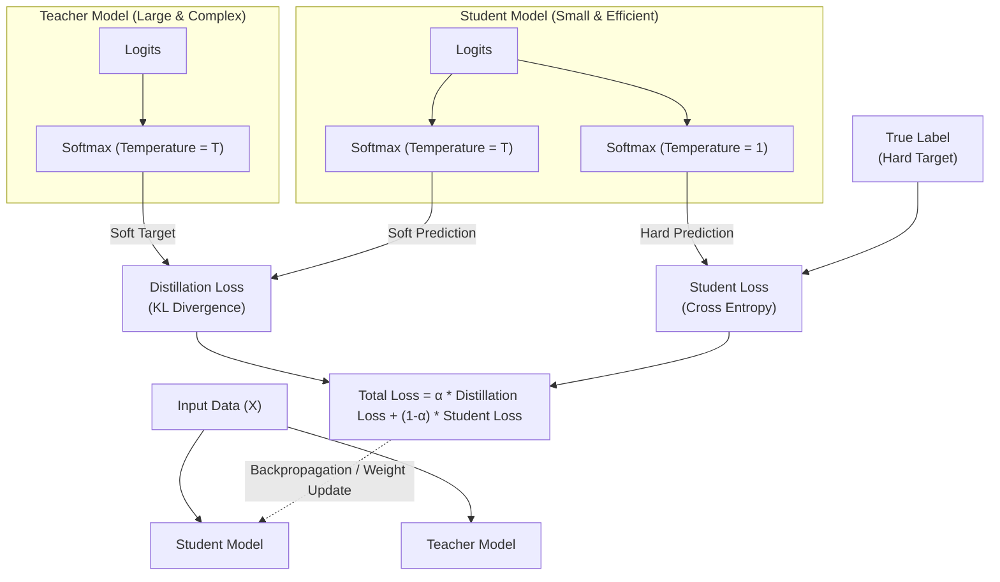

# 지식 증류 (Knowledge Distillation)

---

## I. 초거대 AI 경량화를 위한 모델 압축 기술, 지식 증류의 개요

* **정의**: 거대하고 복잡한 교사 모델(Teacher Model)이 학습한 지식을 압축하여 작고 효율적인 학생 모델(Student Model)로 전달하는 모델 경량화 및 학습 최적화 기술
* **배경**: [[초거대 언어 모델|LLM]] 등 초거대 파라미터 모델의 운영 비용 증가, 엣지([[EDGE|Edge]]) 환경 및 [[온디바이스 AI]](On-Device AI)에서의 실시간 추론 요구사항 증대
* **특징**: 암묵적 지식(Dark Knowledge) 전이, 소프트 타겟(Soft Target) 기반 [[일반화]](Generalization) 성능 향상, 물리적 구조 변경 없는 [[알고리즘]] 기반 압축

---

## II. 지식 증류의 개념도 및 핵심 기술 요소

### 가. 지식 증류의 아키텍처 및 동작 원리

* 교사 모델의 Soft Target(확률 분포)과 학생 모델의 예측 간 KL Divergence 손실, 그리고 정답 라벨과의 Cross Entropy 손실을 결합(Total Loss)하여 학생 모델의 가중치를 최적화함

### 나. 지식 증류의 핵심 구성 요소

| 구분 | 요소 기술(키워드) | 세부 설명 |
| --- | --- | --- |
| **구성 모델** | Teacher Model | 사전 학습된 파라미터 수가 많고 정확도가 높은 대형 모델 (지식 제공자) |
| **구성 모델** | Student Model | 교사 모델의 지식을 전이받아 추론을 수행하는 경량화 모델 (지식 수용자) |
| **주요 지표** | Soft Target | 온도(T)를 적용하여 정답 이외의 [[클래스]] 확률 분포(Dark Knowledge)를 보존한 값 |
| **주요 지표** | Hard Target | 실제 정답을 나타내는 One-Hot Encoding 벡터 (True Label, Ground Truth) |
| **손실 함수** | Distillation Loss | 교사와 학생의 Soft Target 분포 간의 차이 측정 (주로 KL Divergence 활용) |
| **손실 함수** | Student Loss | 학생 모델의 일반적인 예측값(T=1)과 실제 정답 간의 차이 (Cross Entropy 활용) |
| **제어 변수** | Temperature ($T$) | Softmax 출력 분포를 평활화(Smoothing)하여 정보량(Variance)의 노출을 조절하는 상수 |
| **제어 변수** | Weight ($\alpha$) | 전체 손실 함수 계산 시 Distillation Loss와 Student Loss 간의 반영 비율(가중치) |

---

## III. 지식 증류와 주요 AI 모델 경량화 기술 비교 및 동향

### 가. 지식 증류와 타 모델 경량화(Compression) 기술 비교

| 비교 항목 | 지식 증류 (Knowledge Distillation) | 프루닝 (Pruning) | 양자화 (Quantization) |
| --- | --- | --- | --- |
| **핵심 개념** | 큰 모델의 지식을 작은 모델로 학습 전이 | 중요도가 낮은 연결망(가중치/노드) 제거 | 가중치 표현 데이터 비트 수를 축소 (예: FP32 → INT8) |
| **압축 대상** | 알고리즘 및 학습 [[프로세스]] | 모델 파라미터 구조 (희소성 확보) | 데이터 타입 및 정밀도(Precision) |
| **주요 장점** | [[모델 구조]] 변경 없이 일반화 성능 유지 우수 | 모델 크기 축소 및 연산량 직접적 감소 | 연산 속도 대폭 향상 및 메모리 대역폭 최소화 |
| **주요 단점** | 교사 모델 사전 학습 및 증류에 긴 시간 소요 | 과도한 압축 시 성능 저하 (재학습 필요) | 정밀도 손실(Loss)로 인한 모델 정확도 하락 가능성 |

* **전망 및 동향**: 최근 LLM의 발전으로 프루닝, 양자화(PTQ, QAT) 기법과 지식 증류를 혼합 적용하는 하이브리드 경량화 기법이 대세로 자리 잡고 있으며, [[sLLM (Smaller Large Language Model)|sLLM]](소형 대규모 언어 모델) 구축 및 스마트폰/가전 등에 탑재되는 온디바이스 AI의 핵심 기반 기술로 적극 활용 중임

---

### 🔗 연관 토픽

- **소속 도메인**: [[00_인공지능_MOC|🤖 인공지능]]
- **세부 분류**: `4. 거대언어모델 (LLM) & 생성형 AI`
- **핵심 연관 토픽**:
  - [[온디바이스 AI]]
  - [[sLLM (Smaller Large Language Model)]]
  - [[초거대 언어 모델|초거대 언어 모델(Large Language Model)]]
  - [[파운데이션 모델|파운데이션 모델(Foundation Model)]]
  - [[전이학습|전이학습 (Transfer Learning)]]
