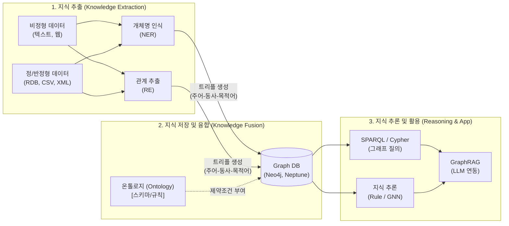

# 지식그래프 (Knowledge Graph)

---

## I. 시맨틱 연결 기반의 데이터 지식화 기술, 지식그래프의 개요

* **정의**: 실세계의 다양한 개체(Entity)와 그들 간의 관계(Relationship)를 노드(Node)와 엣지([[EDGE|Edge]])로 구성된 그래프 형태로 표현하여, 기계가 이해하고 추론할 수 있도록 구축한 지식 베이스
* **등장배경**: 기존 관계형 DB의 복잡한 [[조인|조인(Join)]] 한계 극복, 분산/사일로화된 데이터의 연결성 확보 및 의미적 검색(Semantic Search) 요구 증대
* **특징**: 트리플(Triple) 구조 기반 유연한 [[스키마]], 문서 횡단(Cross-document) 추론, [[초거대 언어 모델|LLM]] 환각(Hallucination) 방지 및 설명 가능성([[XAI]]) 제공

---

## II. 지식그래프의 아키텍처 및 핵심 기술 요소

### 가. 지식그래프의 아키텍처 및 동작 원리

* 원시 데이터에서 NLP를 통해 개체/관계를 추출하여 온톨로지 기반의 Graph DB에 저장 후, 그래프 질의와 추론을 거쳐 LLM([[GraphRAG (Graph Retrieval-Augmented Generation)|GraphRAG]]) 등에 활용하는 흐름

### 나. 지식그래프의 핵심 기술 요소

| 구분 | 요소기술(키워드) | 세부 설명 |
| --- | --- | --- |
| **지식 모델링** | Ontology (온톨로지) | 특정 도메인의 개념, 속성, 관계를 정의한 지식 스키마 (OWL 표준) |
| **지식 모델링** | RDF / Property Graph | 주어-술어-목적어의 트리플(Triple) 구조 및 속성(Key-Value) 부여 그래프 |
| **지식 추출** | NER / RE 기술 | 자연어에서 개체(Entity)와 관계(Relation)를 식별하여 자동 추출하는 NLP 기술 |
| **데이터 저장** | Graph Database | 데이터를 노드와 엣지 형태로 네이티브 저장하여 탐색 성능 극대화 (Neo4j 등) |
| **지식 질의** | SPARQL / Cypher | 지식그래프의 복잡한 연결 패턴을 탐색하고 매칭하기 위한 전용 그래프 질의어 |
| **지식 추론** | Rule-based Reasoning | 사전 정의된 논리 규칙(SWRL 등)을 기반으로 숨겨진 새로운 지식을 연역적 도출 |
| **지식 추론** | GNN (Graph Neural Network) | 그래프 구조 자체를 딥러닝으로 학습하여 노드 분류 및 링크(관계) 예측 수행 |
| **응용 기술** | GraphRAG | 지식그래프를 LLM의 검색 증강 생성(RAG)에 결합하여 환각 현상을 억제하는 기술 |

---

## III. 지식그래프 기반 검색(GraphRAG)과 일반 벡터 검색(Vector RAG) 비교 및 전망

### 가. GraphRAG vs Vector RAG 비교 (최신 LLM 활용 관점)

| 비교 항목 | Vector RAG (기존 검색 증강 생성) | GraphRAG (지식그래프 기반 검색 증강 생성) |
| --- | --- | --- |
| **데이터 표현 방식** | 텍스트 청크(Chunk)의 밀집 벡터(Vector) 임베딩 | 개체(Entity)와 관계(Relation) 기반 네트워크 |
| **검색(Retrieval) 기법** | 코사인 [[유사도]] (수학적 의미 유사성 매칭) | [[그래프 순회]](Traversal) 및 부분 그래프 매칭 |
| **추론 및 연결성** | 개별 문서/청크 간의 연결성 파악 한계 (Silo) | 다수 문서에 걸친 복잡한 다단계(Multi-hop) 추론 가능 |
| **설명 가능성(XAI)** | 출처 제시는 가능하나 정확한 추론 과정 불투명 | 노드 간 연결 경로(Path) 제공으로 논리적 근거 제시 |

### 나. 지식그래프 향후 전망 및 동향

* **Hybrid RAG 진화**: Vector Database의 의미론적 검색 속도와 Graph Database의 정확한 관계 추론 능력을 결합한 하이브리드 아키텍처 도입 가속화
* **Neuro-Symbolic AI 도약**: [[딥러닝]](신경망)의 패턴 인식 능력과 지식그래프(기호주의)의 논리적 추론 능력을 결합한 차세대 [[인공지능]] 패러다임의 핵심 인프라로 자리매김

---

### 🔗 연관 토픽

- **소속 도메인**: [[00_인공지능_MOC|🤖 인공지능]]
- **세부 분류**: `6. 설명가능한 AI (XAI) & AI 윤리 · 거버넌스`
- **핵심 연관 토픽**:
  - [[XAI]]
  - [[인공지능]]
  - [[GraphRAG (Graph Retrieval-Augmented Generation)]]
  - [[초거대 언어 모델|초거대 언어 모델(Large Language Model)]]
  - [[딥러닝]]
