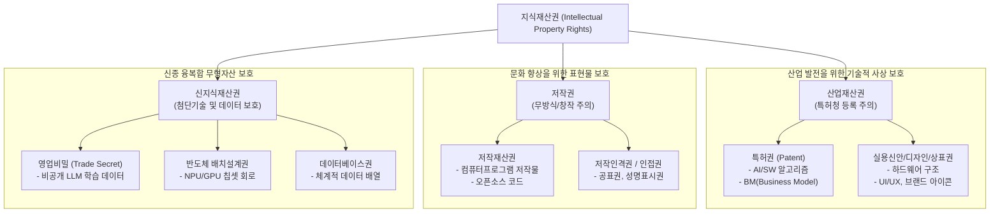

# 지식재산권 (Intellectual Property Rights)

---

## I. 4차 산업혁명 시대 무형자산 보호의 핵심 기제, 지식재산권의 개요

* **정의**: 인간의 지적 창작 활동을 통해 창출된 무형의 결과물이나 영업상의 표지에 대해 법령에 의해 부여되는 배타적이고 독점적인 재산적 권리
* **등장배경**: SW 및 AI 산업의 가치 중심이 유형 자산에서 무형 자산([[알고리즘]], 데이터, 소스코드)으로 이동, 기술 탈취 방지 및 창작 의욕 고취 필요성 증대
* **특징**: 무체재산권(형체가 없음), 배타적 독점권(타인의 무단 사용 금지), 보호 기간의 제한(발명 20년, 저작물 사후 70년 등), 아이디어-표현 이분법(Idea-Expression Dichotomy) 적용

---

## II. 지식재산권의 개념도 및 핵심 구성 요소

### 가. 지식재산권의 분류 및 IT/AI 기술 매핑 개념도

* IT 환경에서 SW는 '컴퓨터프로그램 저작물(표현)'과 'BM/소프트웨어 특허(아이디어)'로 중복 보호되며, 최근 AI 학습 데이터는 '영업비밀' 및 '데이터베이스권'으로 보호되는 추세임

### 나. 지식재산권의 핵심 구성 요소

| 구분 | 요소 권리(키워드) | 세부 설명 |
| --- | --- | --- |
| **산업재산권** | 특허권 (Patent) | 자연법칙을 이용한 기술적 사상의 창작(고도성 요구), 신규성/진보성/산업상 이용가능성 필수 |
| **산업재산권** | 상표권 (Trademark) | 자타의 상품을 식별하기 위한 기호, 문자, 도형. 10년 단위 갱신으로 반영구적 브랜드 보호 |
| **저작권** | 컴퓨터프로그램 저작물 | 특정한 결과를 얻기 위해 컴퓨터 등에서 작동하는 지시/명령의 집합 (소스코드 자체를 보호) |
| **저작권** | 2차적 저작물 작성권 | 원저작물을 번역, 편곡, 변형, 각색 등의 방법으로 작성한 창작물에 대한 독자적 권리 |
| **신지식재산권** | 영업비밀 (Trade Secret) | 비공지성, 경제적 유용성, 비밀관리성을 모두 갖춘 기술상/경영상의 정보 보호 |
| **신지식재산권** | 데이터베이스권 (DB권) | 소재의 선택이나 배열에 창작성이 있는 데이터 집합체의 제작자 권리 보호 |
| **신지식재산권** | 반도체 배치설계권 | 반도체 집적회로를 제조하기 위해 회로소자 및 도선을 평면/입체적으로 배치한 설계물 보호 |
| **기타 권리** | 퍼블리시티권 / 부정경쟁 | 성명, 초상 등의 상업적 이용 권리 ([[딥페이크]] 악용 방지) 및 타인 성과물(데이터 무단 크롤링) 도용 방지 |

---

## III. SW 보호 관점의 특허권과 저작권 비교 및 최신 동향

### 가. IT 자산 보호를 위한 특허권과 저작권 비교

| 비교 항목 | SW 특허권 (Patent) | 컴퓨터프로그램 저작권 (Copyright) |
| --- | --- | --- |
| **보호 대상** | 알고리즘, 비즈니스 모델, 아이디어 자체 | 소스코드, 오브젝트 코드 등 구체적 표현물 |
| **권리 발생 요건** | 특허청 심사 및 등록주의 (요건 충족 필수) | 창작한 시점에 자동 발생 (무방식주의) |
| **핵심 성립 요건** | 신규성, 진보성, 산업상 이용 가능성 | 창작성 (타인의 것을 베끼지 않음) |
| **권리 존속 기간** | 특허 출원일로부터 20년 | 저작자 생존 기간 및 사후 70년 |
| **침해 판단 기준** | 균등론 (실질적으로 동일한 기술 사상인가) | 실질적 유사성 및 의거성 (보고 베꼈는가) |

### 나. AI 시대 지식재산권 주요 쟁점 및 동향

* **AI 생성물의 저작권 주체성**: 현행법상 지식재산권은 '인간의 창작물'에 한정되므로 프롬프트 입력만으로 생성된 AI 결과물은 저작권 불인정 원칙 (단, 인간의 실질적 기여도에 따라 제한적 인정 논의 중)
* **TDM (Text and [[데이터 마이닝|Data Mining]]) 면책 도입 논의**: 초거대 AI 학습을 위해 웹 데이터를 무단 크롤링하는 과정에서의 저작권 침해 분쟁을 막기 위해, 상업적/비상업적 데이터 마이닝의 '공정이용(Fair Use)' 면책 규정(저작권법 개정) 입법화 추진 중

---

### 🔗 연관 토픽

- **소속 도메인**: [[00_경영전략_MOC|📈 경영전략]]
- **세부 분류**: `5. IT 투자 성과 평가 & 비즈니스 연속성 계획 (BCP)`
- **핵심 연관 토픽**:
  - [[데이터 마이닝|Data Mining (데이터 마이닝)]]
  - [[알고리즘]]
  - [[딥페이크|딥페이크(Deepfake)]]
  - [[딥테크|딥테크 (Deep Tech)]]
  - [[엠비언트 커머스|엠비언트 커머스 (Ambient Commerce)]]
