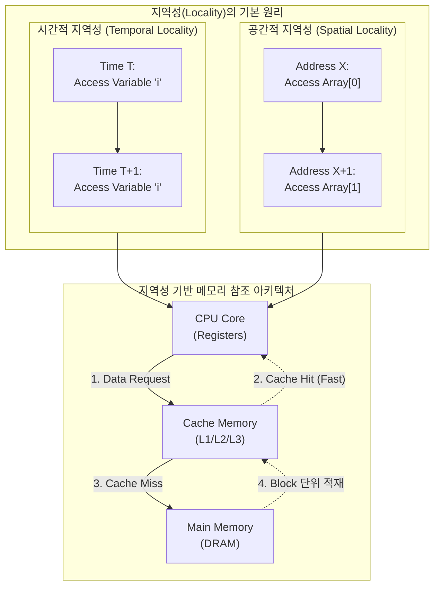

# 지역성 (Locality)

---

## I. 메모리 계층 구조 최적화의 핵심 원리, 지역성의 개요

* **정의**: 프로세서가 짧은 시간 동안 동일한 메모리 위치나 인접한 메모리 위치를 반복적으로 참조하는 컴퓨터 프로그램의 실행 특성(Locality of Reference)
* **필요성**: 폰 노이만 병목 현상([[CPU]]와 메모리 간 속도 차이) 극복, 캐시 적중률(Cache Hit Ratio) 극대화를 통한 시스템 전체 성능 향상
* **특징**: 시간적/공간적 메모리 참조 편향성 존재, 메모리 계층 구조(Memory Hierarchy) 설계의 근간, 워킹 셋(Working Set) 형성

---

## II. 지역성의 개념도 및 핵심 기술 요소

### 가. 지역성의 개념도 및 동작 원리

* 프로그램 실행 시 자주 쓰이는 데이터(시간적)와 인접한 데이터(공간적)를 상위 메모리(캐시)에 블록 단위로 미리 적재하여 CPU 대기 시간(Latency)을 최소화함

### 나. 지역성의 핵심 분류 및 구성 요소

| 구분 | 요소기술(키워드) | 세부 설명 |
| --- | --- | --- |
| **핵심 유형** | 시간적 지역성 (Temporal) | 한 번 참조된 데이터가 가까운 미래에 다시 참조될 가능성 (예: Loop 제어 변수, [[Stack]]) |
| **핵심 유형** | 공간적 지역성 (Spatial) | 참조된 데이터와 인접한 주소의 데이터가 참조될 가능성 (예: Array, 순차적 접근 코드) |
| **핵심 유형** | 순차적 지역성 (Sequential) | 분기(Branch)가 발생하지 않는 한 명령어들이 기억장치에 저장된 순서대로 실행되는 특성 |
| **성능 지표** | 캐시 적중률 (Hit Ratio) | CPU가 요청한 데이터가 캐시 메모리에 존재하는 비율 (지역성이 높을수록 적중률 상승) |
| **하드웨어 기법** | 프리패칭 (Prefetching) | 공간적 지역성을 활용하여 미래에 사용될 데이터를 메인 메모리에서 캐시로 선탑재하는 기법 |
| **[[OS(운영체제)|운영체제]] 기법** | 워킹 셋 (Working Set) | 프로세스가 일정 시간 동안 집중적으로 참조하는 페이지 집합 (스래싱/Thrashing 방지 목적) |
| **분산 환경** | 지리적 지역성 (Geographic) | 사용자와 데이터 간의 물리적 거리 최소화 ([[CDN]], [[EDGE|Edge]] Computing 환경에서 활용) |
| **빅데이터 처리** | 데이터 지역성 (Data Locality) | [[하둡]]([[HDFS]]), 스파크 등에서 네트워크 I/O 최소화를 위해 데이터가 있는 노드에서 연산 수행 |

---

## III. 지역성 적용 기술 범위 및 최신 아키텍처 동향

### 가. IT 인프라 계층별 지역성 적용 기술 동향

| 계층 (Layer) | 적용 기술 및 아키텍처 | 주요 활용 목적 및 특징 |
| --- | --- | --- |
| **HW / 서버 계층** | **NUMA (Non-Uniform Memory Access)** | 멀티 프로세서 환경에서 자신의 로컬 메모리에 빠르게 접근하도록 공간/물리적 지역성 극대화 |
| **[[네트워크 계층]]** | **MEC ([[Mobile Edge Computing]]) / CDN** | 물리적 데이터 센터의 위치를 엔드포인트(사용자)에 가깝게 배치하여 지리적 지역성 확보 |
| **데이터 플랫폼** | **하둡 랙 인식(Rack Awareness)** | 데이터 블록의 물리적 위치(Data Locality)를 고려하여 분산 처리 태스크를 할당해 병목 해소 |
| **AI / [[GPU]] 연산** | **타일링(Tiling) 및 공유 메모리 최적화** | [[초거대 언어 모델|LLM]] 및 [[딥러닝]] 행렬 곱셈 시 데이터 재사용성을 높이기 위해 텐서 코어 내 시간적 지역성 활용 |

* **향후 전망**: [[클라우드 네이티브]] 환경 및 대규모 AI 학습 환경에서는 메모리 장벽(Memory Wall) 해소를 위해, 단순히 하드웨어 캐시 구조를 넘어 소프트웨어(컴파일러, [[DBMS]]) 및 분산 네트워크 차원에서 지역성을 인지(Locality-Aware)하고 최적화하는 [[스케줄링]] 알고리즘이 필수적으로 요구됨

---

### 🔗 연관 토픽

- **소속 도메인**: [[00_운영체제_MOC|⚙️ 운영체제]]
- **세부 분류**: `6. 커널 아키텍처 & 입출력 시스템`
- **핵심 연관 토픽**:
  - [[CPU]]
  - [[하둡]]
  - [[HDFS]]
  - [[기억장치 계층 구조|기억장치 계층 구조 (Memory Hierarchy)]]
  - [[OS(운영체제)]]
