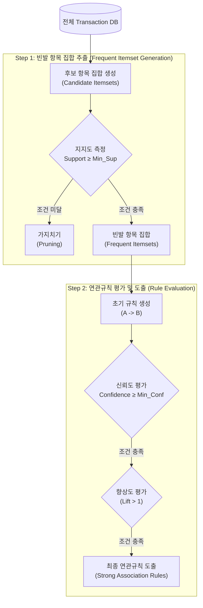

# 지지도 (Support)

---

## I. 연관규칙 마이닝의 핵심 평가 지표, 지지도의 개요

* **정의**: 대규모 데이터베이스의 전체 [[트랜잭션]](거래) 중 특정 항목 집합(Itemset) A와 B가 동시에 포함된 트랜잭션의 비율을 의미하는 빈도 기반 패턴 평가 지표
* **목적 및 필요성**: 전체 데이터 내 패턴의 절대적 보편성 검증, 최소 지지도(Minimum Support) 설정을 통한 무의미한 연관규칙 탐색 배제(Pruning) 및 연산 복잡도 감소
* **특징**: 신뢰도(Confidence), 향상도(Lift)와 함께 활용되어 장바구니 분석(Market Basket Analysis) 및 초개인화 추천 시스템의 핵심 근간 알고리즘으로 작용함

---

## II. 지지도 기반 연관규칙 알고리즘의 개념도 및 핵심 기술 요소

### 가. 지지도를 활용한 빈발 항목 집합 및 연관규칙 생성 개념도

* 전체 데이터베이스에서 지지도 기반 가지치기를 통해 연산량을 줄인 후, 도출된 빈발 항목 집합을 대상으로 신뢰도와 향상도를 검증하여 유의미한 최종 규칙을 산출함

### 나. 지지도 및 연관규칙 핵심 구성 요소

| 구분 | 요소기술(키워드) | 세부 설명 |
| --- | --- | --- |
| **기본 지표** | 지지도 (Support) | 전체 거래 중 A와 B가 동시에 포함된 비율 ($P(A \cap B)$) |
| **기본 지표** | 신뢰도 (Confidence) | A를 포함하는 거래 중 B도 포함하는 거래의 비율, 조건부 확률 ($P(B \vert A)$) |
| **기본 지표** | 향상도 (Lift) | A와 B가 독립적일 때의 기대 지지도 대비 실제 지지도의 비율 ($P(A \cap B)/(P(A)P(B))$) |
| **제어 파라미터** | 최소 지지도 (Min_Sup) | 유의미한 연관규칙을 필터링하기 위해 분석가가 사전에 설정하는 하한 임계값 |
| **핵심 [[알고리즘]]** | [[Apriori 알고리즘]] | 항목 집합의 크기를 1씩 늘려가며 최소 지지도를 넘는 빈발 집합을 찾는 고전 알고리즘 |
| **핵심 알고리즘** | FP-Growth 알고리즘 | Tree 구조를 활용하여 전체 DB 스캔 횟수를 최소화하고 지지도 산출 속도를 대폭 개선한 알고리즘 |
| **최적화 기법** | 가지치기 (Pruning) | 특정 집합의 지지도가 최소 지지도보다 낮으면 그 상위 집합도 빈발하지 않음을 이용해 연산량 축소 |
| **응용 모델** | 협업 필터링 (CF) | 도출된 연관규칙을 이커머스 추천 시스템의 모델 기반 협업 필터링에 결합하여 예측력 향상 |

---

## III. 지지도 중심의 연관규칙 평가지표 비교 및 최신 동향

### 가. 연관규칙 핵심 평가지표 비교 (지지도, 신뢰도, 향상도)

| 비교 항목 | 지지도 (Support) | 신뢰도 (Confidence) | 향상도 (Lift) |
| --- | --- | --- | --- |
| **수식** | $P(A \cap B)$ | $P(B \vert A) = \frac{P(A \cap B)}{P(A)}$ | $\frac{P(A \cap B)}{P(A) \times P(B)}$ |
| **핵심 개념** | 전체 트랜잭션 내 **발생 빈도** | A 구매 시 B의 **조건부 확률** | 우연적 발생을 통제한 **실질적 상관관계** |
| **평가 목적** | 빈도가 낮아 가치가 없는 규칙 사전 제거 | A가 B를 수반하는 확실성 및 예측력 측정 | 두 항목 간의 양/음의 상관관계 판별 |
| **해석 기준** | 1.0에 가까울수록 보편적 규칙 | 1.0에 가까울수록 인과성/연관성 큼 | 1 초과: 양(+)의 상관, 1 미만: 음(-)의 상관 |

### 나. 지지도 기반 알고리즘의 향후 전망 및 기술 동향

* **빅데이터 기반 대규모 분산 처리**: 수천만 건 이상의 트랜잭션 환경에서 병목 현상을 해소하기 위해 Apache Spark MLlib 등 인메모리 분산 플랫폼 기반의 병렬 FP-Growth 처리가 주류로 자리잡음
* **추천 알고리즘(RecSys) 고도화 및 하이브리드 결합**: 기존 단순 장바구니 지지도 분석을 넘어 [[딥러닝]] 기반의 Graph Neural Networks(GNN)와 결합하여 숨겨진 롱테일(Long-tail) 패턴까지 추론하는 초개인화 추천 시스템으로 진화하고 있음

---

### 🔗 연관 토픽

- **소속 도메인**: [[00_인공지능_MOC|🤖 인공지능]]
- **세부 분류**: `6. 설명가능한 AI (XAI) & AI 윤리 · 거버넌스`
- **핵심 연관 토픽**:
  - [[Apriori 알고리즘]]
  - [[통계 데이터 마이닝|통계데이터마이닝 (연관규칙 & 베이즈)]]
  - [[딥러닝]]
  - [[비지도 학습]]
  - [[연관성 분석]]
