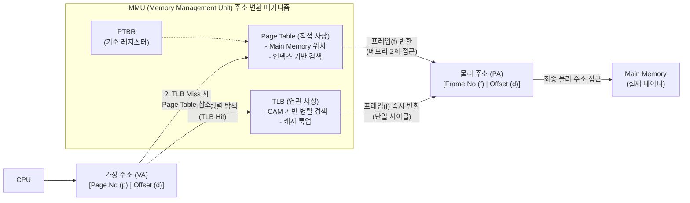

# 직접 사상과 연관 사상 페이징 기법

---

## I. 가상 메모리 주소 변환의 핵심, 직접/연관 사상 페이징의 개요

* **정의**: [[CPU]]가 생성한 논리적 가상 주소(Virtual Address)를 실제 [[물리 주소]](Physical Address)로 변환하기 위해, 메인 메모리의 페이지 테이블을 참조(직접 사상)하거나 고속의 캐시 메모리인 TLB를 활용(연관 사상)하는 [[메모리 관리]] 기법
* **배경 및 필요성**: 직접 사상 방식은 메모리에 2번 접근해야 하는 병목 현상(Overhead) 발생, 이를 해결하기 위해 [[지역성|지역성(Locality)]] 기반의 고속 연관 메모리(CAM)를 활용한 연관 사상 도입
* **특징**: 현대 시스템의 MMU([[MMU(Memory Management Unit)|Memory Management Unit]])는 성능과 비용의 최적화를 위해 두 기법을 결합한 **연관/직접 매핑(하이브리드)** 방식을 기본 채택함

---

## II. 직접 사상 및 연관 사상 페이징의 아키텍처 및 핵심 기술 요소

### 가. 페이징 주소 변환 아키텍처 및 동작 원리

* CPU가 가상 주소 요청 시 먼저 고속의 TLB(연관 사상)를 병렬 탐색하고, TLB Miss 발생 시 메인 메모리의 페이지 테이블(직접 사상)을 순차 탐색하여 물리 주소로 변환하는 구조

### 나. 직접/연관 사상 페이징의 핵심 기술 요소

| 구분 | 요소기술(키워드) | 세부 설명 |
| --- | --- | --- |
| **직접 사상** | Page Table | 논리적 페이지 번호를 물리적 프레임 번호로 매핑하는 메모리 내 자료구조 |
| **직접 사상** | PTBR | 페이지 테이블 기준 레지스터 (Page Table Base Register), 테이블 시작 주소 저장 |
| **직접 사상** | 인덱싱 (Indexing) | 페이지 번호(p)를 오프셋으로 사용하여 테이블 항목에 O(1)으로 직접 접근하는 방식 |
| **연관 사상** | TLB | 주소 변환 캐시(Translation Lookaside Buffer), 빈번히 접근하는 페이지 정보 저장 |
| **연관 사상** | CAM | 내용 주소화 메모리(Content Addressable Memory), 주소가 아닌 데이터 내용으로 병렬 검색 |
| **평가 지표** | Hit Ratio (적중률) | 가상 주소 변환 시 TLB에서 프레임 번호를 성공적으로 찾은 비율 (성능 직결) |
| **평가 지표** | EAT | 유효 접근 시간(Effective Access Time), TLB Hit/Miss 확률을 고려한 평균 메모리 접근 시간 |
| **최적화 기법** | 지역성 (Locality) | 시간적/공간적 지역성을 활용하여 소규모 TLB만으로도 90% 이상의 적중률 확보 |

---

## III. 직접 사상과 연관 사상의 비교 및 최신 메모리 관리 동향

### 가. 직접 사상과 연관 사상 페이징 기법 비교

| 비교 항목 | 직접 사상 (Direct Mapping) | 연관 사상 (Associative Mapping) |
| --- | --- | --- |
| **매핑 위치** | 메인 메모리 (Main Memory) 내 페이지 테이블 | CPU 내 MMU의 고속 캐시 (TLB) |
| **검색 방식** | 페이지 번호를 활용한 순차/인덱스 검색 | CAM을 이용한 병렬 내용 검색 (Parallel Search) |
| **메모리 접근** | 2회 접근 (페이지 테이블 1회 + 실제 데이터 1회) | 1회 접근 (TLB Hit 시 실제 데이터 1회만 접근) |
| **구축 비용** | 메인 메모리를 활용하므로 하드웨어 비용 저렴 | 고가의 CAM 소자 사용으로 인한 비용 증가 (용량 제한) |
| **변환 속도** | 상대적으로 느림 (메모리 I/O 병목 발생) | 매우 빠름 (단일/수 사이클 내 변환 완료) |

### 나. 주소 변환 아키텍처 향후 전망 및 최신 기술 동향

* **대용량 페이지(HugePages) 도입**: 4KB 기본 페이지 사이즈를 2MB, 1GB 단위로 확장하여 단일 TLB 엔트리가 커버하는 메모리 영역을 넓혀 TLB Miss를 획기적으로 줄이는 기술([[데이터베이스]], 빅데이터 분산 처리 환경에 필수 적용)
* **하드웨어 [[가상화]] 지원 MMU (EPT/NPT)**: 클라우드 하이퍼바이저 환경에서 발생하는 'Guest 가상 주소 $\rightarrow$ Guest 물리 주소 $\rightarrow$ Host 물리 주소'의 2차원 페이징 변환 오버헤드를 줄이기 위해 인텔 EPT(Extended Page Tables) 등 하드웨어 가속 기술 발전
* **다단계 페이지 테이블 진화**: 64비트 주소 공간 확장에 따라 페이지 테이블의 메모리 낭비를 막기 위해 4-Level(기존)에서 5-Level Paging(Intel 5-Level Paging) 구조로 아키텍처가 고도화 중임

---

### 🔗 연관 토픽

- **소속 도메인**: [[00_운영체제_MOC|⚙️ 운영체제]]
- **세부 분류**: `5. 가상 메모리 관리 & 페이지 교체 알고리즘`
- **핵심 연관 토픽**:
  - [[물리 주소]]
  - [[메모리 관리]]
  - [[MMU(Memory Management Unit)]]
  - [[CPU]]
  - [[지역성|지역성(Locality)]]
