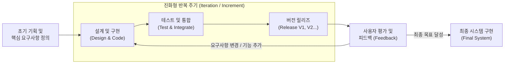

# 진화형 개발 모델 (Evolutionary Model)

---

## I. 유연한 요구사항 수용, 진화형 개발 모델의 개요

* **정의**: 초기 요구사항이 불명확한 상태에서 핵심 기능을 먼저 개발하고, 지속적인 사용자 피드백을 수용하여 시스템을 점진적, 반복적으로 확장해 나가는 소프트웨어 생명주기([[SDLC]]) 모델
* **등장배경**: [[워터폴|폭포수]](Waterfall) 모델의 경직성 한계 노출, 비즈니스 환경의 급격한 변화에 따른 요구사항 [[변동성]] 증가, 리스크 조기 식별 필요성 대두
* **특징**: 점증적(Incremental) 및 반복적(Iterative) 개발 병행, 사용자 피드백 중심, 릴리즈(버전) 단위의 지속적 가치 제공, 타임 투 마켓(Time-to-Market) 단축

---

## II. 진화형 개발 모델의 개념도 및 핵심 구성 요소

### 가. 진화형 개발 모델의 프로세스 개념도

* 시스템 전체를 한 번에 구축하지 않고, 다수의 릴리즈 주기를 거치며 피드백 기반으로 시스템의 기능과 품질을 고도화함

### 나. 진화형 개발 모델의 핵심 기술 요소

| 구분 | 요소기술(키워드) | 세부 설명 |
| --- | --- | --- |
| **핵심 접근법** | 반복형 (Iterative) | 전체 시스템의 뼈대(초기 버전)를 먼저 만들고, 반복을 통해 디테일과 품질을 고도화하는 방식 |
| **핵심 접근법** | 점증형 (Incremental) | 독립적인 기능 모듈 단위로 쪼개어 하나씩 순차적으로 완성 및 추가해 나가는 방식 |
| **요구사항 관리** | 제품 백로그 (Product Backlog) | 개발해야 할 기능, 버그 수정, 비기능 요구사항 등을 우선순위화하여 관리하는 목록 |
| **위험 관리** | 프로토타이핑 (Prototyping) | 본격적 개발 전 UI/UX 및 핵심 알고리즘을 모형으로 제작하여 타당성을 조기 검증 |
| **구현 프랙티스** | 타임박싱 (Time-boxing) | 각 반복 주기를 1~4주의 고정된 시간(Sprint)으로 제한하여 일정 지연을 방지하는 기법 |
| **최신 통합 기술** | CI/CD 파이프라인 | 잦은 릴리즈로 인한 빌드/테스트/배포 오버헤드를 줄이기 위한 자동화 파이프라인 |
| **아키텍처** | [[MSA (Micro Service Architecture)|MSA]] (Microservices) | 점진적 배포 및 변경 영향도를 최소화하기 위해 결합도를 낮춘 독립적 서비스 아키텍처 |
| **비즈니스 연계** | [[01_IT Tech/MVP]] (최소 기능 제품) | [[린 방법론|Lean]] Startup 개념과 결합, 가설 검증을 위한 최소한의 기능만 포함된 제품을 조기 출시 |

---

## III. 진화형 모델과 폭포수 모델 비교 및 최신 동향

### 가. 진화형 모델과 폭포수 모델 비교

| 비교 항목 | 진화형 모델 (Evolutionary) | [[폭포수 모델]] (Waterfall) |
| --- | --- | --- |
| **요구사항 변경** | 수용 용이 (변화를 기본 전제로 함) | 수용 곤란 (초기 확정 후 동결) |
| **시스템 인도 시점** | 주기적, 다수 릴리즈 (가치 조기 실현) | 프로젝트 최종 단계 단일 릴리즈 |
| **리스크 통제** | 조기 식별 및 통제 가능 (피드백 기반) | 프로젝트 후반부(테스트 단계) 집중 |
| **적합한 프로젝트** | 요구사항 가변성이 큰 혁신적 IT 서비스 | 요구사항이 명확하고 안정적인 차세대/SI |

### 나. 진화형 모델의 발전 및 최신 동향

* **애자일([[Agile]]) 철학의 근간**: 현대의 [[SCRUM|Scrum]], Kanban 등 애자일 방법론은 진화형 개발 모델을 모태로 하여 조직 문화와 실무 프랙티스로 발전한 형태임
* **[[DevOps]] 체계와의 결합**: 잦은 반복과 릴리즈를 완벽히 지원하기 위해 개발(Dev)과 운영(Ops)의 경계를 허무는 DevOps 기반 [[클라우드 네이티브]] 환경([[컨테이너]], [[쿠버네티스]])이 진화형 모델 구현의 표준 인프라로 정착됨

---

### 🔗 연관 토픽

- **소속 도메인**: [[00_소프트웨어공학_MOC|🏗️ 소프트웨어공학]]
- **세부 분류**: `1. 소프트웨어 개발 생명주기(SDLC) & 방법론`
- **핵심 연관 토픽**:
  - [[SDLC]]
  - [[폭포수 모델]]
  - [[Agile]]
  - [[클라우드 네이티브]]
  - [[MSA (Micro Service Architecture)]]
