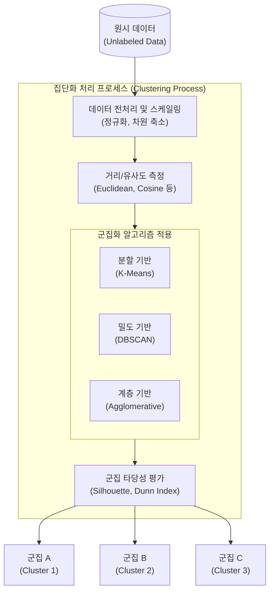

# 집단화 (Clustering)

---

## I. 비지도 학습 기반 데이터 마이닝의 핵심, 집단화의 개요

* **정의**: 사전에 정의된 레이블(Label) 없이 데이터 객체들 간의 유사성(Similarity) 또는 거리를 바탕으로 동일한 성격을 지닌 그룹(Cluster)으로 묶는 [[비지도 학습]](Unsupervised Learning) 기법
* 탐색적 데이터 분석([[EDA]]) 과정에서 데이터 내 숨겨진 구조나 패턴을 파악하여 고객 세분화, 이상 탐지 등에 널리 활용됨
* **특징**:
* **비지도 학습**: 목표 변수(Target Variable) 없이 입력 데이터의 특성만으로 학습 수행
* **최적화 목표**: 군집 내 [[응집도]](Cohesion)를 최대화하고, 군집 간 분리도(Separation)를 최대화함

---

## II. 집단화의 개념도 및 핵심 기술 요소

### 가. 집단화의 개념도 및 동작 원리

* 원시 데이터의 특성(Feature) 간 거리를 측정하고, 선택된 알고리즘을 통해 그룹화한 뒤 실루엣 계수 등을 통해 군집의 타당성을 검증함

### 나. 집단화의 핵심 기술 및 구성 요소

| 분류 | 요소기술(키워드) | 세부 설명 |
| --- | --- | --- |
| **[[알고리즘]]** | **K-Means (분할 기반)** | - 사전에 지정된 K개의 중심점(Centroid)과 각 데이터 간의 거리를 최소화하는 방식으로 군집화- 계산이 빠르나 이상치에 민감하고 K값 선정이 중요함 |
| **알고리즘** | **[[DBSCAN(밀도 기반 클러스터링)|DBSCAN]] (밀도 기반)** | - 특정 반경(Eps) 내에 있는 최소 데이터 수(MinPts)를 기준으로 밀도가 높은 영역을 연결하여 군집 구성- 형태가 불규칙한 군집 탐지 및 노이즈([[이상치]]) 처리에 강함 |
| **알고리즘** | **Hierarchical (계층 기반)** | - 덴드로그램(Dendrogram)을 사용하여 상향식(Agglomerative) 또는 하향식(Divisive)으로 군집을 병합/분할- 사전에 군집 수를 지정할 필요가 없음 |
| **거리 측도** | **유클리디안 거리 (Euclidean)** | - n차원 공간에서 두 점 사이의 가장 짧은 직선 거리를 측정 (L2 Norm) |
| **거리 측도** | **코사인 [[유사도]] (Cosine)** | - 두 벡터 사이의 사잇각을 기반으로 방향성의 유사도를 측정 (텍스트/임베딩 분석에 주로 활용) |
| **거리 측도** | **맨해튼 거리 (Manhattan)** | - 격자(Grid) 구조에서 축을 따라 이동하는 절대값 거리의 합 (L1 Norm) |
| **평가 지표** | **실루엣 계수 (Silhouette)** | - 군집 내의 데이터 응집도와 타 군집 간의 분리도를 동시에 평가하는 지표- -1에서 1 사이의 값을 가지며, 1에 가까울수록 군집화가 잘 된 것으로 평가 |
| **평가 지표** | **Dunn [[RDBMS 인덱스(index)|Index]]** | - 서로 다른 군집 간의 최소 거리와 동일 군집 내의 최대 거리(지름)의 비율로 평가 (클수록 우수) |

---

## III. 집단화와 분류(Classification) 비교 및 향후 동향

### 가. 집단화 vs 분류 기술 비교

| 비교 항목 | 집단화 (Clustering) | 분류 (Classification) |
| --- | --- | --- |
| **학습 방식** | 비지도 학습 (Unsupervised Learning) | 지도 학습 (Supervised Learning) |
| **데이터 형태** | 레이블(정답)이 없는 데이터 | 레이블(정답)이 포함된 데이터 |
| **주요 목적** | 데이터 내 숨겨진 구조/패턴 발견 및 그룹화 | 새로운 데이터의 [[클래스]](Class) 예측 |
| **대표 알고리즘** | K-Means, DBSCAN, 계층적 군집화, GMM | [[서포트 벡터 머신|SVM]], Decision Tree, Random Forest, KNN |
| **주요 활용 분야** | 고객 세분화(Segmentation), 이상치 탐지, 추천 | 스팸 메일 필터링, 이미지 인식, 신용 평가 |

### 나. 집단화 기술의 최신 동향 및 향후 전망

* **딥클러스터링(Deep Clustering) 적용**: 고차원/비정형 데이터(이미지, 텍스트)의 차원 저주(Curse of Dimensionality) 문제를 해결하기 위해 오토인코더(AutoEncoder) 기반의 [[딥러닝]] 잠재 공간(Latent Space)에서 군집화를 수행하는 기법 확산
* **[[초거대 언어 모델|LLM]] 임베딩 기반 의미론적 군집화**: 대형언어모델(LLM)이 생성한 고품질 텍스트 임베딩 벡터를 코사인 유사도로 군집화하여, RAG(검색 증강 생성) 시스템의 검색 정확도를 높이거나 토픽 모델링을 고도화하는 데 핵심적으로 활용됨

---

### 🔗 연관 토픽

- **소속 도메인**: [[00_데이터베이스_MOC|🗄️ 데이터베이스]]
- **세부 분류**: `2. 트랜잭션 & 동시성 제어 (Concurrency)`
- **핵심 연관 토픽**:
  - [[RDBMS 인덱스(index)]]
  - [[이상치]]
  - [[유사도|유사도(Similarity)]]
  - [[서포트 벡터 머신|서포트 벡터 머신 SVM(Support Vector Machine)]]
  - [[비지도 학습]]
