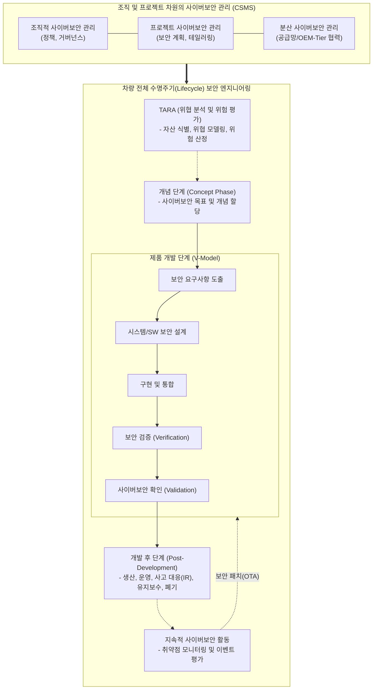

# 차량 사이버 보안 국제 표준 (ISO/SAE 21434)

---

## I. 차량 라이프사이클 전반의 보안 가이드, ISO 21434의 개요

* **정의**: 커넥티드 카, 자율주행차의 기획, 설계, 구현, 운영, [[유지보수]], 폐기 등 전체 수명주기(Lifecycle)에 걸쳐 사이버 보안 위험을 관리하기 위한 자동차 사이버 보안 엔지니어링 국제 표준
* **등장배경**: SDV(Software Defined Vehicle) 확산 및 V2X 통신 증가로 인한 차량 해킹 위협 증대, 공급망(Supply Chain) 전반의 보안 책임 불명확성 해소 필요
* **특징**: 전체 수명주기 기반(Lifecycle Approach), TARA(위협 분석 및 위험 평가) 활용, UN ECE R155(CSMS) 규제 대응을 위한 핵심 컴플라이언스로 작용함

---

## II. ISO 21434의 개념도 및 핵심 구성 요소

### 가. ISO 21434의 아키텍처 및 핵심 프로세스 개념도

* CSMS(사이버보안 관리 체계) 거버넌스 하에, 기획 단계의 TARA를 시작으로 V-모델 기반의 보안 개발과 운영/폐기까지의 전 생애주기 보안 엔지니어링 수행

### 나. ISO 21434의 핵심 기술/프로세스 요소

| 구분 | 요소기술(키워드) | 세부 설명 |
| --- | --- | --- |
| **위험 평가** | TARA (Threat Analysis and Risk Assessment) | 보호 자산 식별, 위협 시나리오 도출, 공격 잠재력 평가를 통해 사이버보안 위험도를 산정하는 기법 |
| **관리 체계** | CSMS (Cyber Security Management System) | 차량 사이버보안을 위한 조직의 정책, [[프로세스]], 책임 등 전반적인 관리 체계 (UN R155 핵심) |
| **공급망 보안** | 분산 사이버보안 관리 (Distributed) | OEM(완성차)과 Tier 1, 2(부품사) 간의 보안 역할과 책임(CIAS 등)을 규정하는 상호 계약 및 인터페이스 |
| **개념 설계** | 사이버보안 목표 (Cybersecurity Goal) | TARA 분석 결과를 바탕으로 도출된 위험을 완화(Mitigation)하기 위한 최상위 보안 요구사항 |
| **개발 검증** | V-Model 기반 엔지니어링 | 좌측(설계/구현)의 보안 요구사항이 우측(검증/확인)에서 펜테스트(Pen-Test), 퍼징(Fuzzing) 등으로 검증됨 |
| **사후 관리** | 사고 대응 (Incident Response, IR) | 차량 양산 이후 발견된 신규 보안 취약점 및 해킹 사고에 대한 지속적인 모니터링 및 대응 체계 |
| **사후 관리** | End of Support / Decommissioning | 차량의 수명 종료 및 폐기 시 개인정보 및 [[암호화]] 키 등 민감 데이터의 안전한 파기 프로세스 |
| **업데이트** | OTA 연계 (Over-The-Air) | 식별된 취약점을 해결하기 위해 무선 SW 업데이트를 안전하게 배포하는 체계 (UN R156 SUMS와 연계) |

---

## III. 차량 안전/보안 국제 표준 비교 및 향후 전망

### 가. ISO 21434 (보안) vs ISO 26262 (안전) 비교

| 비교 항목 | ISO 21434 (Cybersecurity) | [[ISO 26262]] (Functional Safety) |
| --- | --- | --- |
| **핵심 목적** | 악의적인 **사이버 공격(해킹)**으로부터 차량/승객 보호 | 시스템 오류나 하드웨어 **무작위 고장**으로 인한 사고 방지 |
| **분석 방법론** | **TARA** (위협 분석 및 위험 평가) | **HARA** (위험원 분석 및 리스크 평가) |
| **보안/안전 등급** | **CAL** (Cybersecurity Assurance Level) 적용 | **[[ASIL]]** (Automotive Safety Integrity Level) 적용 |
| **라이프사이클** | 양산 후에도 신규 취약점 모니터링 등 **동적(지속적) 관리** | 개발 및 양산 완료 시점에서 비교적 **정적(Static) 완료** |

### 나. 차량 사이버 보안의 향후 전망 및 동향

* **글로벌 규제 의무화**: 유럽 연합(UNECE WP.29)은 UN R155(CSMS) 및 R156(SUMS) 규정을 통과하지 못한 신차(2022년 7월~) 및 모든 차량(2024년 7월~)의 판매를 전면 금지함에 따라 ISO 21434 획득이 글로벌 시장 진출의 필수 조건(De facto standard)이 됨
* **IT-OT 융합 보안 생태계 확장**: 차량 아키텍처가 Zonal 기반의 SDV로 진화함에 따라, 차량 내부(In-Vehicle) 보안을 넘어 클라우드, 백엔드 서버, 스마트폰 앱을 포괄하는 [[제로 트러스트 보안모델|Zero Trust]] Architecture(ZTA) 도입이 가속화되고 있음

---

### 🔗 연관 토픽

- **소속 도메인**: [[00_보안_MOC|🛡️ 보안]]
- **세부 분류**: `4. 웹 & 애플리케이션 보안 · 취약점 점검`
- **핵심 연관 토픽**:
  - [[ISO 26262]]
  - [[ASIL|ASIL (Automotive Safety Integrity Level)]]
  - [[암호화|암호화 (Encryption)]]
  - [[제로 트러스트 보안모델|제로 트러스트 (Zero Trust) 보안모델]]
  - [[공급망 공격|공급망 공격(Supply Chain Attack)]]
