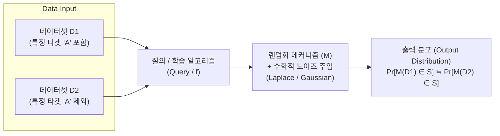
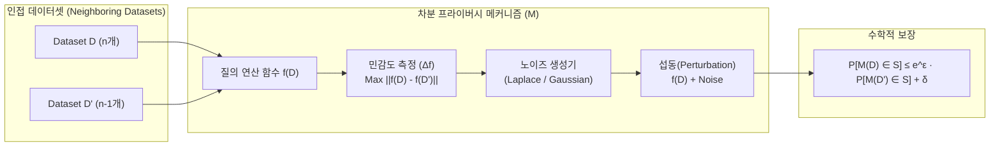

# 차분 프라이버시 (Differential Privacy)

---

## I. 개인정보 보호 프레임워크, 차분 프라이버시의 개요

**가. 차분 프라이버시의 정의**

* 특정 데이터 포인트(개인)의 포함 여부가 전체 통계 분석 결과나 모델의 출력 분포에 유의미한 영향을 주지 않도록 수학적 노이즈를 주입하여 개인정보를 보호하는 정량적 프라이버시 모델

**나. 차분 프라이버시의 필요성 및 특징**

* **필요성**: 단순 익명화·가명화의 한계 극복(재식별화, 연결 공격 방어), 머신러닝 및 거대 언어 모델([[초거대 언어 모델|LLM]])의 훈련 데이터 암기(Memorization)에 따른 민감 정보 유출 방지
* **특징**: 프라이버시 예산($\epsilon$, $\delta$) 기반의 보안성 정량화 제공, 데이터 유용성(Utility)과 프라이버시 간의 트레이드오프(Trade-off) 존재, 연합학습(Federated Learning)과 결합 용이

---

## II. 차분 프라이버시의 개념도 및 핵심 기술 요소

### 가. 차분 프라이버시의 개념도 및 동작 원리

* 단일 레코드가 다른 두 개의 인접한 데이터셋(D1, D2)에 동일한 질의 수행 시 출력 확률 분포의 차이를 ε(Epsilon) 이하로 엄격히 통제함
* 모델 학습(DP-SGD) 시에는 기울기(Gradient) 클리핑(Clipping)을 통해 민감도를 제한하고, 파라미터 업데이트 전 노이즈를 주입하여 역추적을 차단함

### 나. 차분 프라이버시의 핵심 구성 요소

| 구분 | 요소기술(키워드) | 세부 설명 |
| --- | --- | --- |
| **보안 정량화** | 프라이버시 예산 (Epsilon, $\epsilon$) | 개인정보 보호 강도의 척도, 값이 작을수록 더 많은 노이즈가 추가되어 보안성 증가 |
| **보안 정량화** | 완화 변수 (Delta, $\delta$) | 엄격한 $\epsilon$-DP를 만족하지 못할 허용 오차 확률, 통상 암호학적으로 매우 작은 값 설정 |
| **데이터 민감도** | 글로벌 민감도 (Global Sensitivity) | 한 명의 데이터가 추가 또는 삭제될 때 결과값(함수)이 변할 수 있는 이론적 최대 크기 |
| **노이즈 주입** | 라플라스 메커니즘 (Laplace) | 수치형 질의 결과에 라플라스 분포 기반의 노이즈를 주입하는 순수 차분 프라이버시 기법 |
| **노이즈 주입** | # 차분 프라이버시 (Differential Privacy) |  |

---

## I. 수학적 정보보호 모델, 차분 프라이버시의 개요

* **정의**: 데이터셋 내 특정 개인의 데이터 포함 여부와 무관하게 질의 결과의 통계적 분포 차이를 수학적 한도($\epsilon$) 이내로 제한하는 데이터 프라이버시 보호 모델
* **배경**: 준식별자 결합을 통한 재식별화 공격, 다중 질의 차분을 이용한 재구성 공격(Reconstruction Attack), AI 모델 대상 멤버십 추론 공격(MIA) 방어 한계 극복
* **특징**: 수학적 엄밀성(Provable Guarantee), 후처리 불변성(Post-processing Invariance), 합성 가능성(Composability, 다중 질의 시 누적 프라이버시 손실 추적 가능)

---

## II. 차분 프라이버시의 메커니즘 및 핵심 기술 요소

### 가. 차분 프라이버시의 동작 메커니즘

* 인접 데이터셋 간 최대 결과 차이인 민감도($\Delta f$)와 프라이버시 예산($\epsilon$)에 맞춘 무작위 노이즈를 질의 결과에 섭동(주입)하여 개인의 기여 여부를 수학적으로 은닉함

### 나. 차분 프라이버시의 핵심 기술 요소

| 구분 | 핵심 기술 | 세부 설명 |
| --- | --- | --- |
| **수학적 파라미터** | 프라이버시 예산 ($\epsilon$) | 데이터 누출 허용 한계치; $\epsilon \to 0$일수록 보호 수준 증가, 데이터 유용성(정확도) 감소 |
| **수학적 파라미터** | 완화 계수 ($\delta$) | 순수 차분 프라이버시 한도를 벗어날 확률; 통상 데이터셋 크기의 역수 ($1/\vert{}D\vert{}$) 미만으로 설정 |
| **민감도 척도** | 전역 민감도 ($\Delta f$) | 단일 레코드 유무에 따른 질의 결과의 최대 변화량; $L_1$ Norm(라플라스), $L_2$ Norm(가우시안) 활용 |
| **노이즈 메커니즘** | 라플라스 메커니즘 | 수치형 질의에 $Lap(\Delta f / \epsilon)$ 분포의 노이즈를 부가하는 순수 DP ($(\epsilon, 0)$-DP) 기법 |
| **노이즈 메커니즘** | 가우시안 메커니즘 | $L_2$ 민감도 기반 [[정규분포]] 노이즈 주입 기법; 완화된 DP ($(\epsilon, \delta)$-DP) 보장 |
| **노이즈 메커니즘** | 지수 메커니즘 | 최빈값, 중앙값 등 이산형/비수치형 출력값 선택 시 점수 함수 기반 확률적 선택 기법 |
| **배포 아키텍처** | 중앙형 (CDP) | 신뢰 가능한 중앙 서버가 원본 데이터를 수합 후 분석·집계 단계에서 노이즈 주입 |
| **배포 아키텍처** | 국소형 (LDP) | 단말(클라이언트) 단에서 무작위 응답(Randomized Response) 등으로 노이즈 주입 후 전송 |
| **AI/ML 융합** | DP-SGD | [[딥러닝]] [[역전파]] 시 배치 그래디언트 클리핑(Clipping) 및 가우시안 노이즈 주입 기반 모델 학습 |
| **누적 손실 관리** | 프라이버시 어카운턴트 | Moments Accountant, Rényi DP(RDP)를 통해 반복 질의/반복 에포크(Epoch)의 누적 $\epsilon$ 정밀 추적 |

---

## III. 전통적 비식별화 기술 vs 차분 프라이버시 비교 및 최신 동향

### 가. 전통적 비식별화(@@@PROT_22@@@-익명성) vs 차분 프라이버시 비교

| 비교 항목 | 전통적 [[비식별화]] ($k$-익명성 기반) | 차분 프라이버시 (Differential Privacy) |
| --- | --- | --- |
| **접근 방식** | 휴리스틱 기반 데이터 마스킹, 범주화, 삭제 | 엄밀한 수학적 확률 분포 기반 노이즈 섭동(주입) |
| **보호 수준** | 동질성 공격, 배경지식 공격에 취약 | 공격자의 사전/배경지식 보유 여부와 무관하게 안전 보장 |
| **데이터 형태** | 정형 마이크로데이터(행/열 테이블) 위주 변환 | 통계적 질의 결과, [[합성 데이터]] 생성, 머신러닝 가중치 |
| **프라이버시 손실 추적** | 다중 데이터셋 결합 시 누적 노출 위험 정량화 불가 | 합성 정리(Composition Theorem)를 통한 누적 손실($\epsilon$) 정량 추적 가능 |

### 나. 최신 기술 동향 및 산업 적용 방향

* **초거대 AI 및 LLM 보안**: LLM 사전학습/파인튜닝 단계에서 훈련 데이터 추출 공격(Data Extraction Attack) 및 암기(Memorization)를 차단하기 위해 DP-SGD 표준 채택
* **연합학습(Federated Learning) 결합**: LDP 기반 클라이언트 가중치 섭동과 안전한 집계(Secure Aggregation) 프로토콜을 결합하여 통신 오버헤드 최소화 및 종단 간 프라이버시 구현
* **유용성-보안 트레이드오프 극복**: 과도한 노이즈로 인한 분석 정확도 저하를 완화하기 위해 적응형 클리핑(Adaptive Clipping) 및 프라이버시 손실 한도가 정밀한 RDP(Rényi Differential Privacy) 엔진 고도화 추진

---

### 🔗 연관 토픽

- **소속 도메인**: [[00_보안_MOC|🛡️ 보안]]
- **세부 분류**: `5. 사이버 공격 기법 & 침해사고 대응`
- **핵심 연관 토픽**:
  - [[비식별화]]
  - [[딥러닝]]
  - [[역전파|역전파(Backpropagation)]]
  - [[합성 데이터|합성 데이터(Synthetic Data)]]
  - [[데이터 안심구역|데이터 안심구역 (Data Safety Zone)]]
