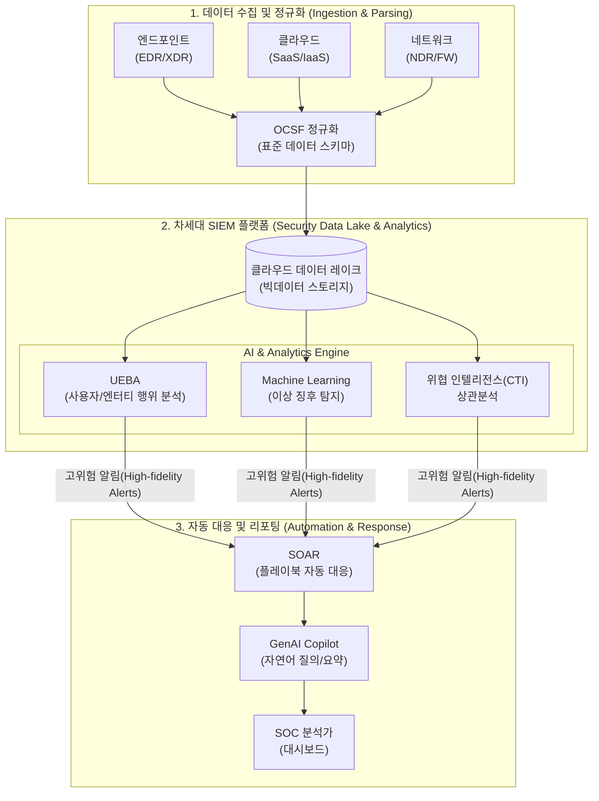

# 차세대 SIEM (Next-Gen SIEM)

---

## I. AI와 자동화 기반의 지능형 보안 관제 플랫폼, 차세대 SIEM의 개요

* **정의**: 기존 [[SIEM]]의 한계를 극복하기 위해 [[클라우드 네이티브]] 아키텍처, AI/ML 기반의 행위 분석(UEBA), 보안 오케스트레이션 및 자동 대응([[SOAR (Security Orchestration, Automation and Response)|SOAR]]) 기술을 결합하여 사이버 위협을 실시간으로 탐지하고 선제적으로 대응하는 지능형 보안 플랫폼
* **등장배경**: 멀티 클라우드 환경 확대로 인한 보안 텔레메트리 데이터 폭증, 기존 정적 룰(Rule) 기반 탐지의 높은 오탐률(False Positive) 및 보안 분석가의 피로도(Alert Fatigue) 증가
* **특징**: 클라우드 기반 무한 확장성, AI를 활용한 알려지지 않은 위협(Unknown Threat) 탐지, 플레이북(Playbook) 기반의 사고 처리 자동화, 이기종 데이터 정규화(OCSF)

---

## II. 차세대 SIEM의 개념도 및 핵심 기술 요소

### 가. 차세대 SIEM의 아키텍처 및 동작 원리

* 다양한 IT 인프라 환경에서 수집된 로그를 클라우드 데이터 레이크에 저장하고, AI/ML 및 UEBA로 고도화된 위협을 탐지한 후 SOAR를 통해 대응을 자동화하는 구조

### 나. 차세대 SIEM의 핵심 기술 요소

| 구분 | 요소기술(키워드) | 세부 설명 |
| --- | --- | --- |
| **수집/저장** | 클라우드 데이터 레이크 | 대규모 핫/콜드 데이터를 효율적으로 저장 및 처리하는 클라우드 네이티브 스토리지 |
| **수집/저장** | OCSF | 이기종 벤더의 보안 로그 및 이벤트 데이터를 공통 포맷으로 정규화하는 오픈 [[스키마]] [[프레임워크]] |
| **탐지/분석** | UEBA | 사용자(User) 및 기기(Entity)의 정상 행위 기준선을 학습하여 내부자 위협 및 계정 탈취를 탐지 |
| **탐지/분석** | AI/ML 모델링 | 기존 시그니처 룰이 잡지 못하는 패턴과 이상 징후를 식별하여 오탐률 감소 및 정확도 향상 |
| **탐지/분석** | 위협 인텔리전스 ([[CTI]]) | 글로벌 보안 피드(IoC)를 실시간 스트리밍으로 연동하여 최신 공격 기법 선제적 방어 |
| **대응/자동화** | SOAR 통합 | 사전에 정의된 플레이북(Playbook)을 실행하여 감염 단말 격리, [[방화벽]] 차단 등 즉각적인 자동 대응 수행 |
| **대응/자동화** | [[위협 헌팅]] (Threat Hunting) | 데이터 간의 연관관계를 그래프 DB 등으로 시각화하여 잠복 중인 지능형 지속 위협(APT) 능동 탐색 |
| **최신 기술** | GenAI 보안 코파일럿 | 생성형 AI를 결합하여 복잡한 보안 쿼리를 자연어로 자동 생성하고, 사고 원인 및 권장 조치사항을 요약 제공 |

---

## III. 기존 SIEM과 차세대 SIEM의 비교 및 향후 전망

### 가. 기존 SIEM과 차세대 SIEM 비교

| 비교 항목 | 기존 SIEM (Traditional SIEM) | 차세대 SIEM (Next-Gen SIEM) |
| --- | --- | --- |
| **데이터 아키텍처** | 온프레미스 기반 RDBMS, 어플라이언스 종속 | 클라우드 네이티브 기반 데이터 레이크 (SaaS) |
| **위협 탐지 방식** | 정적 룰(Rule) 및 시그니처 기반 상관 분석 | AI/ML, UEBA 기반의 동적 행위 및 이상 징후 분석 |
| **초점 및 한계** | 단순 로그 수집, 높은 오탐률, 분석가 피로도 가중 | 위협 상황(Context) 우선순위화, 경보 피로도 최소화 |
| **사고 대응 체계** | 수동 조사 및 알림 위주의 수동적/사후적 대응 | SOAR 연동을 통한 워크플로 기반 자동 완화 및 차단 |
| **생태계(연동성)** | 단일 벤더 중심, 제한적인 API 연동 | 개방형 스키마(OCSF), [[XDR]]/[[EDR(Endpoint Detection and Response)|EDR]] 등 유연한 외부 확장 연동 |

* **전망 및 동향**: 차세대 SIEM은 단순한 관제 도구를 넘어 조직의 전체 보안 데이터를 중앙 집중화하는 에이전틱 SOC(Agentic SOC)의 두뇌로 진화 중이며, 향후 [[초거대 언어 모델|LLM]] 기반 자율 방어 체계(Autonomous Response)와 깊게 결합하여 제로 트러스트([[제로 트러스트 보안모델|Zero Trust]]) 환경의 핵심 인프라로 확고히 자리잡을 것임.

---

### 🔗 연관 토픽

- **소속 도메인**: [[00_보안_MOC|🛡️ 보안]]
- **세부 분류**: `2. 현대 암호학 & 키 관리 · 전자서명`
- **핵심 연관 토픽**:
  - [[XDR|XDR(eXtended Detection Response)]]
  - [[제로 트러스트 보안모델|제로 트러스트 (Zero Trust) 보안모델]]
  - [[EDR(Endpoint Detection and Response)]]
  - [[CTI]]
  - [[SIEM]]
