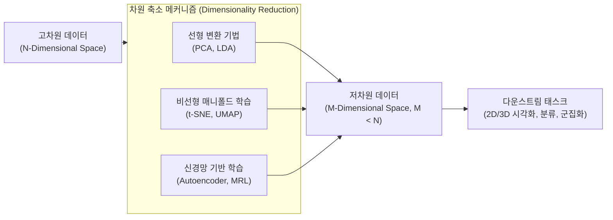

# 차원 축소 (Dimensionality Reduction)

---

## I. 데이터 복잡성 감소 및 패턴 탐색 기술, 차원 축소의 개요

* **정의**: 고차원 데이터를 정보 손실을 최소화하면서 더 적은 수의 차원(변수)으로 재표현하여 데이터의 복잡성을 줄이는 [[비지도 학습]] 기반 [[데이터 전처리]] 기법
* **필요성 및 등장배경**: 차원 증가로 인해 데이터가 희소해지고 모델 성능이 저하되는 '차원의 저주(Curse of Dimensionality)' 문제 완화, 과적합 방지 및 연산 비용 감소 필요
* **특징**: 분산 보존(선형), 매니폴드 구조 유지(비선형), 인공신경망 기반의 특징 추출을 통해 [[데이터 가시화|데이터 시각화]], 군집화, 모델 성능 최적화에 기여

---

## II. 차원 축소의 개념도 및 핵심 기술 요소

### 가. 차원 축소의 프로세스 개념도 및 동작 원리

* 원본 고차원 공간의 복잡한 데이터를 선형 행렬 연산이나 비선형 확률 모델, 딥러닝을 거쳐 저차원 공간에 사상(Mapping)하여 시각화 및 머신러닝의 효율성을 극대화함

### 나. 차원 축소의 핵심 기술 및 구성 요소

| 분류 | 요소기술(키워드) | 세부 설명 |
| --- | --- | --- |
| **선형 기법** | PCA (주성분 분석) | 공분산 행렬의 고유값 분해([[SVD(Singular Value Decomposition)|SVD]])를 통해 데이터의 분산이 최대화되는 새로운 직교 축(주성분)을 도출하는 기법 |
| **선형 기법** | [[LDA(Linear Discriminant Analysis)|LDA]] (선형 판별 분석) | [[클래스]] 간 분산을 최대화하고 클래스 내 분산을 최소화하여 지도 학습 분류 성능을 높이는 차원 축소 기법 |
| **비선형 기법** | t-SNE | 고차원 데이터의 국소적 거리(확률 분포)를 저차원에서도 유지하도록 KL Divergence를 최소화하는 시각화 특화 기법 |
| **비선형 기법** | UMAP | 위상 수학(Topology)과 근접 그래프 기반으로 t-SNE의 연산 속도를 개선하여 전역/국소적 구조를 함께 보존하는 최신 기법 |
| **신경망 기법** | Autoencoder | 인코더와 디코더의 병목(Bottleneck) 구조를 통해 입력 데이터를 압축(잠재 공간)하고 다시 복원하며 특징을 추출하는 [[딥러닝]] 기법 |
| **최신 기법** | MRL (Matryoshka) | 고차원 임베딩 벡터의 앞부분(일부 차원)만 잘라서 사용해도 표현력(성능)이 유지되도록 강제하는 최신 [[표현 학습]] 기법 |
| **해결 과제** | 차원의 저주 | 피처(Feature) 수가 많아질수록 학습에 필요한 데이터 볼륨이 기하급수적으로 커지고 과적합이 발생하는 현상 |
| **수학적 모델** | KL 다이버전스 | 두 확률 분포(고차원 공간과 저차원 공간의 데이터 인접성) 간의 차이를 계산하여 오차를 줄이는 정보량 측정 지표 |

---

## III. 차원 축소 기법 비교 및 최신 동향

### 가. 주요 차원 축소 기법 비교 (PCA vs t-SNE vs UMAP)

| 비교 항목 | PCA ([[PCA(Principal Component Analysis)|Principal Component Analysis]]) | t-SNE (t-Distributed Stochastic) | UMAP (Uniform Manifold) |
| --- | --- | --- | --- |
| **기반 원리** | 선형 대수 (분산 최대화) | 비선형 확률 분포 (국소 거리 유지) | 비선형 근접 그래프 (위상 수학) |
| **연산 복잡도** | 낮음 / 매우 빠름 | 매우 높음 (O(N²), 대규모 데이터 부적합) | 중간 (O(N log N), 대규모 데이터 적합) |
| **신규 데이터 변환** | 지원 가능 (Transform 용이) | 미지원 (비매개변수적 모델, 재학습 필요) | 지원 가능 (실시간 추론 가능) |
| **주요 목적/활용** | 특성 추출, 노이즈 제거, 데이터 압축 | 고차원 데이터의 2D/3D 군집 시각화 | 대규모 데이터 임베딩, 고속 군집 시각화 |

### 나. 차원 축소 기술 향후 전망 및 최신 동향

* **[[초거대 언어 모델|LLM]] 임베딩의 혁신, Matryoshka Representation Learning (MRL)**: 최근 OpenAI 등 초거대 AI 모델의 임베딩 영역에서 벡터 차원 앞부분 일부만 잘라(Truncate) 사용해도 원본 수준의 정보 탐색 성능을 발휘하는 마트료시카 기법이 표준으로 정착하며 Vector DB의 저장 비용을 획기적으로 절감함
* **대규모 실시간 데이터 시각화 패러다임 변화 (UMAP 부상)**: 기존 t-SNE가 가진 전역적(Global) 구조 왜곡과 극심한 연산 병목 현상을 극복한 UMAP이 수백만 건 이상의 다차원 데이터 탐색 시 압도적인 속도와 성능을 입증하며 데이터 마이닝의 표준 매니폴드 기법으로 자리매김하고 있음

---

### 🔗 연관 토픽

- **소속 도메인**: [[00_인공지능_MOC|🤖 인공지능]]
- **세부 분류**: `1. 수학 · 통계학 & 데이터 전처리`
- **핵심 연관 토픽**:
  - [[PCA(Principal Component Analysis)]]
  - [[비지도 학습]]
  - [[표현 학습]]
  - [[SVD(Singular Value Decomposition)]]
  - [[데이터 전처리]]
