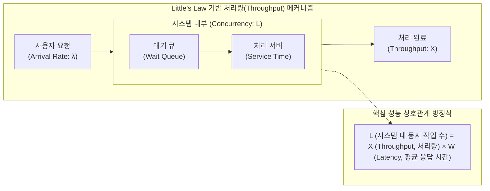

# 처리량 (Throughput)

---

## I. 시스템 성능 평가의 핵심 지표, 처리량(Throughput)의 개요

* **정의**: 컴퓨터, 네트워크, 소프트웨어 시스템이 단위 시간당 성공적으로 처리 완료한 작업, 데이터, 트랜잭션의 총량
* **배경 및 필요성**: [[응답시간]](Latency)과 함께 시스템의 가용성과 확장성을 측정하는 핵심 지표이며, 시스템 병목(Bottleneck) 구간 식별 및 인프라 용량 산정(Capacity Planning)에 필수적임
* **특징**: 임계점(Saturation Point) 도달 전까지는 동시성에 비례하여 증가하나, 한계를 초과하면 큐잉 지연(Queuing Delay)으로 인해 스래싱(Thrashing)이 발생하며 급격히 저하됨

---

## II. 처리량의 메커니즘 및 핵심 평가 지표(KPI)

### 가. 처리량의 동작 메커니즘 (리틀의 법칙 기반)

* 안정 상태(Steady State)의 시스템에서 동시성(L)이 주어졌을 때, 처리량(X)은 응답시간(W)에 반비례하는 수학적 상관관계를 가짐
* 부하가 시스템 처리 용량을 초과하면 대기 큐([[Queue]])가 길어지며 응답시간이 급증하고, 실제 처리량은 저하됨

### 나. 처리량의 핵심 평가 지표(KPI) 및 연관 개념

| 분류 | 핵심 지표 및 요소 (키워드) | 세부 설명 |
| --- | --- | --- |
| **웹/애플리케이션** | RPS / QPS | 초당 처리되는 클라이언트의 HTTP 요청(Requests) 및 DB 쿼리(Queries) 수 |
| **[[데이터베이스]]** | TPS | 1초 동안 성공적으로 처리 및 커밋(Commit)된 논리적 작업(Transactions)의 개수 |
| **네트워크** | BPS / PPS | 초당 성공적으로 전송되는 데이터 비트 수(Bits) 및 패킷 수(Packets) |
| **스토리지** | IOPS | 1초 동안 디스크/스토리지 장치에서 발생하는 읽기(Read) 및 쓰기(Write) 작업 횟수 |
| **AI/컴퓨팅** | FLOPS / Tokens per sec | 초당 부동소수점 연산 횟수(FLOPS) 및 [[초거대 언어 모델|LLM]] 추론 시 초당 생성되는 텍스트 토큰 수 |
| **성능 이론** | 리틀의 법칙 (Little's Law) | 대기행렬 이론을 바탕으로 동시 사용자, 처리량, 응답시간 간의 상관관계를 정의한 법칙 |
| **성능 한계** | 임계점 (Saturation Point) | 시스템 자원([[CPU]], Memory)이 한계에 도달하여 더 이상 처리량이 증가하지 않는 지점 |
| **장애 현상** | 스래싱 (Thrashing) | 과도한 동시 부하로 인해 실제 처리보다 대기 및 컨텍스트 스위칭에 자원을 소모하여 처리량이 급감하는 현상 |

---

## III. 처리량과 응답시간 비교 및 최신 성능 최적화 동향

### 가. 시스템 성능의 양대 축, 처리량과 응답시간 비교

| 비교 항목 | 처리량 (Throughput) | 응답시간 (Latency / Response Time) |
| --- | --- | --- |
| **관점 및 초점** | 시스템 관점 (System-centric), 전체 처리 용량 | 사용자 관점 (User-centric), 개별 요청의 지연 체감 |
| **측정 대상** | 단위 시간당 성공적으로 **완료된 총 작업의 양** | 요청 발생부터 결과 **수신까지 걸린 총 대기 시간** |
| **성능 목표** | 측정 단위(TPS, IOPS 등)가 **클수록 우수** | 측정 단위(ms, sec 등)가 **작을수록 우수** |
| **부하 상관성** | 임계점 이전까지는 동시 요청 수에 비례하여 증가 | 부하 초과 시 큐잉 지연(Queuing Delay) 발생으로 급증 |
| **최적화 기법** | 스케일 아웃(Scale-out), 비동기 모델, 배치(Batch) 처리 | 스케일 업(Scale-up), 캐싱(Cache), [[CDN]], 엣지 컴퓨팅 |

### 나. 최신 IT 인프라의 처리량 향상 기술 동향 및 전망

* **AI/LLM 추론 처리량 최적화 (vLLM)**: 초거대 AI 모델 서빙(Serving) 시, 정적 배치(Static Batching)의 한계를 극복하기 위해 **Continuous Batching(연속 배치)** 및 **PagedAttention** 기술을 적용하여 [[GPU]] VRAM의 파편화를 줄이고 전체 시스템의 토큰 생성 처리량을 대폭 향상시킴
* **[[클라우드 네이티브]] 기반 탄력적 확장**: [[MSA (Micro Service Architecture)|MSA]](Microservices) 아키텍처와 [[쿠버네티스]](Kubernetes) 기반 [[HPA (Horizontal Pod Autoscaler)|HPA]](Horizontal Pod Autoscaling)를 결합하여 트래픽 폭증 시 동적으로 스케일 아웃을 수행, 병목 현상을 방지하고 TPS를 극대화함
* **비동기 이벤트 기반 처리 아키텍처 부상**: Node.js, WebFlux, Kafka 등 논블로킹(Non-blocking) I/O 모델 및 이벤트 스트리밍 기반의 구조를 채택하여 최소한의 스레드로 수만 건의 동시 접속(High Concurrency)을 병렬 처리하는 방식이 주류로 자리잡음

---

### 🔗 연관 토픽

- **소속 도메인**: [[00_운영체제_MOC|⚙️ 운영체제]]
- **세부 분류**: `1. 프로세스 & 스레드 관리`
- **핵심 연관 토픽**:
  - [[응답시간]]
  - [[초거대 언어 모델|초거대 언어 모델(Large Language Model)]]
  - [[스케줄링]]
  - [[FIFO]]
  - [[스케줄러|스케줄러 (Scheduler)]]
