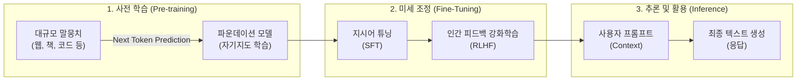

# 초거대 언어 모델 (Large Language Model)

---

## I. 사람처럼 이해하고 생성하는 AI의 핵심 기반, 초거대 언어 모델의 개요

* **정의**: 수십억에서 수천억 개 이상의 파라미터(매개변수)와 방대한 텍스트 데이터를 학습하여, 인간 수준의 자연어 이해, 생성, 추론 능력을 수행하는 [[트랜스포머|트랜스포머(Transformer)]] 기반의 [[딥러닝]] 모델
* **등장배경 및 특징**:
* 기존 순환신경망([[RNN (Recurrent Neural Network)|RNN]]/[[LSTM (Long Short-Term Memory)|LSTM]])의 장기 의존성 한계 및 병렬 연산 불가 문제 극복
* 파라미터 규모 확장에 따른 창발적 능력(Emergent Abilities) 발현 및 In-context Learning 가능
* 모델 학습/운영을 위한 방대한 컴퓨팅 자원([[GPU]]) 요구 및 환각(Hallucination) 현상 발생 등 한계 상존

---

## II. 초거대 언어 모델의 개념도 및 핵심 기술 요소

### 가. 초거대 언어 모델의 학습 프로세스 및 동작 원리

* 방대한 데이터 말뭉치를 활용해 파운데이션 모델을 사전 학습한 후, 지시어 미세조정(SFT)과 인간 피드백 [[강화학습]](RLHF)을 거쳐 사용자 의도에 정렬(Alignment)된 최종 모델을 구축함

### 나. 초거대 언어 모델의 핵심 기술 요소

| 구분 | 요소기술(키워드) | 세부 설명 |
| --- | --- | --- |
| **아키텍처** | 트랜스포머 (Transformer) | 인코더-디코더 구조 중 주로 디코더(Decoder-only)를 사용하여 다음 단어를 예측하는 병렬 처리 아키텍처 |
| **핵심 기법** | 셀프 어텐션 (Self-Attention) | 입력 시퀀스 내의 단어들 간 연관성과 중요도(가중치)를 동적으로 계산하여 장기 문맥을 파악하는 기법 |
| **학습 최적화** | [[PEFT]] ([[LoRA(Low-rank adaptation)|LoRA]]) | 거대 모델의 전체 파라미터를 고정하고, 학습 가능한 일부 저랭크(Low-Rank) 행렬만 추가하여 학습 비용 최소화 |
| **품질 강화** | RLHF | 인간의 피드백을 바탕으로 보상 모델(Reward Model)을 학습시켜 윤리적이고 무해한(Harmless) 답변 유도 |
| **지식 확장** | RAG (검색 증강 생성) | 모델 외부에 있는 기업 데이터 및 최신 지식 베이스를 검색, 주입하여 환각 현상을 획기적으로 완화 |
| **추론 최적화** | vLLM (PagedAttention) | OS의 페이징(Paging) 기법을 차용해 KV Cache 메모리 파편화를 줄이고 GPU 추론 [[처리량]](Throughput) 향상 |
| **모델 경량화** | 양자화 (Quantization) | 모델 가중치의 정밀도(예: FP16 → INT8/INT4)를 낮춰 성능 저하를 방어하며 VRAM 사용량 감소 |
| **프롬프팅** | ICL (In-context Learning) | 별도의 가중치 업데이트 없이 프롬프트 내의 몇 가지 예시(Few-shot)만으로 문맥을 파악하여 태스크 수행 |

---

## III. 초거대 언어 모델(LLM)과 경량화 모델(sLLM) 비교 및 전망

### 가. 범용 LLM과 특정 도메인 맞춤형 sLLM 비교

| 비교 항목 | LLM (초거대 언어 모델) | [[sLLM (Smaller Large Language Model)|sLLM]] (경량화 대형 언어 모델) |
| --- | --- | --- |
| **파라미터 규모** | 수백억 ~ 수천억 개 이상 (예: GPT-4, Gemini) | 수십억 ~ 100억 개 내외 (예: Llama 3 8B, Phi-3) |
| **운영 인프라** | 클라우드 기반 초고성능 다중 GPU 클러스터 | 단일 GPU [[인스턴스]] 또는 온디바이스(On-device) 구동 |
| **학습/운영 비용** | 천문학적 비용 소요, 실시간 응답 지연(Latency) 우려 | 저비용 구축/미세조정 가능, 가볍고 빠른 추론 속도 보장 |
| **보안 및 프라이버시** | 퍼블릭 AIAPI 의존으로 민감 데이터 유출 리스크 존재 | 온프레미스(On-premise) 구축 용이하여 내부 데이터 철통 보호 |
| **주요 활용 분야** | 범용적 지식 챗봇, 고도의 복합 추론, 다국어 번역 | 금융/공공 등 특정 도메인 특화, 보안 민감형 B2B 서비스 |

### 나. 향후 기술 전망 및 동향

* **멀티모달(Multimodal) 진화**: 텍스트를 넘어 이미지, 음성, 비디오를 동시에 이해하고 생성하는 LMM(Large Multimodal Model)으로 발전하며 자율 에이전트(Agentic AI)의 두뇌 역할 수행
* **[[온디바이스 AI]] 패러다임 확산**: [[NPU]] 기술의 고도화 및 양자화 기술과 맞물려 스마트폰, PC 등 엣지([[EDGE|Edge]]) 단에서 인터넷 연결 없이도 동작하는 하이브리드 AI 생태계로 진입 중

---

### 🔗 연관 토픽

- **소속 도메인**: [[00_인공지능_MOC|🤖 인공지능]]
- **세부 분류**: `3. 딥러닝 핵심 아키텍처 & 신경망`
- **핵심 연관 토픽**:
  - [[딥러닝]]
  - [[트랜스포머|트랜스포머(Transformer)]]
  - [[RNN (Recurrent Neural Network)]]
  - [[sLLM (Smaller Large Language Model)]]
  - [[온디바이스 AI]]
