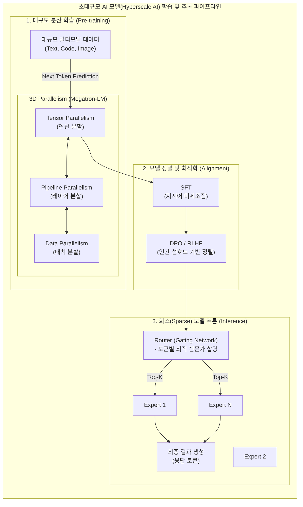

# 초대규모 AI 모델 (Hyperscale AI Model)

---

## I. AGI(범용 인공지능) 시대를 여는 핵심 인프라, 초대규모 AI 모델의 개요

* **정의**: 수백억에서 수조 개 이상의 파라미터(Parameter)를 보유하고 슈퍼컴퓨팅 인프라를 통해 방대한 데이터를 학습하여, 인간에 버금가는 종합적 추론 및 생성 능력을 갖춘 AI 모델
* **등장배경**: 기존 특정 태스크(Task-specific) 중심 인공지능의 한계 극복, 스케일링 법칙(Scaling Laws) 입증에 따른 파라미터와 데이터 규모의 기하급수적 확장
* **특징**: 창발적 능력(Emergent Abilities) 발현, 문맥 내 학습(In-context Learning) 지원, 제로샷/퓨샷(Zero-shot/Few-shot) 기반 범용적 문제 해결

---

## II. 초대규모 AI 모델의 개념도 및 핵심 기술 요소

### 가. 초대규모 AI 모델의 분산 학습 및 추론 아키텍처

* 단일 [[GPU]] 메모리에 적재할 수 없는 초대규모 모델을 3D 병렬 기법으로 분산 학습한 뒤, 인간의 의도에 맞게 정렬(DPO)하고 MoE(전문가 혼합) 구조를 통해 추론 연산량을 최적화함

### 나. 초대규모 AI 모델의 핵심 기술 요소

| 구분 | 핵심 기술 (키워드) | 세부 설명 |
| --- | --- | --- |
| **아키텍처** | MoE ([[MOE(Mixture of Experts)|Mixture of Experts]]) | 수조 개의 파라미터 중 입력된 토큰에 특화된 일부 신경망(Expert)만 활성화하여 연산 효율성 극대화 |
| **분산 학습** | 3D 병렬처리 (3D Parallelism) | 초대규모 모델을 텐서(Tensor), 파이프라인(Pipeline), 데이터(Data) 단위로 분할하여 클러스터 분산 학습 |
| **위치 인코딩** | RoPE (Rotary Position Embedding) | 토큰의 상대적 위치 정보를 회전 행렬로 표현하여 무한대에 가까운 긴 문맥(Long-context) 처리 지원 |
| **모델 정렬** | DPO (Direct Preference [[OPT|Opt]].) | 별도의 보상 모델 없이 인간의 선호 데이터를 직접 최적화하여 기존 RLHF의 복잡성과 불안정성 개선 |
| **파인튜닝** | [[PEFT]] ([[LoRA(Low-rank adaptation)|LoRA]]) | 수백억 개의 파라미터 중 저랭크(Low-Rank) 행렬로 분해된 일부 가중치만 업데이트하여 학습 비용 절감 |
| **추론 최적화** | PagedAttention (vLLM) | OS의 페이징(Paging) 기법을 차용해 KV Cache 메모리의 파편화를 제거하고 동시 추론(Throughput)량 향상 |
| **지식 확장** | RAG (검색 증강 생성) | 모델 외부에 있는 최신 지식이나 기업 내부 벡터 DB를 검색/주입하여 고질적인 환각(Hallucination) 현상 억제 |
| **인프라망** | 초저지연 패브릭 네트워크 | 10만 개 이상의 GPU 클러스터를 무손실(Zero-packet-loss)로 묶는 InfiniBand 및 NVLink/NVSwitch 스위칭 기술 |

---

## III. 기존 AI와의 비교 및 초대규모 AI 모델의 향후 전망

### 가. 기존 AI (Task-Specific AI) vs 초대규모 AI (Hyperscale AI) 비교

| 비교 항목 | 기존 AI 모델 | 초대규모 AI 모델 |
| --- | --- | --- |
| **설계 목적** | 특정 단일 문제 해결 (이미지 분류, 예측 등) | 범용적 문제 해결 및 [[AGI]]([[범용 인공지능]]) 기반 |
| **파라미터/데이터** | 수백만 ~ 수천만 개 / 수 GB 규모 도메인 데이터 | 수백억 ~ 수조(Trillion) 개 / 수십 PB 규모 멀티모달 |
| **추론 방식** | Dense Network (모든 파라미터 활성화) | Sparse Network (MoE 기반 필요 파라미터만 활성화) |
| **태스크 적응** | 태스크마다 별도의 모델 개발 및 라벨링 필수 | [[프롬프트 엔지니어링]](Zero-shot)만으로 다양한 태스크 수행 |

### 나. 초대규모 AI 모델의 향후 기술 동향 및 전망

* **자율 에이전트(Agentic AI)로의 진화**: 단순한 텍스트 챗봇을 넘어, 외부 도구(Tool-use)를 API로 호출하고 다단계 논리 추론(Reasoning)을 통해 목표를 자율적으로 완수하는 AI 에이전트로 발전
* **초대규모 LMM(Large Multimodal Model) 표준화**: 텍스트, 이미지, 비디오, 음성을 별도 인코더 없이 네이티브(Native)로 동시 처리하여 공간 지각력 및 맥락 이해도가 획기적으로 상승
* **소버린 AI ([[Sovereign AI (소버린 AI)|Sovereign AI]]) 구축 가속화**: 글로벌 빅테크의 AI 기술 독점에 대응하여, 각 국가 및 대기업들이 데이터 주권과 보안을 확보하기 위해 독자적인 초대규모 AI 모델 구축 인프라 투자를 확대하는 추세임.

---

### 🔗 연관 토픽

- **소속 도메인**: [[00_인공지능_MOC|🤖 인공지능]]
- **세부 분류**: `6. 설명가능한 AI (XAI) & AI 윤리 · 거버넌스`
- **핵심 연관 토픽**:
  - [[Sovereign AI (소버린 AI)]]
  - [[PEFT|PEFT(Parameter-Efficient Fine-Tuning)]]
  - [[LoRA(Low-rank adaptation)]]
  - [[프롬프트 엔지니어링|프롬프트 엔지니어링(Prompt Engineering)]]
  - [[AGI|AGI (Artificial General Intelligence)]]
