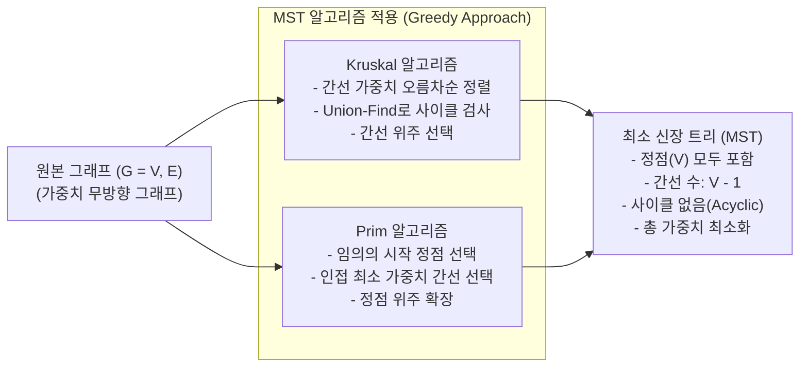

# 최소 신장 트리 (Minimum Spanning Tree, MST)

---

## I. 네트워크 구축 비용 최적화의 핵심, 최소 신장 트리(MST)의 개요

* **정의**: 가중치 무방향 그래프(Weighted Undirected Graph)에서 모든 정점을 사이클(Cycle) 없이 연결하며, 구성된 간선들의 가중치 총합이 최소가 되는 트리 형태의 부분 그래프(Subgraph)
* **등장배경 및 필요성**: 통신망, 도로망, 전력망 등 물리적 네트워크 구축 시 비용(거리, 시간, 금액 등)을 최소화하기 위한 최적화 수학적 모델링 요구
* **특징**: 탐욕적(Greedy) 접근법 적용, 구성된 간선의 수는 반드시 ‘정점 수 - 1 ($V-1$)’개임, 모든 간선의 가중치가 다를 경우 MST는 유일함(Uniqueness)

---

## II. 최소 신장 트리의 아키텍처 및 핵심 알고리즘 요소

### 가. 최소 신장 트리 생성 개념도 및 동작 원리

* 원본 그래프에서 그리디(Greedy) 알고리즘을 기반으로 하는 Kruskal 또는 Prim 알고리즘을 적용하여 사이클이 없는 최적의 경로(부분 그래프)를 추출함

### 나. 최소 신장 트리의 핵심 알고리즘 및 구성 요소

| 구분 | 요소기술(키워드) | 세부 설명 |
| --- | --- | --- |
| **핵심 [[알고리즘]]** | Kruskal (크루스칼) | 간선을 가중치 기준 오름차순 정렬 후, 사이클을 형성하지 않는 최소 간선을 차례로 선택하는 방식 |
| **핵심 알고리즘** | Prim (프림) | 임의의 정점에서 시작하여 현재 구성된 트리에 인접한 간선 중 가장 가벼운 간선을 추가하며 확장하는 방식 |
| **확장 알고리즘** | Borůvka (보루프카) | 각 정점(포레스트)에서 가장 가중치가 적은 간선을 동시에 선택하여 병합, **병렬 컴퓨팅** 환경에 최적화됨 |
| **핵심 자료구조** | Union-Find 알고리즘 | Kruskal 알고리즘에서 간선 추가 시, 두 정점이 같은 집합인지 확인하여 **사이클 발생 여부를 판별** (Disjoint Set) |
| **핵심 자료구조** | Priority [[Queue]] (우선순위 큐) | Prim 알고리즘에서 인접 정점 탐색 시 최솟값을 빠르게 추출하기 위해 **Min-Heap(최소 힙)** 트리 구조 활용 |
| **성능 지표** | 시간 복잡도 (Time Complexity) | Kruskal은 간선 정렬에 $O(E \log E)$, Prim은 최소 힙 사용 시 $O(E \log V)$의 처리 시간을 소요함 |
| **그래프 속성** | 희소 그래프 (Sparse Graph) | 간선의 수($E$)가 정점($V$)에 비해 적은 그래프 구조로, 상대적으로 **Kruskal** 알고리즘 적용이 유리함 |
| **그래프 속성** | 밀집 그래프 (Dense Graph) | 간선의 수($E$)가 정점($V$)의 제곱($V^2$)에 가까운 구조로, 간선 정렬 오버헤드가 없는 **Prim** 알고리즘 적용이 유리함 |

---

## III. 핵심 알고리즘 비교(Kruskal vs Prim) 및 최근 활용 동향

### 가. Kruskal 알고리즘과 Prim 알고리즘 비교

| 비교 항목 | Kruskal 알고리즘 | Prim 알고리즘 |
| --- | --- | --- |
| **탐색 중심 및 방식** | **간선([[EDGE|Edge]])** 중심 / 전체 간선 정렬 후 선택 | **정점(Vertex)** 중심 / 인접 간선 중 선택 후 확장 |
| **사이클 판별 여부** | 필수 (Union-Find 알고리즘 사용) | 불필요 (트리를 점진적으로 확장하므로 미발생) |
| **주요 활용 자료구조** | 정렬(Sorting) 알고리즘, 분리 집합(Disjoint Set) | 최소 힙(Min-Heap) 기반 우선순위 큐 |
| **시간 복잡도 (최악)** | $O(E \log E)$ (간선 정렬 시간에 지배됨) | $O(E \log V)$ (우선순위 큐 갱신 시간에 지배됨) |
| **최적 적용 그래프** | 간선이 적은 희소 그래프 (Sparse Graph) | 간선이 많은 밀집 그래프 (Dense Graph) |

### 나. 최소 신장 트리의 산업 적용 및 향후 기술 동향

* **대규모 분산 컴퓨팅 환경 적용**: 클라우드 및 P2P 네트워크의 라우팅 테이블 최적화를 위해 중앙 집중형 연산의 한계를 극복하는 **GHS (Gallager-Humblet-Spira) 분산 MST 알고리즘** 활용 증가
* **머신러닝 기반 데이터 군집화(Clustering)**: 데이터 포인트 간의 유클리디안 거리를 간선 가중치로 변환하여 MST를 구성한 뒤, 가중치가 가장 큰 간선을 끊어내는 방식(Divisive Clustering)으로 비지도 학습의 고도화에 기여
* **초정밀 반도체 설계(VLSI) 최적화**: 수십억 개의 트랜지스터를 연결하는 칩 설계 시, 배선 길이를 최소화하여 전력 소모(Power)와 지연 시간(Delay)을 단축하기 위한 라우팅 핵심 알고리즘으로 지속 활용 중임

---

### 🔗 연관 토픽

- **소속 도메인**: [[00_컴퓨터구조_MOC|💻 컴퓨터구조]]
- **세부 분류**: `4. 기본 자료구조 (Data Structures)`
- **핵심 연관 토픽**:
  - [[Queue]]
  - [[다익스트라 알고리즘|다익스트라 (Dijkstra) 알고리즘]]
  - [[알고리즘]]
  - [[EDGE|edge]]
  - [[그리디 알고리즘|그리디 (탐욕) 알고리즘]]
