# 최적화 알고리즘 (Optimization Algorithm)

---

## I. 기계학습 모델 학습의 핵심, 최적화 알고리즘의 개요

* **정의**: 기계학습 및 딥러닝에서 손실 함수(Loss Function)의 값을 최소화하기 위해 모델의 파라미터(가중치 및 [[편향]])를 반복적으로 업데이트하여 최적점(Global Minima)을 탐색하는 [[알고리즘]]
* **배경 및 필요성**: 다차원 비선형 공간에서의 기울기 소실/폭발 방지, 안장점(Saddle Point) 및 국소 최적점(Local Minima) 탈출, 빠른 수렴 속도(Convergence Speed) 확보
* **최신 동향**: 최근 [[초거대 언어 모델]](LLM)의 파라미터가 수천억 개로 급증함에 따라, 훈련 비용과 VRAM(메모리) 사용량을 획기적으로 줄이는 Lion, Muon 등의 차세대 알고리즘이 부상하고 있음

---

## II. 최적화 알고리즘의 개념도 및 핵심 기술 요소

### 가. 최적화 알고리즘의 개념도 및 파라미터 업데이트 프로세스

```mermaid
flowchart TB
    Data["학습 데이터 (Batch)"] -->|Forward Pass| Model["인공신경망 모델<br/>(Weights & Biases)"]
    Model -->|예측값 출력| Loss["손실 함수 (Loss Function)<br/>- MSE, Cross-Entropy 등"]
    Loss -->|Backward Pass| Grad["그래디언트 계산 (∇L)<br/>- 오차 역전파"]
    
    subgraph "최적화 알고리즘 (Optimization Algorithm)"
        direction TB
        M["모멘텀 (Momentum)<br/>- 과거 기울기 관성 누적<br/>- 방향성 유지 및 지그재그 완화"] 
        A["적응형 학습률 (Adaptive LR)<br/>- 파라미터별 업데이트 빈도 반영<br/>- 최적 스텝 사이즈 조절"]
        W["가중치 감소 (Weight Decay)<br/>- 정규화(Regularization) 분리<br/>- 과적합 방지"]
        
        Grad --> M & A & W
        M & A & W --> Compute["업데이트 벡터 계산 (ΔW)"]
    end
    
    Compute -->|"가중치 업데이트 (W = W - ΔW)"| Model


```

* 신경망의 오차(Loss)를 역전파하여 그래디언트를 구한 뒤, 모멘텀과 적응형 학습률 메커니즘을 거쳐 최적화된 파라미터 업데이트 벡터($\Delta W$)를 산출하는 과정임

### 나. 최적화 알고리즘의 핵심 기술 요소

| 분류 | 요소기술(키워드) | 세부 설명 |
| --- | --- | --- |
| **기본 연산** | SGD (확률적 [[경사하강법]]) | 전체 데이터셋 대신 미니배치 단위로 기울기를 계산하여 메모리를 절약하고 빠르게 가중치를 업데이트하는 기법 |
| **방향성 최적화** | Momentum (관성) | 이전 그래디언트의 이동 평균을 누적하여 진동을 줄이고, 안장점 및 국소 최적점을 빠르게 탈출하도록 돕는 기법 |
| **보폭 최적화** | Adaptive LR (적응형) | 파라미터의 과거 업데이트 크기(분산)에 반비례하도록 개별 학습률을 자동 조절하여 희소 데이터 최적화 (AdaGrad, RMSProp 등) |
| **표준 알고리즘** | Adam / AdamW | Momentum과 RMSProp을 결합(Adam)하고, 가중치 감소(Weight Decay)를 분리(AdamW)하여 [[일반화]] 성능을 극대화한 현 LLM 훈련 표준 |
| **최신 경량화** | Lion (Evolved Sign) | 2차 모멘트(분산)를 저장하지 않고 그래디언트의 부호(Sign) 연산만 적용하여 VRAM 사용량을 획기적으로 줄인 구글의 최신 기법 |
| **최신 고효율** | Muon (직교화 모멘텀) | Newton-Schulz 직교화 기반 행렬 연산을 통해 업데이트 방향의 기하학적 특성을 안정화시켜 훈련 효율을 2배 향상시킨 최신 기법 |
| **학습 안정화** | Gradient Clipping | 심층 신경망에서 [[역전파]] 시 그래디언트 폭발(Exploding)을 방지하기 위해 임계값을 초과하는 기울기의 크기를 잘라내는 억제 기법 |
| **학습 안정화** | LR Scheduling | 학습 진행 과정(Epoch)에 따라 학습률을 웜업(Warm-up) 후 점진적으로 감소(Cosine Annealing)시켜 안정적인 수렴을 유도하는 기법 |

---

## III. 주요 최적화 알고리즘 비교 및 향후 전망

### 가. 딥러닝/LLM 주요 최적화 알고리즘 진화 비교

| 비교 항목 | AdamW (표준 범용형) | Lion (초경량 메모리형) | Muon (초고효율 연산형) |
| --- | --- | --- | --- |
| **핵심 원리** | 1차(관성)/2차(분산) 모멘트 누적 및 Weight Decay 연산 | 진화 알고리즘으로 발견된 부호(Sign) 기반의 단순 모멘텀 연산 | Newton-Schulz 기반 행렬 직교화(Matrix Orthogonalization) |
| **메모리(VRAM) 효율** | 낮음 (최적화 상태 저장을 위해 모델 파라미터의 2배 공간 필요) | 매우 높음 (2차 모멘트 추적이 불필요하여 메모리 오버헤드 최소화) | 중간 (ZeRO 분산 적용 시 AdamW 대비 통신/메모리 고효율 달성) |
| **주요 장점** | 하이퍼파라미터 튜닝에 강건하며 압도적인 범용성 확보 | 훈련 속도 향상 및 자원 제약 환경([[EDGE|Edge]])에서의 훈련 비용 대폭 절감 | AdamW 대비 동일 학습 토큰량 기준 2배의 효율성(Sample Efficiency) 입증 |
| **최근 적용 동향** | GPT-4, Llama 등 현존하는 거의 모든 파운데이션 모델의 기본 [[옵티마이저]] | 자원 인프라가 제한적인 대규모 분산 훈련 멀티모달 모델 | 2025년 공개된 초고효율 [[MOE(Mixture of Experts)|MoE]] 모델(Moonlight) 훈련에 전격 채택 |

### 나. 최적화 알고리즘의 향후 전망 및 산업 동향

* **메모리 병목 극복을 위한 양자화 기술 결합**: LLM 크기가 급증하며 옵티마이저의 상태([[OPTIMIZER|Optimizer]] State) 저장용 VRAM 점유가 훈련 병목의 핵심으로 작용함에 따라, 8-bit Adam 및 Paged Optimizer 등 양자화 기반 최적화 기술이 필수적으로 요구됨.
* **수학적/기하학적 접근법의 부상**: 단순히 손실을 줄이는 1차 미분(Gradient) 연산을 넘어, 그래디언트 행렬의 기하학적 특성을 이용하는 Muon이나, 2차 미분(Hessian)을 근사하여 수렴 속도를 높이는 Sophia(Second-order Clipped) 등 연산 효율과 훈련 안정성을 동시에 잡는 하이브리드 최적화 알고리즘 융합이 향후 [[AGI]] 인프라 구축의 핵심 경쟁력이 될 전망임.

---

### 🔗 연관 토픽

- **소속 도메인**: [[00_컴퓨터구조_MOC|💻 컴퓨터구조]]
- **세부 분류**: `5. 핵심 알고리즘 & 계산 복잡도 (Algorithms)`
- **핵심 연관 토픽**:
  - [[경사하강법|경사하강법 (Gradient Descent Algorithm)]]
  - [[역전파|역전파(Backpropagation)]]
  - [[알고리즘]]
  - [[편향]]
  - [[일반화]]
