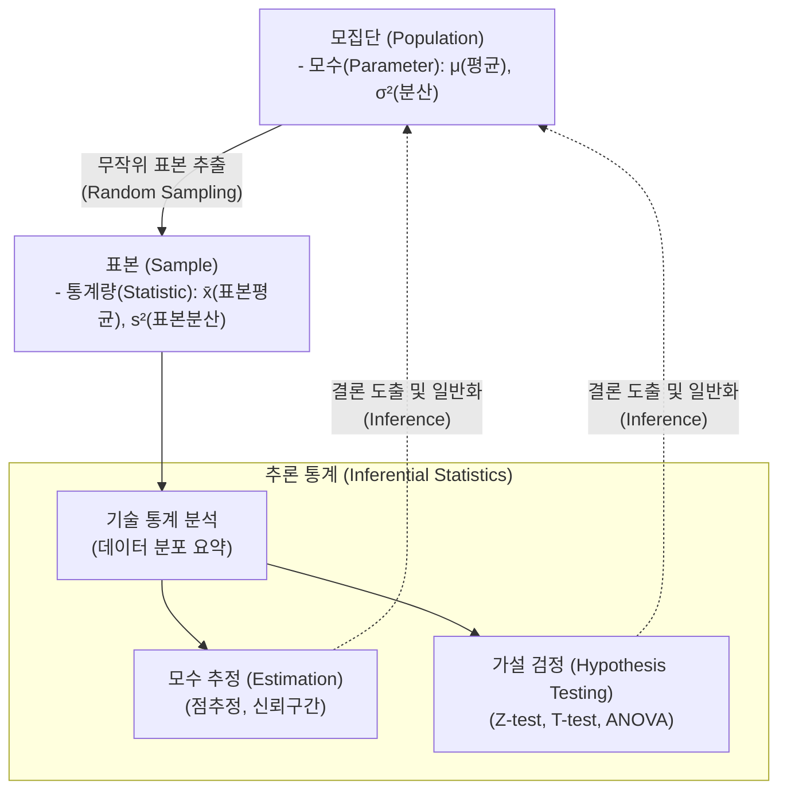

# 추론 통계 (Inferential Statistics)

---

## I. 표본을 통한 모집단 특성 예측, 추론 통계의 개요

* **정의**: 모집단에서 추출한 표본(Sample)의 데이터를 분석하여 통계적 불확실성을 계산하고, 전체 모집단(Population)의 특성(모수)을 추정하거나 가설을 검정하는 통계 분석 기법
* **배경 및 필요성**: 시간과 비용의 제약으로 인한 전수조사의 현실적 한계 극복, 불확실한 상황 하에서의 객관적인 데이터 기반 의사결정(Data-driven Decision) 지원
* **특징**: 확률 이론 기반 접근, 점추정 및 구간추정을 통한 모수 예측, 유의수준(Significance Level) 및 [[유의확률|p-value]]를 활용한 과학적 가설 검증

---

## II. 추론 통계의 개념도 및 핵심 기술 요소

### 가. 추론 통계의 분석 프로세스 및 개념도

* 모집단에서 추출된 표본 데이터의 분포와 기초 통계량을 바탕으로 모수를 확률적으로 추정하고, 귀무가설/대립가설을 검정하여 전체 모집단의 특성을 유추함

### 나. 추론 통계의 핵심 구성 요소

| 구분 | 요소기술(키워드) | 세부 설명 |
| --- | --- | --- |
| **모수 추정** | 점추정 (Point Estimation) | 표본의 평균, 분산 등의 통계량을 이용해 모집단의 모수를 하나의 단일 값으로 예측하는 기법 |
| **모수 추정** | 구간추정 (Interval Estimation) | 오차 한계를 고려하여 모수가 포함될 확률(신뢰수준, 예: 95%)을 지닌 신뢰구간(Confidence Interval)을 산출 |
| **[[가설 검정]]** | 귀무가설(H0) / 대립가설(H1) | 기각하고자 하는 기존의 사실(H0)과 연구자가 새롭게 입증하고자 하는 주장(H1)을 설정하여 검증 |
| **가설 검정** | p-value (유의확률) | 귀무가설이 참일 때, 관측된 통계량보다 더 극단적인 값이 나올 확률 (보통 $\alpha$보다 작으면 H0 기각) |
| **의사결정 기준** | 유의수준 (Significance Level, $\alpha$) | 귀무가설이 참임에도 기각하는 제1종 오류를 범할 최대 허용 한계 (통상적으로 0.05 또는 0.01 설정) |
| **오류 유형** | 제1종 오류 / 제2종 오류 | 제1종(Type I, $\alpha$): 참인 H0를 기각할 오류, 제2종(Type II, $\beta$): 거짓인 H0를 기각하지 않을 오류 |
| **분석 방법론** | 파라미터 검정 (Parametric) | 데이터가 정규분포를 따른다는 가정하에 T-검정, 분산분석([[ANOVA(Analysis of variance)|ANOVA]]) 등을 활용하는 모수적 검정 |
| **분석 방법론** | 비모수 검정 (Non-parametric) | [[정규분포]] 가정이 불가능한 소표본이나 서열 데이터에 대해 카이제곱($\chi^2$), 맨-휘트니 검정 등을 수행 |

---

## III. 기술 통계와 추론 통계 비교 및 최신 산업 동향

### 가. 기술 통계(Descriptive)와 추론 통계(Inferential) 비교

| 비교 항목 | [[기술 통계]] (Descriptive Statistics) | 추론 통계 (Inferential Statistics) |
| --- | --- | --- |
| **분석 목적** | 수집된 데이터의 형태와 특징을 요약 및 설명 | 수집된 표본을 통해 모집단의 특성을 예측 및 [[일반화]] |
| **주요 분석 지표** | 평균, 중앙값, 분산, 표준편차, 왜도, 첨도 | 신뢰구간, 오차한계, p-value, 검정 통계량(t, Z, F) |
| **불확실성 여부** | 존재하지 않음 (주어진 데이터 그 자체의 팩트) | 존재함 (표본 오차 및 확률적 한계 수반) |
| **주요 시각화/결과** | 히스토그램, 박스플롯, 산점도, 빈도표 | 가설 채택/기각 여부, 모델의 적합도(회귀 분석 등) |

### 나. 추론 통계의 최신 산업 적용 동향

* **베이지안(Bayesian) A/B 테스트 도입 가속화**: 기존 빈도주의(Frequentist) 기반 p-value의 경직성과 오남용 한계를 극복하기 위해, 사전 확률을 모델에 지속 반영하여 빠른 의사결정을 돕는 베이지안 추론 및 MAB(Multi-Armed Bandit) [[알고리즘]] 결합이 디지털 프로덕트 최적화의 표준으로 정착 중임.
* **데이터 인과추론(Causal Inference) 고도화**: 머신러닝의 단순 상관관계 위주 한계를 보완하기 위해 Do-calculus 및 통제 집단(Control group) 기반의 Causal AI를 결합하여 알고리즘 변경이나 마케팅 개입의 순효과(ATE, Average Treatment Effect)를 정밀 규명하는 비즈니스 활용이 증가함.

---

### 🔗 연관 토픽

- **소속 도메인**: [[00_인공지능_MOC|🤖 인공지능]]
- **세부 분류**: `1. 수학 · 통계학 & 데이터 전처리`
- **핵심 연관 토픽**:
  - [[기술 통계|기술 통계(Descriptive statistics)]]
  - [[가설 검정]]
  - [[통계적 가설검정|통계적 가설검정 (Hypothesis Testing)]]
  - [[정규분포|정규분포(Normal Distribution)]]
  - [[ANOVA(Analysis of variance)]]
