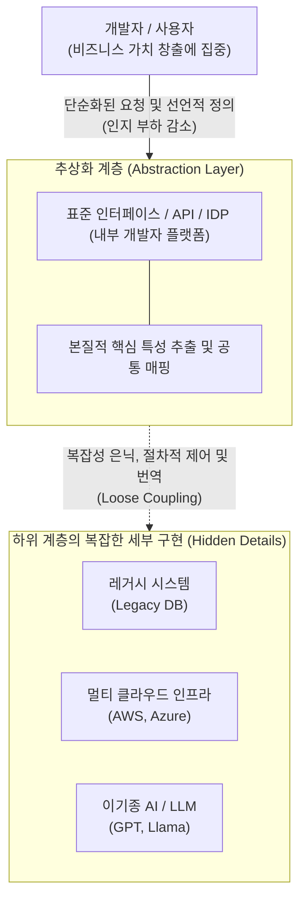

# 추상화 (Abstraction)

---

## I. 복잡성 통제와 생산성 극대화의 핵심 원리, 추상화의 개요

* **정의**: 시스템의 복잡한 내부 세부사항은 은닉하고, 문제 해결에 필요한 본질적이고 핵심적인 정보나 기능만을 추출하여 모델링하는 시스템 설계 원칙이자 기법
* **배경 및 필요성**: 시스템 규모의 대형화 및 멀티 클라우드 환경 확대로 인한 복잡성(Complexity) 폭증, 개발자의 인지 부하(Cognitive Load) 증가, [[결합도]](Coupling) 감소 요구
* **특징**: 정보 은닉(Information Hiding), [[일반화]](Generalization), 계층 분리, [[객체지향]] 프로그래밍(OOP) 및 [[클라우드 네이티브]] 아키텍처 설계의 근간

---

## II. 추상화의 개념도 및 핵심 기술 요소

### 가. 시스템 및 인프라 통합 관점의 추상화 동작 개념도

* 사용자 및 상위 시스템은 하위 인프라(Cloud, AI 등)의 구체적인 작동 방식을 알 필요 없이, 추상화 계층이 제공하는 표준 인터페이스를 통해 단순하게 통신하고 제어함

### 나. IT 전 영역에 걸친 추상화의 핵심 구성/기술 요소

| 구분 | 요소기술(키워드) | 세부 설명 |
| --- | --- | --- |
| **코드/객체 (OOP)** | 데이터 추상화 (Data) | 복잡한 자료형을 묶어 본질만 나타내는 단일 사용자 정의 타입([[클래스]], 구조체) 생성 |
| **코드/객체 (OOP)** | 제어 추상화 (Control) | 특정 로직이나 반복되는 실행 절차의 내부 구현을 숨기고 함수나 메서드로 [[캡슐화]] |
| **아키텍처 (SW)** | 인터페이스 추상화 | Facade 패턴 등을 통해 서브시스템의 복잡한 내부 로직을 숨기고 정돈된 단일 API 노출 |
| **인프라/HW** | OS/[[가상화]] (Container) | 하이퍼바이저 및 OCI([[컨테이너]])를 통해 물리 리소스 및 구동 환경을 추상화하여 이식성 보장 |
| **클라우드** | 선언적 IaC (Terraform) | 클라우드 리소스 프로비저닝의 복잡한 API 호출 절차를 선언적 코드로 추상화 |
| **클라우드** | K8s API (Crossplane) | 멀티 클라우드의 다양한 자원 프로비저닝을 [[쿠버네티스]] 컨트롤 플레인 공통 API로 추상화 |
| **개발 환경 (최신)** | 플랫폼 엔지니어링 (IDP) | CI/CD, 보안, 배포 등 개발 생태계 전반을 골든 패스(Golden Path) 기반 셀프 서비스 포털로 추상화 |
| **AI / [[초거대 언어 모델|LLM]] (최신)** | AI 모델 [[프레임워크]] | LangChain, LlamaIndex 등을 활용해 다종의 LLM API와 RAG 파이프라인의 복잡성을 추상화 |

---

## III. 추상화 패러다임의 진화 및 최신 트렌드 전망

### 가. 소프트웨어 공학 측면의 추상화 패러다임 진화 흐름

| 발전 단계 | 중심 패러다임 | 주요 추상화 대상 | 궁극적 목적 |
| --- | --- | --- | --- |
| **과거 (코드 레벨)** | 구조적/객체지향(OOP) 기법 | 소스 코드 데이터/제어 흐름 | 재사용성 확보 및 [[유지보수]] 용이 |
| **현재 (인프라 레벨)** | 클라우드 네이티브 / [[MSA (Micro Service Architecture)|MSA]] | 물리 서버, 네트워크, 배포 환경 | 시스템 확장성 및 인프라 이식성 보장 |
| **미래 (조직/인지 레벨)** | 플랫폼 엔지니어링 (IDP) | 개발 [[프로세스]], 보안 정책, 규정 | 개발자 인지 부하 최소화 및 생산성 극대화 |

### 나. 최신 IT 트렌드에서의 추상화 적용 동향 및 전망

* **개발자 인지 부하 감소를 위한 플랫폼 엔지니어링 부상**: 가트너 및 CNCF의 핵심 트렌드로, 복잡한 [[DevOps]] 도구 체계와 인프라 관리 지식을 내부 개발자 플랫폼(IDP, 예: Backstage)이라는 단일 포털로 추상화하여 비즈니스 개발 생산성을 극대화하는 조직적 전환 가속화
* **AI 생태계의 프레임워크 추상화**: 수많은 오픈소스 및 상용 파운데이션 모델들의 파편화된 인터페이스를 단일 코드로 제어하고 엮어내는 AI 오케스트레이션 프레임워크(추상화 계층) 중심의 생태계로 재편 중임

---

### 🔗 연관 토픽

- **소속 도메인**: [[00_소프트웨어공학_MOC|🏗️ 소프트웨어공학]]
- **세부 분류**: `3. 요구사항 공학 & UML 객체지향 분석/설계`
- **핵심 연관 토픽**:
  - [[클래스]]
  - [[객체지향]]
  - [[클라우드 네이티브]]
  - [[가상화]]
  - [[쿠버네티스|쿠버네티스(Kubernates)]]
