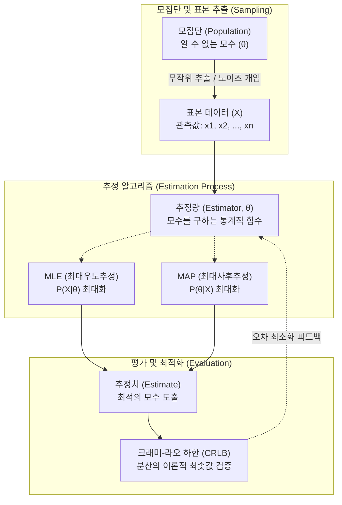

# 추정 이론 (Estimation Theory)

---

## I. 불확실한 데이터로부터 최적의 모수를 추론하는 통계적 기반, 추정 이론의 개요

* **정의**: 노이즈가 포함된 관측 데이터(표본)의 확률 분포를 기반으로, 알 수 없는 모집단의 물리적/통계적 특성(모수, Parameter)을 확률적으로 예측하고 최적화하는 통계 이론
* **등장배경 및 필요성**: 전수 조사의 현실적/물리적 불가능성 극복, 센서 신호의 노이즈 제거 및 유의미한 정보 추출, 기계학습(ML) 모델의 파라미터 최적화(Loss 최소화) 수학적 근거 확보 필요
* **특징**: 점추정(Point)과 구간추정(Interval)으로 구분, 좋은 추정량의 4가지 조건(불편성, 효율성, 일치성, 충분성) 요구, 베이지안 통계망 및 [[딥러닝]] 최적화의 근간 역할 수행

---

## II. 추정 이론의 개념도 및 핵심 기술 요소

### 가. 추정 이론의 개념도 및 동작 원리

* 관측된 표본 데이터를 바탕으로 추정량(함수)을 구성하고, MLE 또는 MAP 등의 알고리즘을 통해 추정치를 산출한 후 분산 한계점(CRLB)을 통해 추정의 타당성을 평가함

### 나. 추정 이론의 핵심 구성 및 평가 요소

| 구분 | 요소기술(키워드) | 세부 설명 |
| --- | --- | --- |
| **추정 방식** | 점추정 (Point Est.) | 표본의 평균, 분산 등을 이용해 모집단의 모수를 **단일 값(스칼라/벡터)** 으로 정확히 짚어 예측하는 기법 |
| **추정 방식** | 구간추정 (Interval Est.) | 오차 한계를 고려하여 모수가 포함될 확률(신뢰수준, 예: 95%)을 지닌 **신뢰구간(Confidence Interval)** 을 산출 |
| **핵심 [[알고리즘]]** | MLE (최대우도추정) | 주어진 관측 데이터가 나타날 확률(우도, Likelihood)을 가장 크게 만드는 모수를 찾는 기법 |
| **핵심 알고리즘** | MAP (최대사후추정) | 모수에 대한 **사전 확률(Prior)** 을 반영하여, 관측 이후의 사후 확률(Posterior)을 최대화하는 기법 |
| **추정량 조건** | 불편성 (Unbiasedness) | 추정량의 기댓값이 실제 모집단의 모수와 정확히 일치하는 성질 ($E(\hat{\theta}) = \theta$) |
| **추정량 조건** | 효율성 (Efficiency) | 여러 [[불편추정량]] 중 **분산(Variance)이 가장 작아** 추정의 정밀도가 가장 높은 성질 (MVUE) |
| **추정량 조건** | 일치성 (Consistency) | 표본의 크기($n$)가 무한히 커질수록 추정량이 실제 모수에 확률적으로 수렴하는 성질 |
| **한계 평가** | CRLB (크래머-라오 하한) | 어떠한 불편추정량도 가질 수 없는 **분산의 이론적인 최솟값(하한선)** 을 제공하여 추정 성능의 한계를 정의 |

---

## III. MLE와 MAP 비교 및 최신 산업 활용 동향

### 가. 기계학습/추론통계의 양대 산맥, MLE와 MAP 비교

| 비교 항목 | MLE (최대우도추정, Maximum Likelihood Est.) | MAP (최대사후추정, Maximum A Posteriori) |
| --- | --- | --- |
| **핵심 원리** | 데이터 자체만으로 우도 $P(X \mid \theta)$ 최대화 | 데이터 + 사전 지식으로 사후확률 $P(\theta \mid X)$ 최대화 |
| **사전확률(Prior)** | 가정하지 않음 (모든 모수의 발생 확률이 동일하다고 가정) | 가정함 (모수의 분포에 대한 사전 정보 반영) |
| **AI/ML 연관성** | 인공신경망의 손실 함수인 **Cross-Entropy 최적화**와 수학적으로 동치 | 기계학습의 과적합 방지를 위한 **L1/L2 정규화(Regularization)** 와 동치 |
| **데이터 크기 민감도** | 표본 데이터가 적을 경우 과적합(Overfitting) 발생 가능성 높음 | 사전 확률을 통해 데이터 부족을 보완하여 강건성(Robustness) 향상 |

### 나. 추정 이론의 최신 산업 활용 동향 및 전망

* **[[Smart Car(자율주행)|자율주행]] 및 로보틱스의 센서 퓨전 (Sensor Fusion)**: 라이다, 레이더, 카메라 등에서 입력되는 노이즈가 섞인 신호로부터 차량의 현재 상태(위치, 속도)를 실시간으로 추정하기 위해 최소평균제곱오차(MMSE) 기반의 **칼만 필터(Kalman Filter) 알고리즘**이 핵심 기술로 활발히 적용 중임.
* **[[베이지안 딥러닝]](Bayesian Deep Learning)으로의 진화**: 기존 AI 모델이 도출하는 결과값의 '불확실성(Uncertainty)'을 정량적으로 추정하지 못하는 한계를 극복하기 위해, 가중치를 단일 점추정(MLE)이 아닌 확률 분포로 추정하여 자율주행 및 의료 AI의 안전성을 보장하는 기술로 발전하고 있음.

---

### 🔗 연관 토픽

- **소속 도메인**: [[00_인공지능_MOC|🤖 인공지능]]
- **세부 분류**: `1. 수학 · 통계학 & 데이터 전처리`
- **핵심 연관 토픽**:
  - [[베이지안 딥러닝]]
  - [[불편추정량|불편추정량 (Unbiased Estimator)]]
  - [[딥러닝]]
  - [[Smart Car(자율주행)]]
  - [[베이지안 모델]]
