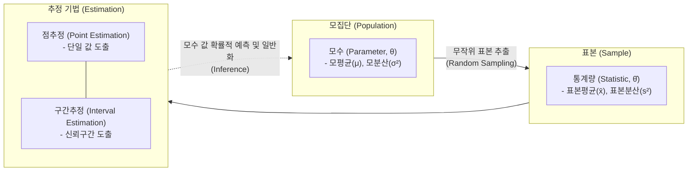

# 추정통계 (Estimation Statistics)

---

## I. 데이터 불확실성을 극복하는 모수 예측 기법, 추정통계의 개요

* **정의**: 모집단에서 추출한 표본(Sample)의 통계량을 바탕으로, 알 수 없는 모집단(Population)의 특성인 모수(Parameter)를 확률적으로 예측하고 추론하는 통계적 기법
* **배경 및 필요성**: 전수조사의 시간적·물리적 한계 극복, 불확실한 데이터 환경에서의 합리적 의사결정 지원, 기계학습(ML) 모델의 파라미터 최적화를 위한 수학적 근거 확보
* **특징**: 확률 이론을 바탕으로 점추정(Point)과 구간추정(Interval) 수행, 좋은 추정량이 되기 위한 4가지 평가 기준(불편성, 효율성, 일치성, 충분성) 충족 요구

---

## II. 추정통계의 개념도 및 핵심 기술 요소

### 가. 추정통계의 아키텍처 및 동작 원리

* 표본 데이터로부터 통계량을 계산한 뒤, 점추정이나 구간추정 알고리즘을 통해 모집단의 진짜 모습(모수)을 확률적으로 역산하여 추론하는 흐름임

### 나. 추정통계의 핵심 기술 및 구성 요소

| 구분 | 요소기술(키워드) | 세부 설명 |
| --- | --- | --- |
| **추정 방식** | 점추정 (Point Est.) | 표본의 평균, 분산 등을 이용해 모집단의 모수를 **단일 스칼라 값**으로 짚어 예측하는 기법 |
| **추정 방식** | 구간추정 (Interval Est.) | 표본 오차를 고려하여 모수가 포함될 확률(신뢰수준, 예: 95%)을 지닌 **신뢰구간(Confidence Interval)** 을 산출 |
| **평가 기준** | 불편성 (Unbiasedness) | 추정량의 기댓값이 실제 모집단의 모수와 [[편향]] 없이 정확히 일치하는 성질 ($E(\hat{\theta}) = \theta$) |
| **평가 기준** | 효율성 (Efficiency) | 여러 [[불편추정량]] 중에서 **분산(Variance)이 가장 작아** 추정의 정밀도가 가장 높은 성질 (MVUE) |
| **평가 기준** | 일치성 (Consistency) | 표본의 크기($n$)가 무한히 커질수록 추정량이 실제 모수에 확률적으로 수렴하는 성질 |
| **평가 기준** | 충분성 (Sufficiency) | 선택된 추정량이 모수에 대한 표본의 모든 정보를 누락 없이 100% 포함하고 있는 성질 |
| **추정 방법론** | 최대우도추정 (MLE) | 주어진 표본 데이터가 관측될 확률(우도, Likelihood)을 가장 극대화하는 모수를 찾는 통계 기법 |
| **추정 방법론** | 베이즈 추정 (MAP) | 모수에 대한 **사전 확률(Prior)** 을 반영하여, 관측 이후의 사후 확률(Posterior)을 최대화하는 기법 |

---

## III. 추정통계와 가설검정 비교 및 최신 활용 동향

### 가. 추론통계학의 양대 산맥, 추정(Estimation)과 가설검정(Hypothesis Testing) 비교

| 비교 항목 | 추정 (Estimation) | 가설검정 (Hypothesis Testing) |
| --- | --- | --- |
| **핵심 목적** | 모집단의 **모수 값이 무엇인지** 예측하고 규명 | 모집단 모수에 대한 **특정 주장의 사실 여부** 확인 |
| **주요 결과물** | 특정 예측값 (점추정) 또는 예측 범위 (신뢰구간) | 주장의 채택/기각 여부 ([[유의확률|p-value]], 유의수준) |
| **분석 주안점** | "데이터를 보니 모평균은 50~55 사이일 것이다" | "모평균이 50이라는 주장은 통계적으로 기각된다" |
| **AI/ML 활용** | [[딥러닝]] 모델의 최적 파라미터(가중치) 탐색 (MLE 기반) | 모델 간 성능 차이의 통계적 유의성 검증 (A/B 테스트) |

### 나. 추정통계의 최신 산업 동향 및 향후 전망

* **[[인공지능]] 손실 함수와의 수학적 결합**: 딥러닝에서 사용하는 교차 엔트로피(Cross-Entropy) 최소화는 본질적으로 최대우도추정(MLE)과 완전히 동일하며, L1/L2 정규화(Regularization) 기법은 베이즈 추정(MAP)의 수학적 구현체로 작용하여 AI 모델 최적화의 이론적 근간이 됨
* **베이지안 추론 기반 불확실성(Uncertainty) 정량화**: 의료 인공지능 및 [[Smart Car(자율주행)|자율주행]] 시스템에서는 단일 점추정 결괏값의 맹신이 치명적 사고로 직결될 수 있으므로, 몬테카를로(MCMC) 및 베이지안 신경망(BNN)을 통해 가중치를 확률 분포로 구간추정하여 판단의 불확실성을 수치화하는 기술이 핵심 트렌드로 부상 중임

---

### 🔗 연관 토픽

- **소속 도메인**: [[00_인공지능_MOC|🤖 인공지능]]
- **세부 분류**: `1. 수학 · 통계학 & 데이터 전처리`
- **핵심 연관 토픽**:
  - [[불편추정량|불편추정량 (Unbiased Estimator)]]
  - [[유의확률|유의확률 (p-value)]]
  - [[인공지능]]
  - [[편향]]
  - [[CNN|CNN (Convolutional Neural Network)]]
