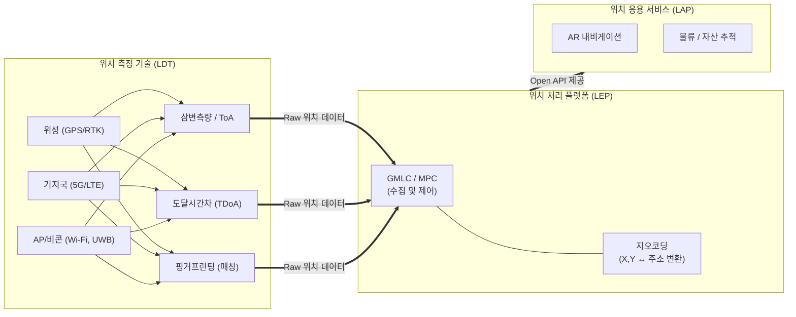

# 측위기술 (LDT: Location Determination Technology)

---

## I. LBS의 핵심 기반, 측위기술(LDT)의 개요

**가. 측위기술(LDT)의 정의**

* 스마트폰, 사물인터넷(IoT) 단말 등 이동체의 물리적 위치(좌표)를 파악하기 위해 위성, 통신망, 센서 등의 신호를 수집하여 정밀한 위치를 산출하는 무선 기반 위치 결정 기술

**나. 측위기술의 등장배경 및 특징**

* **등장배경**: GPS 기반 실외 측위의 한계(실내 음영지역) 극복 필요, O2O(Online to Offline) 및 초연결 스마트시티 시대의 초정밀 실내 위치 수요 증가
* **특징**: 연속성(Seamless 실내외 연동), 초정밀(cm 단위 오차 최소화), 하이브리드(다중 센서 융합 기반 측위)

---

## II. 측위기술(LDT)의 아키텍처 및 핵심 구성요소

### 가. 측위기술(LDT)의 아키텍처 및 동작 원리

* 다양한 무선 노드(위성, 기지국, AP)로부터 수신된 신호를 삼변측량, TDoA, [[핑거프린팅]] 방식으로 계산하여 단말의 초기 좌표 획득
* LDT에서 산출된 좌표 데이터는 LEP(위치 플랫폼)에서 주소로 정제(Geocoding)되어 LAP(응용 서비스)로 전달됨

### 나. 측위기술(LDT)의 핵심 기술 요소

| 구분 | 핵심 기술(키워드) | 세부 설명 |
| --- | --- | --- |
| **실외 측위** | **GPS / A-GPS** | 위성 신호(ToA)를 기반으로 측위하며, 통신망 보조 데이터를 활용해 초기 위치 획득 시간(TTFF)을 단축 |
| **실외 측위** | **RTK-GPS** | 기준국과의 양방향 통신으로 반송파 위상 오차를 실시간 보정하여 cm급 초정밀 실외 위치 제공 |
| **실외 측위** | **Cell-ID** | 이동통신 단일 기지국의 커버리지와 섹터 정보를 활용한 개략적 위치 파악 (오차 범위 넓음) |
| **실내 측위** | **Wi-Fi 핑거프린팅** | 특정 공간 내 무선랜 신호 세기(RSSI)를 사전 수집해 DB화하고, 현재 신호 패턴과 매칭하여 위치 추정 |
| **실내 측위** | **BLE Beacon (AoA)** | 저전력 블루투스 비콘 신호의 도달 각도(AoA)와 출발 각도(AoD)를 이용해 3D 공간상의 위치와 방향 파악 |
| **실내 측위** | **UWB (Ultra-Wideband)** | 수백 MHz 이상의 초광대역 주파수와 펄스 도달 시간차(TDoA)를 활용한 센티미터(cm) 단위 정밀 측위 |
| **영상 측위** | **VPS (비전 기반 측위)** | 카메라 영상의 사물/공간 특징점을 추출하고, 클라우드의 3D 맵핑 데이터와 비교하여 시각적 위치 계산 |
| **센서 기반** | **SLAM / DR (추측항법)** | 가속도계/자이로스코프 등 내장 센서를 활용해 이전 위치로부터의 이동 궤적을 추적 및 [[Smart Car(자율주행)|자율주행]] 매핑 |

---

## III. 실내외 주요 측위기술 비교 및 향후 전망

**가. 주요 실내외 측위기술(LDT) 상세 비교**

| 비교 항목 | GPS / A-GPS (실외) | Wi-Fi 핑거프린팅 (실내) | BLE / UWB (실내 정밀) | VPS (비전 기반) |
| --- | --- | --- | --- | --- |
| **주요 측위 원리** | 위성 신호 ToA 기반 삼변측량 | 라디오 맵(RSSI) DB 패턴 매칭 | AoA/AoD, ToF, TDoA 활용 | 카메라 3D 점군 데이터 매칭 |
| **위치 정확도** | 5~20m (전리층 오차 발생) | 2~5m (DB 정밀도에 의존) | BLE(1~2m), UWB(10cm 내외) | 50cm 내외 (렌즈 성능에 의존) |
| **인프라 의존성** | 위성 인프라 (초기 도입비 무) | 기존 건물 무선랜 AP 재활용 | 전용 비콘/앵커 설치 필수 | 사전 3D 맵핑 DB 구축 필수 |
| **특징 및 한계** | 실내 음영지역 발생, 날씨 영향 | AP 이동/변경 시 DB 재구축 | 장애물 투과 및 보안성 우수(UWB) | 조명 변화 및 야간 환경에 취약 |
| **주요 활용 서비스** | 차량용 내비게이션, 선박 관제 | 대형 쇼핑몰 길안내, 출입 관리 | 스마트키, 스마트 팩토리, [[드론]] | AR 내비게이션, 로봇 자율주행 |

**나. 향후 전망 및 동향**

* **하이브리드 측위 기술로의 진화**: 단일 측위 기술의 커버리지 한계를 극복하기 위해 실외(RTK-GPS)와 실내(UWB, VPS) 데이터를 매끄럽게 결합하는 Seamless 하이브리드 포지셔닝(Hybrid Positioning) 도입 가속화
* **5G Advanced 기반 측위**: 초저지연 통신망 특성을 이용한 5G 기반 고정밀 포지셔닝 기술(Rel-17 이후)이 산업 현장(자율주행, 로봇 제어)의 표준 측위 기술로 부상 중

---

### 🔗 연관 토픽

- **소속 도메인**: [[00_디지털서비스_MOC|🚀 디지털서비스]]
- **세부 분류**: `3. 사물인터넷 (IoT) & 스마트 플랫폼 · 메타버스`
- **핵심 연관 토픽**:
  - [[Smart Car(자율주행)]]
  - [[드론|드론 (Drone; 무인기)]]
  - [[물리적 AI]]
  - [[ISO 26262]]
  - [[CPS]]
