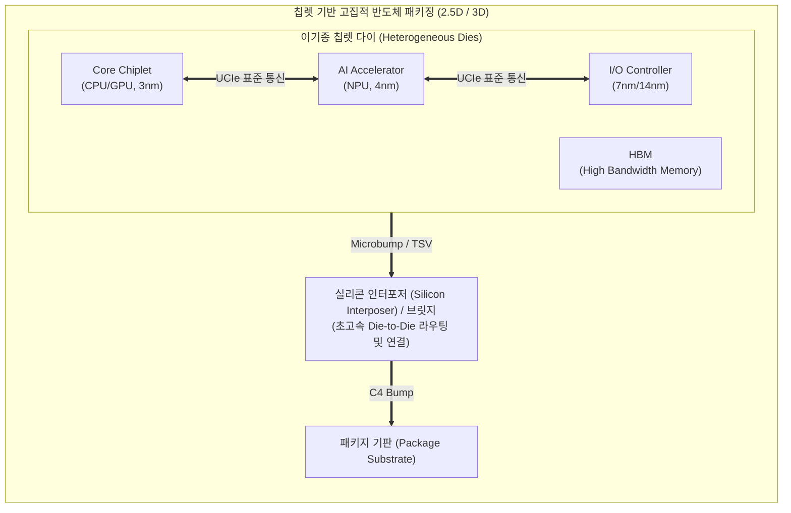

# 칩렛 (Chiplet)

---

## I. 반도체 미세공정 한계 극복, 칩렛(Chiplet)의 개요

**가. 칩렛(Chiplet)의 정의**

* 단일 칩(Monolithic)으로 구현하던 복잡한 기능을 여러 개의 작은 독립적 다이(Die)로 분할 제조한 뒤, 고급 패키징 기술을 통해 하나의 칩처럼 동작하게 만드는 반도체 설계 및 제조 기술

**나. 칩렛의 등장배경 및 특징**

* **등장배경**: 초미세공정(3nm 이하) 도입에 따른 천문학적 비용 증가, 칩 면적 증가로 인한 수율(Yield) 저하, 무어의 법칙(Moore's Law) 한계 도달
* **특징**: 이기종 통합(Heterogeneous Integration), 높은 수율 확보 및 제조 원가 절감, 유연한 설계 및 적기 출시(Time-to-Market) 가능

---

## II. 칩렛의 아키텍처 및 핵심 기술 요소

### 가. 칩렛의 개념도 및 동작 원리

* 각기 다른 최적의 공정(3nm, 7nm 등)에서 생산된 칩렛을 실리콘 인터포저 위에 수평/수직 배치
* 칩렛 간 통신은 UCIe(Universal Chiplet Interconnect Express) 등 초고속 D2D 인터페이스를 통해 단일 칩 수준의 대역폭으로 데이터 교환

### 나. 칩렛의 핵심 기술 요소

| 분류 | 요소기술(키워드) | 세부 설명 |
| --- | --- | --- |
| **패키징** | **2.5D / 3D 패키징** | 인터포저를 활용한 수평 배치(2.5D) 및 다이를 수직으로 적층(3D)하여 실장 면적 최소화 및 집적도 향상 |
| **연결 기판** | **실리콘 인터포저 (Interposer)** | 칩렛과 패키지 기판 사이에 위치하며, 칩 간 초고속 통신을 위해 미세 회로가 패턴화된 실리콘 기반 기판 |
| **수직 연결** | **TSV (Through Silicon Via)** | 실리콘 다이를 수직으로 관통하는 미세 구리 선을 형성하여 칩 간 전기적 신호와 데이터를 고속 전송 |
| **인터페이스** | **UCIe / D2D (Die-to-Die)** | 이기종 칩렛 간 상호 연결 및 데이터 통신을 위한 개방형 산업 표준 인터페이스 (초당 수십 GB/s 대역폭) |
| **설계/공정** | **이기종 통합 (Heterogeneous Integration)** | 연산(3nm), I/O(7nm), 메모리 등 역할에 맞춰 최적화된 각기 다른 공정의 다이를 하나의 패키지로 결합 |
| **접합 기술** | **Microbump / Hybrid Bonding** | 칩렛과 기판을 연결하는 미세 돌기(범프) 및 범프 없이 구리 전극을 직접 붙여 간격을 좁히는 하이브리드 본딩 |
| **품질 검증** | **KGD (Known Good Die)** | 패키징 전 개별 칩렛 상태에서 완벽하게 불량 여부를 테스트 및 검증하여 최종 패키징 수율을 보장하는 기술 |
| **독자 기술** | **CoWoS / Foveros / EMIB** | TSMC의 2.5D 패키징(CoWoS), 인텔의 3D 적층(Foveros) 및 실리콘 브릿지(EMIB) 등 벤더별 칩렛 구현 기술 |

---

## III. 칩렛과 모놀리식(Monolithic) SoC 비교 및 향후 전망

### 가. 모놀리식 SoC와 칩렛 아키텍처 비교

| 비교 항목 | 모놀리식 (Monolithic SoC) | 칩렛 (Chiplet) |
| --- | --- | --- |
| **설계/구조** | 모든 기능([[CPU]], I/O 등)을 단일 다이(Die)에 집적 | 기능을 분할하여 여러 다이로 제조 후 패키징 통합 |
| **제조 수율** | 칩 면적이 커질수록 결함 확률이 높아져 수율 급감 | 작은 다이(Die) 단위로 제조하여 불량률 감소 및 수율 우수 |
| **공정 최적화** | 모든 블록이 동일한 최선단 공정 종속 (비용 낭비 발생) | 블록별 최적 공정(로직 3nm, I/O 7nm 등) 적용 가능 |
| **초기 개발비** | 포토마스크 제작 등 막대한 초기 설계/공정 비용 발생 | 검증된 칩렛 [[재사용]](IP 활용)으로 설계 비용 및 기간 단축 |
| **연결 성능** | 칩 내부 온칩(On-Chip) 버스 통신으로 지연시간 최소화 | 칩 간(Off-Chip) 통신 발생으로 패키징 및 통신 오버헤드 존재 |

### 나. 향후 전망 및 기술 동향

* **UCIe 표준화 가속 및 생태계 확장**: 인텔, AMD, TSMC, 삼성전자 등이 참여하는 UCIe 컨소시엄을 통해 제조사가 다른 칩렛 간에도 완벽한 호환성을 제공하는 플러그앤플레이(Plug-and-Play) 생태계 구축 진행 중
* **AI 반도체 및 초거대 연산 중심의 주류화**: 엔비디아(Blackwell), AMD(MI300) 등 AI 가속기 및 서버용 프로세서 시장에서 초고대역폭 메모리([[HBM]])와 연산 코어 칩렛의 하이브리드 결합이 필수적인 설계 표준으로 자리매김

---

### 🔗 연관 토픽

- **소속 도메인**: [[00_컴퓨터구조_MOC|💻 컴퓨터구조]]
- **세부 분류**: `3. 고성능 AI 가속기 & 입출력 시스템`
- **핵심 연관 토픽**:
  - [[CPU]]
  - [[지능형 반도체]]
  - [[메모리 반도체|메모리 반도체 (Memory Semiconductor)]]
  - [[비메모리 반도체|비메모리 반도체 (Non-Memory Chip System Semiconductor)]]
  - [[HBM|HBM (High Bandwidth Memory)]]
