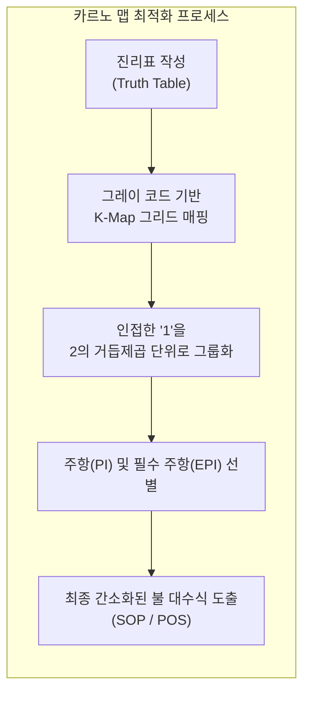

# 카르노 맵 (Karnaugh Map)

---

## I. 논리 회로 간소화를 위한 시각적 최적화 도구, 카르노 맵의 개요

**가. 카르노 맵(Karnaugh Map)의 정의**

* 불 대수(Boolean Algebra) 식을 복잡한 수학적 정리 증명 없이, 진리표를 2차원 그리드 형태로 변형하여 시각적으로 간소화하는 논리 최적화 기법

**나. 카르노 맵의 등장배경 및 특징**

* **등장배경**: 불 대수 공식을 이용한 수동 간소화의 복잡성과 휴먼 에러 발생 가능성을 극복하고, 논리 게이트 수를 최소화하여 회로 비용 및 전력 절감 필요
* **특징**: 그레이 코드(Gray Code) 배열 기반 인접 셀 간소화, 직관적인 패턴 매칭, 4~5변수 이하의 소규모 조합 논리 설계에 최적화

---

## II. 카르노 맵의 아키텍처 및 핵심 구성요소

### 가. 카르노 맵의 최적화 동작 원리

* 진리표의 결과값을 인접 셀의 변동이 1비트만 발생하도록 구성된 그레이 코드 그리드에 배치한 후, 2의 거듭제곱($1, 2, 4, 8$) 단위로 묶어 최소화된 논리식을 도출

### 나. 카르노 맵의 핵심 구성 요소 및 용어

| 분류 | 요소기술(키워드) | 세부 설명 |
| --- | --- | --- |
| **배열 체계** | **그레이 코드 (Gray Code)** | 인접한 셀 간 오직 1개의 비트만 변경되도록 배치하여 논리 인접성 확보 |
| **그룹화** | **2의 거듭제곱 묶음 ($2^n$)** | 1, 2, 4, 8, 16개 단위로 묶을수록 소거되는 변수(역원 관계)가 증가하여 식이 간소화됨 |
| **항 항목** | **주항 (Prime Implicant)** | 더 이상 큰 크기로 묶을 수 없는 최대 크기의 소거 가능한 항 그룹 |
| **항 항목** | **필수 주항 (EPI)** | 다른 주항이 커버하지 못하는 '1'을 반드시 포함해야만 하는 필수 그룹 |
| **표현 형식** | **SOP (Sum of Products)** | 최소항(Minterm)들의 합 형태로 표현하며, AND-OR 게이트 회로 구현에 적합 |
| **표현 형식** | **POS (Product of Sums)** | 최댓항(Maxterm)들의 곱 형태로 표현하며, OR-AND 게이트 회로 구현에 적합 |
| **한계 극복** | **에스프레소 [[알고리즘]]** | 수작업 K-map의 한계(5변수 이상)를 극복하기 위한 컴퓨터 기반 휴리스틱 논리 최적화 프로그램 |
| **현대적 응용** | **[[EDA]] / 논리 합성** | 하드웨어 설계 자동화 도구에서 게이트 최소화를 위해 내부적으로 활용되는 최적화 로직 |

---

## III. 수작업 카르노 맵 vs 현대적 EDA 논리 합성 비교 및 향후 동향

### 가. 수작업 카르노 맵과 현대적 논리 합성 비교

| 비교 항목 | 수작업 카르노 맵 (Manual K-Map) | 현대적 자동 논리 합성 (EDA / Espresso) |
| --- | --- | --- |
| **적용 규모** | 4~5변수 이하의 소규모 논리식 | 다중 변수 및 수천 개 이상의 게이트를 가진 대규모 설계 |
| **처리 방식** | 인간의 시각적 패턴 인식 및 그레이 코드 매칭 | 휴리스틱 알고리즘 기반 컴퓨터 자동 연산 최적화 |
| **휴먼 에러** | 복잡성 증가 시 누락 및 오류 발생 가능성 높음 | 알고리즘 기반 수행으로 완벽한 [[무결성]] 및 최적화 보장 |
| **주요 활용** | 디지털 논리회로 교육 및 기초 설계 분석 | FPGA, ASIC 등 고성능 실무 반도체 회로 합성 |

### 나. 향후 전망 및 동향

* **교육 및 기초 설계 도구로의 정착**: 대규모 SoC 및 복잡한 반도체 설계의 급증으로 실무에서는 EDA 툴과 [[인공지능]] 기반 하드웨어 합성(AI-driven Logic Synthesis)이 주를 이루며, K-map은 디지털 회로 설계의 근본 원리를 이해하는 핵심 교육 모델로 활용 중

---

### 🔗 연관 토픽

- **소속 도메인**: [[00_컴퓨터구조_MOC|💻 컴퓨터구조]]
- **세부 분류**: `1. CPU 프로세서 & 마이크로아키텍처`
- **핵심 연관 토픽**:
  - [[알고리즘]]
  - [[인공지능]]
  - [[방향성 비순환 그래프|방향성 비순환 그래프(DAG, Directed Acyclic Graph)]]
  - [[캐시 메모리의 쓰기 정책|캐시메모리의 쓰기정책(Write Policy)]]
  - [[무결성]]
