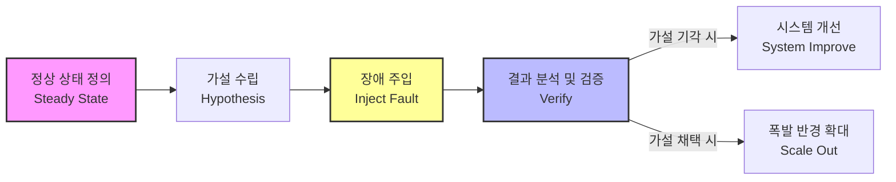

# 카오스 엔지니어링 (Chaos Engineering)

---

## I. 분산 시스템의 회복탄력성 확보, 카오스 엔지니어링의 개요

* **가. 카오스 엔지니어링의 정의**: 프로덕션 환경 등 분산 시스템에서 예상치 못한 장애 조건에서도 시스템이 견딜 수 있는지 확인하기 위해 의도적으로 결함을 주입하고 검증하는 실험적 접근 기법
* **나. 카오스 엔지니어링의 등장배경 및 특징**
* [[MSA (Micro Service Architecture)|MSA]](Microservices Architecture) 및 [[클라우드 네이티브]] 환경 도입으로 인한 시스템 복잡도 및 불확실성 증가
* 사후 장애 대응(Reactive)에서 사전 장애 예방(Proactive)으로의 품질 관리 패러다임 전환
* 실제 서비스 영향을 통제하기 위해 폭발 반경(Blast Radius)을 최소화하여 안전하게 통제된 환경에서 실험 수행

---

## II. 카오스 엔지니어링의 개념도 및 핵심 구성 요소

### 가. 카오스 엔지니어링의 개념도 및 실험 프로세스

* 시스템의 지표를 통해 정상 상태를 정의한 후, 대조군과 실험군 간의 가설을 수립하고 실운영 환경에 장애를 주입하여 시스템의 회복탄력성을 검증함

### 나. 카오스 엔지니어링의 핵심 기술 및 구성 요소

| 구분 | 요소기술(키워드) | 세부 설명 |
| --- | --- | --- |
| **실험 원칙** | 정상 상태 (Steady State) | 시스템이 안정적으로 동작함을 나타내는 측정 가능한 비즈니스/시스템 지표 ([[응답시간]], [[처리량]] 등) |
| **실험 원칙** | 폭발 반경 (Blast Radius) | 장애 주입 실험이 실제 사용자 및 서비스에 미치는 영향도를 최소화하기 위한 통제 범위 |
| **실험 원칙** | 가설 수립 (Hypothesis) | 장애가 발생하더라도 정상 상태 지표가 유지될 것이라는 가정 설정 및 대조군/실험군 비교 |
| **장애 유형** | 지연 주입 (Latency Injection) | 네트워크 지연, 패킷 손실 등을 인위적으로 유도하여 타임아웃 및 Fallback 로직 검증 |
| **장애 유형** | 자원 고갈 (Resource Exhaustion) | [[CPU]], Memory, Disk I/O 리소스를 고갈시켜 오토스케일링 및 시스템 임계점 테스트 |
| **주요 도구** | Chaos Monkey | 넷플릭스(Netflix)에서 고안한 도구로 프로덕션 환경의 인스턴스를 무작위로 종료하여 검증 |
| **주요 도구** | Gremlin | 카오스 엔지니어링을 SaaS 형태로 제공하여 다양한 클라우드 플랫폼에서 직관적인 실험 지원 |
| **주요 도구** | Chaos Mesh | Kubernetes(K8s) 환경에 특화되어 설계된 클라우드 네이티브 기반 카오스 엔지니어링 [[프레임워크]] |

---

## III. 카오스 엔지니어링과 전통적 테스트 비교 및 도입 시 고려사항

### 가. 카오스 엔지니어링과 전통적 소프트웨어 테스트 비교

| 비교 항목 | 카오스 엔지니어링 | 전통적 테스트 (단위/[[통합 테스트]]) |
| --- | --- | --- |
| **목적** | 미지의 장애(Unknown-Unknowns) 탐색 및 회복탄력성 확보 | 알려진 속성(Known-Knowns)에 대한 기능적 결함 탐지 |
| **수행 환경** | 주로 **운영(Production) 환경** 또는 그와 동일한 스테이징 환경 | 주로 **개발/테스트(Dev/QA) 환경** |
| **접근 방식** | 가설 기반의 '실험(Experimentation)' (능동적 장애 주입) | 기대 결과가 명확한 '검증(Validation)' (결과 확인) |
| **대상 영역** | 인프라, 네트워크, 분산 시스템 등 아키텍처 전체 | 개별 모듈, 컴포넌트, 비즈니스 로직 단위 |

### 나. 성공적인 카오스 엔지니어링 도입을 위한 고려사항

* **지속적 모니터링 체계 구축**: Datadog, Prometheus, Grafana 등을 통한 정밀한 옵저버빌리티(Observability) 확보 필수
* **점진적 도입 전략**: 개발 환경에서 시작하여 스테이징, 프로덕션 환경 순으로 실험 범위를 단계적으로 확대하고, 안전 장치(Kill Switch)를 마련하여 서비스 중단 리스크 최소화

---

### 🔗 연관 토픽

- **소속 도메인**: [[00_소프트웨어공학_MOC|🏗️ 소프트웨어공학]]
- **세부 분류**: `4. 아키텍처 스타일 & 객체지향 설계 원리`
- **핵심 연관 토픽**:
  - [[프레임워크]]
  - [[MSA (Micro Service Architecture)]]
  - [[성능 테스트 도구]]
  - [[통합 테스트]]
  - [[응답시간]]
