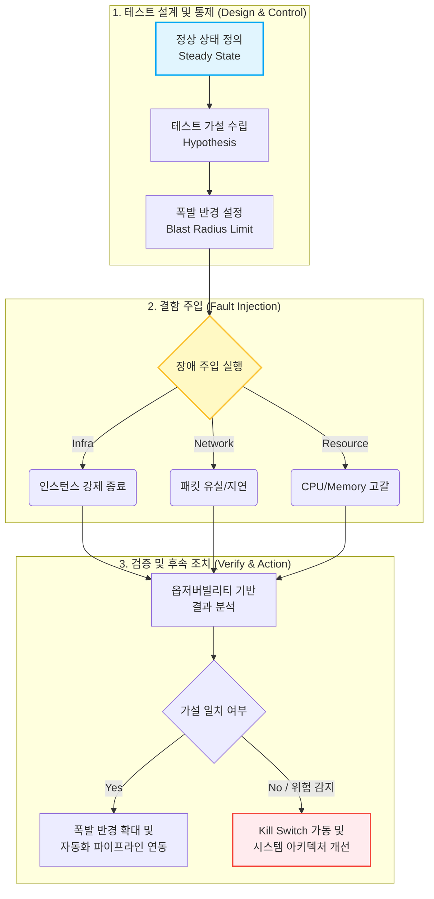

# 카오스 테스트 (Chaos Test)

---

## I. 분산 시스템의 회복탄력성 검증, 카오스 테스트의 개요

* **가. 카오스 테스트의 정의**: 마이크로서비스([[MSA (Micro Service Architecture)|MSA]]) 및 클라우드 등 분산 시스템 환경에서 예상치 못한 결함(서버 다운, 네트워크 지연 등)을 의도적으로 주입하여 시스템의 회복탄력성(Resiliency)을 검증하는 테스트 기법
* **나. 카오스 테스트의 등장배경 및 특징**
* **등장배경**: 복잡한 분산 아키텍처 환경에서 단일 컴포넌트의 장애가 전체 시스템 장애로 확산(Cascading Failure)되는 현상 방지 필요성 증대
* **특징**: 사전 장애 모의 훈련(Proactive), 폭발 반경(Blast Radius) 통제, 주로 실제 운영(Production) 환경에서 수행

---

## II. 카오스 테스트의 개념도 및 핵심 기술 요소

### 가. 카오스 테스트의 동작 프로세스 및 개념도

* 정상 상태 지표(SLI/SLO)를 기준으로 가설을 수립하고, 결함 주입 후 시스템의 자가 복구 및 Fallback 메커니즘이 정상 동작하는지 모니터링 및 검증 수행

### 나. 카오스 테스트의 핵심 구성 요소 및 기법

| 분류 | 요소기술(키워드) | 세부 설명 |
| --- | --- | --- |
| **테스트 원칙** | 폭발 반경 (Blast Radius) | 장애 주입으로 인한 서비스 영향도를 최소화하기 위해 실험 대상을 점진적으로 통제 및 확대 |
| **테스트 원칙** | 정상 상태 (Steady State) | 에러율, [[응답시간]] 등 시스템이 정상적으로 동작하고 있음을 나타내는 측정 가능한 기준 지표 |
| **결함 주입 기법** | 자원 고갈 (Resource Exhaustion) | [[CPU]], Memory, Disk I/O 부하를 임계치 이상으로 발생시켜 오토스케일링 및 리소스 격리 동작 확인 |
| **결함 주입 기법** | 네트워크 지연/유실 (Network Fault) | 인위적인 지연(Latency) 및 패킷 드랍을 발생시켜 타임아웃, 재시도(Retry), 서킷 브레이커 동작 검증 |
| **결함 주입 기법** | 상태 변화 (State Mutation) | DB 페일오버(Fail-over), 시스템 시간 변경 등을 통해 상태 비일치 발생 시의 복원력 테스트 |
| **안전 장치** | 킬 [[스위치 (Layer 3 Switch)|스위치]] (Kill Switch) | 테스트 중 예상치 못한 치명적 장애 발생 시, 즉시 결함 주입을 중단하고 원상 복구하는 자동화 롤백 장치 |
| **테스트 이벤트** | 게임 데이 (Game Day) | 엔지니어링 조직 전체가 참여하여 실제 운영 환경에 모의 장애를 발생시키고 대응 프로세스를 훈련하는 이벤트 |
| **지원 도구** | Chaos Monkey | 넷플릭스에서 개발한 도구로 프로덕션 환경의 가상 머신이나 컨테이너를 무작위로 종료시켜 내결함성을 검증 |

---

## III. 카오스 테스트와 부하/스트레스 테스트 비교 및 성공적 도입 전략

### 가. 카오스 테스트와 부하(Load)/스트레스(Stress) 테스트 비교

| 비교 항목 | 카오스 테스트 (Chaos Test) | 스트레스 테스트 (Stress Test) |
| --- | --- | --- |
| **테스트 목적** | 예상치 못한 **결함/장애에 대한 회복탄력성** 검증 | 한계 트래픽 하에서의 **최대 [[처리량]](Capacity) 및 병목 구간** 확인 |
| **포커스(Focus)** | 서버 다운, 네트워크 지연 등 **환경적 변수** | 동시 접속자 수, 초당 [[트랜잭션]](TPS) 등 **부하 변수** |
| **수행 환경** | 주로 **운영(Production)** 환경 (최종 지향점) | 주로 **테스트(QA)/스테이징** 환경 |
| **기대 효과** | 시스템 내결함성 강화, 미지의 장애(Unknown-Unknowns) 대비 | 성능 튜닝 포인트 도출, 필요 인프라 자원 용량 산정 |

### 나. 성공적인 카오스 테스트 도입 및 수행 전략

* **옵저버빌리티(Observability) 확보**: 메트릭, 로그, 트레이싱(Tracing)을 통합 모니터링할 수 있는 체계(Datadog, Prometheus 등) 사전 구축 필수
* **지속적 카오스 테스팅(Continuous Chaos Testing)**: 일회성 이벤트(Game Day)를 넘어 CI/CD 파이프라인에 카오스 테스트 도구(Chaos Mesh, Gremlin 등)를 통합하여 배포 주기마다 회복탄력성 상시 검증

---

### 🔗 연관 토픽

- **소속 도메인**: [[00_소프트웨어공학_MOC|🏗️ 소프트웨어공학]]
- **세부 분류**: `4. 아키텍처 스타일 & 객체지향 설계 원리`
- **핵심 연관 토픽**:
  - [[MSA (Micro Service Architecture)]]
  - [[응답시간]]
  - [[처리량]]
  - [[카오스 엔지니어링|카오스 엔지니어링 (Chaos Engineering)]]
  - [[프로시저]]
