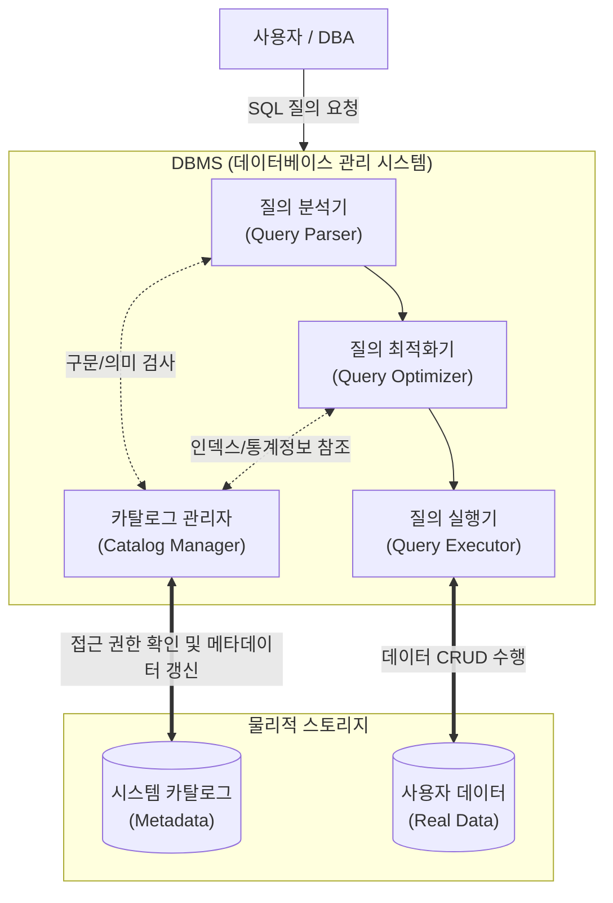

# 시스템 카탈로그 (System Catalog)

---

## I. 데이터베이스의 메타데이터 저장소, 시스템 카탈로그의 개요

* **가. 시스템 카탈로그(System Catalog)의 정의**: 데이터베이스에 저장되어 있는 테이블, 인덱스, 뷰, 제약조건, 사용자 권한 등 모든 객체에 대한 메타데이터(Metadata)를 유지 및 관리하는 시스템 [[데이터베이스]] (데이터 사전, Data Dictionary라고도 함)
* **나. 시스템 카탈로그의 특징**
* **[[DBMS]] 자동 갱신**: 사용자가 [[DDL]](CREATE, ALTER, DROP)을 실행하면 DBMS가 카탈로그의 내용을 자동으로 갱신함
* **조회 전용(Read-Only)**: 일반 사용자 및 DBA는 [[SQL(Structured Query Language)|SQL]]을 이용하여 내용 검색(SELECT)만 가능하며, 직접 갱신(INSERT, UPDATE, DELETE)은 불가함
* **자체 기술성(Self-Describing)**: 데이터베이스 자체의 구조 정보를 포함하여 시스템 스스로 메타데이터를 설명함

---

## II. 시스템 카탈로그의 개념도 및 핵심 구성 요소

### 가. 시스템 카탈로그의 아키텍처 및 동작 원리

* DBMS는 사용자의 SQL 질의를 분석 및 최적화하는 과정에서 카탈로그에 저장된 메타데이터(구조, 제약조건, 통계 정보 등)를 지속적으로 참조하여 실행 계획을 수립함

### 나. 시스템 카탈로그의 핵심 구성 요소

| 구분 | 요소기술(테이블/뷰) | 세부 설명 |
| --- | --- | --- |
| **객체 정보** | SYSTABLES | 데이터베이스 내의 모든 릴레이션(테이블) 및 뷰에 대한 정보 저장 |
| **객체 정보** | SYSCOLUMNS | 각 릴레이션을 구성하는 속성(컬럼)들의 이름, 데이터 타입, 길이 정보 저장 |
| **객체 정보** | SYSINDEXES | 데이터베이스 내에 생성된 모든 인덱스의 구조 및 대상 속성 정보 저장 |
| **객체 정보** | SYSVIEWS | 가상 테이블인 뷰(View)의 정의 문장 및 연관된 기본 테이블 정보 저장 |
| **보안/권한** | SYSUSERS | 데이터베이스 사용자 계정 정보 및 접근 권한(Grant/Revoke) 메타데이터 |
| **보안/권한** | SYSTABAUTH | 특정 테이블에 대해 사용자에게 부여된 조작 권한 정보 저장 |
| **내부 정보** | 통계 정보 (Statistics) | 테이블의 튜플 수, 속성 값의 분포 등을 저장하여 질의 최적화기([[OPTIMIZER|Optimizer]])에 제공 |
| **물리 영역** | 데이터 디렉터리 (Data Directory) | 카탈로그 데이터가 실제 디스크에 저장된 물리적 위치 정보를 보유 (사용자 접근 불가) |

---

## III. 시스템 카탈로그와 사용자 데이터베이스 비교 및 접근 뷰 유형

### 가. 시스템 카탈로그와 사용자 데이터베이스 비교

| 비교 항목 | [[시스템 카탈로그|시스템 카탈로그 (System Catalog)]] | 사용자 데이터베이스 (User Database) |
| --- | --- | --- |
| **저장 대상** | **메타데이터** (데이터 구조, 권한, 인덱스 등) | **실제 데이터** (업무 [[트랜잭션]], 사용자 정보 등) |
| **데이터 생성 주체** | DBMS (DDL 실행 시 자동 생성/변경) | 사용자 및 응용 프로그램 ([[DML]] 실행 시) |
| **사용자 접근 권한** | 제한적 (검색(SELECT)만 허용) | 전면 허용 (CRUD 전체 조작 가능) |
| **활용 목적** | 질의 분석, 보안 검사, 실행 계획 최적화 | 실제 비즈니스 로직 처리 및 정보 활용 |

### 나. 주요 상용 DBMS(Oracle 기준)의 데이터 사전 뷰(View) 제공 형태

* **DBA_xxx (데이터베이스 관리자 뷰)**: DB 내의 모든 객체에 대한 전역적(Global) 메타데이터 조회 가능 (DBA 권한 필요)
* **ALL_xxx (전체 접근 허용 뷰)**: 현재 로그인한 사용자가 접근할 수 있는 모든 객체(자신 소유 + 권한을 부여받은 타인 소유) 정보 제공
* **USER_xxx (사용자 소유 뷰)**: 현재 로그인한 사용자 본인이 소유(생성)한 데이터베이스 객체 정보만 제공 (가장 제한적인 뷰)

---

### 🔗 연관 토픽

- **소속 도메인**: [[00_데이터베이스_MOC|🗄️ 데이터베이스]]
- **세부 분류**: `1. 데이터 모델링 & 관계형 DB 설계`
- **핵심 연관 토픽**:
  - [[데이터베이스]]
  - [[DBMS]]
  - [[DDL]]
  - [[시스템 카탈로그|시스템 카탈로그 (System Catalog)]]
  - [[트랜잭션]]
