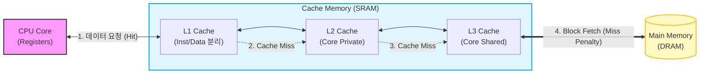

# 캐시 메모리 (Cache Memory)

---

## I. CPU와 메모리 간 속도 차이 극복, 캐시 메모리의 개요

* **가. 캐시 메모리(Cache Memory)의 정의**: 고속의 [[CPU]]와 상대적으로 저속인 주기억장치(Main Memory) 사이의 데이터 처리 속도 병목 현상을 완화하기 위해 사용하는 SRAM 기반의 고속 임시 기억장치
* **나. 캐시 메모리의 필요성 및 특징**
* **메모리 계층 구조(Memory Hierarchy) 최적화**: 폰노이만 아키텍처의 구조적 한계인 메모리 병목(Memory Wall) 현상 해결
* **[[지역성]](Locality)의 원리 활용**: CPU가 자주 참조하는 데이터와 명령어의 시간적, 공간적, 순차적 지역성을 활용하여 캐시 적중률(Hit Ratio) 극대화
* **성능 향상**: 주기억장치 접근 횟수를 최소화하여 전체 시스템의 평균 메모리 접근 시간(AMAT: Average Memory Access Time) 단축

---

## II. 캐시 메모리의 개념도 및 핵심 기술 요소

### 가. 캐시 메모리의 아키텍처 및 동작 원리

* CPU는 데이터를 요청할 때 L1부터 순차적으로 탐색(Hit 확인)하며, 캐시 미스(Miss) 발생 시 하위 계층에서 블록 단위로 데이터를 인출(Fetch)하여 캐시에 저장함

### 나. 캐시 메모리의 핵심 기술 요소

| 구분 | 요소기술(키워드) | 세부 설명 |
| --- | --- | --- |
| **설계 원리** | 시간 지역성 (Temporal) | 최근 참조된 기억장소의 데이터가 가까운 미래에 다시 참조될 가능성이 높음 (반복문, 서브루틴) |
| **설계 원리** | 공간 지역성 (Spatial) | 특정 기억장소가 참조되면, 그 주변의 기억장소가 계속 참조될 가능성이 높음 (배열, 순차 실행) |
| **사상(Mapping)** | 직접 사상 (Direct) | 메인 메모리 블록이 정해진 하나의 캐시 라인에만 매핑되어 하드웨어 구성이 단순하나 충돌(Conflict) 잦음 |
| **사상(Mapping)** | 연관 사상 (Associative) | 메인 메모리 블록이 캐시의 어느 라인에든 매핑 가능하여 적중률이 높으나 검색 속도 및 비용 증가 |
| **사상(Mapping)** | 집합 연관 (Set-Associative) | 직접 사상과 연관 사상의 절충안, 캐시를 N개의 집합으로 나누어 블록을 매핑 (N-Way 집합 연관) |
| **교체 [[알고리즘]]** | [[LRU]] (Least Recently Used) | 캐시 공간 부족 시, 가장 오랫동안 참조되지 않은 블록을 메인 메모리 블록과 교체 |
| **데이터 쓰기** | 즉시 쓰기 (Write-Through) | CPU 연산 결과를 캐시와 메인 메모리에 동시에 기록하여 데이터 일관성 유지 (쓰기 속도 저하) |
| **데이터 쓰기** | 지연 쓰기 (Write-Back) | 캐시에만 먼저 기록하고, 해당 블록이 캐시에서 쫓겨날 때 메인 메모리에 갱신 (빠른 속도, 일관성 주의) |

---

## III. 캐시 메모리 쓰기 정책 비교 및 최신 발전 동향

### 가. 캐시 데이터 쓰기 정책 (Write Policy) 비교

| 비교 항목 | Write-Through (즉시 쓰기) | Write-Back (지연 쓰기) |
| --- | --- | --- |
| **동작 방식** | 변경 데이터를 캐시와 메모리에 동시 업데이트 | 캐시에만 업데이트 후 Dirty Bit 설정, 교체 시 메모리 반영 |
| **데이터 일관성** | 캐시와 메모리 간 데이터 항상 일치 (높음) | 캐시와 메모리 간 데이터 불일치 구간 존재 (낮음) |
| **메모리 트래픽** | 쓰기 연산 시마다 메모리 접근으로 트래픽 증가 | 교체 시에만 접근하므로 메모리 트래픽 최소화 |
| **성능 및 속도** | 주기억장치 접근 시간으로 인해 쓰기 속도 느림 | 캐시 메모리 접근만 발생하여 쓰기 속도 매우 빠름 |
| **활용 분야** | 데이터 안정성이 매우 중요한 시스템, I/O 버퍼 | 빠른 성능이 요구되는 범용 멀티코어 프로세서 시스템 |

### 나. 캐시 메모리의 최신 발전 동향 및 전망

* **[[캐시 일관성]] [[프로토콜]] 고도화**: 멀티 코어 환경에서 각 코어의 L1/L2 캐시 간 데이터 불일치 문제를 해결하기 위해 **MESI(Modified, Exclusive, Shared, Invalid)**, MOESI 프로토콜 등 스누핑/디렉터리 기반 일관성 제어 적용
* **패키징 기술 혁신을 통한 용량 증대**: 평면적인 다이(Die) 면적 한계를 극복하기 위해 SRAM을 CPU 위에 수직으로 적층하는 **3D V-Cache** 기술 도입 등 캐시 메모리의 대용량화로 게이밍 및 AI/서버 워크로드 성능 극대화 추진

---

### 🔗 연관 토픽

- **소속 도메인**: [[00_컴퓨터구조_MOC|💻 컴퓨터구조]]
- **세부 분류**: `1. CPU 프로세서 & 마이크로아키텍처`
- **핵심 연관 토픽**:
  - [[LRU]]
  - [[캐시 일관성|캐시 일관성(Cache Coherence)]]
  - [[사상 기법]]
  - [[중앙처리장치|중앙처리장치 (CPU Central Processing Unit)]]
  - [[캐시 일관성 유지 기법|캐시 일관성(Cache Coherence) 유지 기법]]
