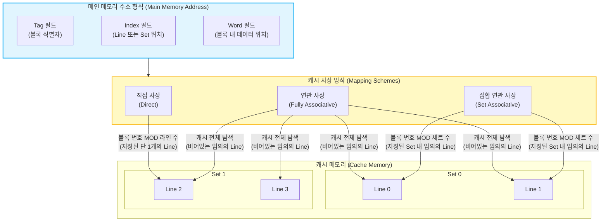

# 캐시 메모리의 사상 방식 (Cache Memory Mapping Scheme)

---

## I. 메인 메모리와 캐시 간의 주소 변환, 캐시 메모리 사상 방식의 개요

* **가. 캐시 사상 방식(Mapping Scheme)의 정의**: 대용량의 메인 메모리 블록을 소용량의 고속 [[캐시 메모리]] 라인(Line)에 적재하기 위해 메인 메모리 주소를 캐시 주소로 변환하고 매핑하는 규칙 및 [[알고리즘]]
* **나. 캐시 사상 방식의 필요성 및 특징**
* **다대일(N:1) 대응 관계 해결**: 주기억장치 용량이 캐시보다 훨씬 크므로, 여러 개의 메모리 블록이 한정된 캐시 공간을 효율적으로 공유하기 위한 기준 필요
* **비용-성능 트레이드오프(Trade-off)**: 주소 탐색을 위한 하드웨어(비교기)의 복잡도와 캐시 적중률(Hit Ratio) 간의 상충 관계를 고려하여 시스템 목적에 맞게 설계
* **공간 및 시간 [[지역성]] 극대화**: 효과적인 사상을 통해 스래싱(Thrashing)을 최소화하고 [[CPU]]의 메모리 접근 지연 시간(Latency) 최소화

---

## II. 캐시 사상 방식의 개념도 및 핵심 구성 요소

### 가. 캐시 3대 사상 방식의 논리적 주소 매핑 개념도

* 직접 사상은 [[RDBMS 인덱스(index)|Index]](Line)로 즉시 위치를 찾고, 연관 사상은 Index 없이 Tag로 전체를 병렬 검색하며, 집합 연관 사상은 Index(Set)로 범위를 좁힌 후 Tag를 검색함

### 나. 캐시 사상 방식의 핵심 기술 및 구성 요소

| 구분 | 요소기술(키워드) | 세부 설명 |
| --- | --- | --- |
| **[[사상 기법]]** | 직접 사상 (Direct Mapping) | 메인 메모리의 블록이 **정해진 단 하나의 캐시 라인**에만 적재되는 매핑 방식 |
| **사상 기법** | 연관 사상 (Fully Associative) | 메모리 블록이 캐시의 **비어있는 어떠한 라인에도** 적재될 수 있는 매핑 방식 |
| **사상 기법** | 집합 연관 사상 (Set-Associative) | 캐시를 N개의 세트(Set)로 분할하고, **특정 세트 내의 임의의 라인**에 적재하는 절충형 방식 |
| **주소 구조** | 태그 (Tag) | 캐시 라인에 적재된 데이터가 메모리의 어떤 블록인지 식별하기 위한 고유 식별자 |
| **주소 구조** | 인덱스 (Line / Set) | 캐시 내부에서 데이터가 저장될 물리적 위치(Line 번호 또는 Set 번호)를 지정하는 필드 |
| **주소 구조** | 워드 (Word / Offset) | 적재된 캐시 라인(블록) 내부에서 CPU가 요구하는 특정 데이터의 세부 위치 (오프셋) |
| **하드웨어 요소** | 비교기 (Comparator) | CPU가 요청한 주소의 Tag와 캐시에 저장된 Tag가 일치(Hit)하는지 판단하는 논리 회로 |
| **발생 현상** | 스래싱 (Thrashing) | 직접 사상에서 동일한 인덱스를 가지는 서로 다른 블록이 번갈아 호출되어 캐시 교체가 계속 발생하는 현상 |

---

## III. 캐시 사상 방식 3가지 상세 비교 및 최신 동향

### 가. 캐시 사상 방식 3가지 상세 비교표

| 비교 항목 | 직접 사상 (Direct Mapping) | 연관 사상 (Fully Associative) | 집합 연관 사상 (Set-Associative) |
| --- | --- | --- | --- |
| **블록 사상 위치** | 지정된 단 1개의 캐시 라인 | 캐시 내의 임의의 모든 라인 | 지정된 1개의 세트 내 임의의 라인 |
| **메모리 주소 구조** | `Tag` + `Line` + `Word` | `Tag` + `Word` (Index 불필요) | `Tag` + `Set` + `Word` |
| **태그 비교 횟수** | 1회 (해당 라인의 Tag만 비교) | 캐시 라인 전체 개수만큼 동시 비교 | 해당 세트(Set)에 속한 라인 수(N)만큼 |
| **비교기(H/W) 비용** | 가장 저렴함 (비교기 1개) | 가장 고가임 (다수의 병렬 비교기) | 중간 수준 (직접 사상과 연관 사상의 절충) |
| **캐시 적중률(Hit)** | 가장 낮음 (충돌, 스래싱 발생) | 가장 높음 (충돌 최소화) | 직접 사상보다 높고 연관 사상과 유사함 |
| **교체 알고리즘** | 불필요 (무조건 해당 라인 교체) | 필요 ([[LRU]], [[LFU]], [[FIFO]] 등) | 필요 (세트 내에서 희생양 선택) |

### 나. 캐시 사상 방식의 도입 트렌드 및 전망

* **N-Way 집합 연관 사상(Set-Associative)의 표준화**: 현대 범용 프로세서(Intel, AMD, ARM 등)의 L1, L2, L3 캐시는 직접 사상의 충돌 문제와 연관 사상의 비용 문제를 해결하기 위해 대부분 **4-Way ~ 16-Way 수준의 집합 연관 사상**을 표준 채택
* **TLB(Translation Lookaside Buffer) 매핑**: 가상 주소를 물리 주소로 변환하는 캐시인 TLB의 경우, 극단적으로 빠른 탐색 속도와 높은 적중률이 요구되어 하드웨어 비용을 감수하더라도 **완전 연관 사상(Fully Associative)** 방식이 자주 활용됨

---

### 🔗 연관 토픽

- **소속 도메인**: [[00_컴퓨터구조_MOC|💻 컴퓨터구조]]
- **세부 분류**: `2. 캐시 & 메모리 계층 구조 · 스토리지`
- **핵심 연관 토픽**:
  - [[캐시 메모리]]
  - [[사상 기법]]
  - [[LRU]]
  - [[LFU]]
  - [[알고리즘]]
