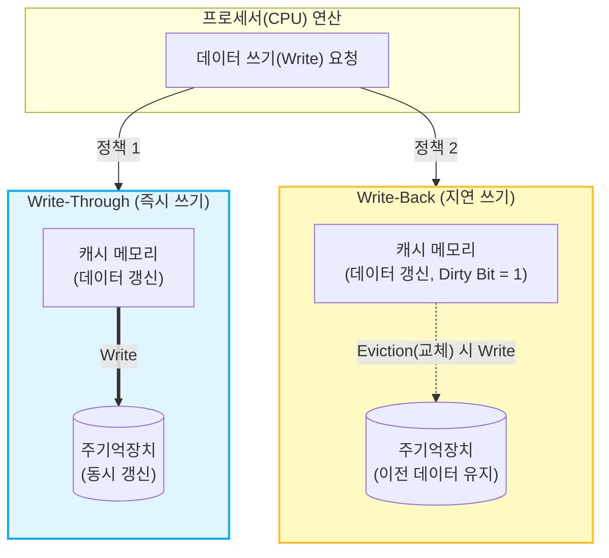

# 캐시 메모리의 쓰기 정책 (Write Policy)

---

## I. 데이터 일관성과 시스템 성능의 균형, 캐시 쓰기 정책의 개요

* **가. 쓰기 정책(Write Policy)의 정의**: 프로세서([[CPU]])가 캐시 메모리에 데이터를 기록(Write)할 때, 변경된 데이터를 하위 계층인 주기억장치(Main Memory)에 반영하는 시점과 방법을 결정하는 갱신 규칙
* **나. 캐시 쓰기 정책의 필요성 및 특징**
* **데이터 일관성(Coherence) 유지**: 캐시와 주기억장치 간에 서로 다른 데이터 값(Stale Data)을 가지는 불일치 문제 예방
* **성능 트레이드오프 조율**: 메모리 대역폭(Bandwidth)을 절약하는 방식과 시스템 신뢰성을 높이는 방식 간의 아키텍처 목적에 따른 선택
* **동적 적용**: 최신 멀티코어 프로세서에서는 캐시 계층(L1, L2, L3) 및 메모리 접근 패턴에 따라 혼합형(Hybrid) 쓰기 정책 활용

---

## II. 캐시 쓰기 정책의 개념도 및 핵심 기술 요소

### 가. 캐시 쓰기 정책의 아키텍처 및 동작 원리

* **Write-Through**는 캐시와 메모리에 데이터를 동시에 기록하여 일관성을 강제하며, **Write-Back**은 캐시에만 우선 기록한 후 해당 블록이 캐시에서 방출(Eviction)될 때 주기억장치에 기록함

### 나. 캐시 쓰기 정책의 핵심 구성 요소 및 연관 기술

| 구분 | 요소기술(키워드) | 세부 설명 |
| --- | --- | --- |
| **기본 정책** | 즉시 쓰기 (Write-Through) | 데이터 변경 시 캐시와 메인 메모리에 동시에 기록하여 항상 일관성을 유지하는 방식 |
| **기본 정책** | 지연 쓰기 (Write-Back) | 데이터 변경 시 캐시에만 기록하고, 캐시 라인 교체 시 메인 메모리에 반영하는 방식 |
| **Miss 시 정책** | Write-Allocate (WA) | 쓰기 실패(Write Miss) 시 메인 메모리의 해당 블록을 캐시로 먼저 적재한 후 캐시에 기록 (주로 WB와 조합) |
| **Miss 시 정책** | No-Write-Allocate (NWA) | 쓰기 실패 시 블록을 캐시로 가져오지 않고 메인 메모리에만 직접 기록 (주로 WT와 조합) |
| **제어 메타데이터** | 더티 비트 (Dirty Bit) | Write-Back 정책에서 캐시 라인의 데이터가 메인 메모리 원본과 다르게 수정되었음을 나타내는 플래그 |
| **제어 메타데이터** | 유효 비트 (Valid Bit) | 해당 캐시 라인에 유의미한 정상 데이터가 들어 있는지를 표시하는 상태 비트 |
| **성능 보완** | 쓰기 버퍼 (Write Buffer) | Write-Through의 메모리 접근 지연을 숨기기 위해 CPU와 메모리 사이에 위치하는 임시 [[FIFO]] 버퍼 |
| **보완 [[알고리즘]]** | 교체 알고리즘 (Eviction) | Write-Back 시 더티 블록을 메인 메모리로 쫓아낼 희생양을 결정하는 기법 ([[LRU]], [[LFU]] 등) |

---

## III. 쓰기 정책(Write-Through vs Write-Back) 비교 및 발전 동향

### 가. 캐시 쓰기 정책 2가지 비교

| 비교 항목 | Write-Through (즉시 쓰기) | Write-Back (지연 쓰기) |
| --- | --- | --- |
| **데이터 일관성** | 캐시와 메인 메모리가 항상 일치 (**매우 높음**) | 메모리와 불일치 구간 발생 (더티 상태) (**낮음**) |
| **메모리 트래픽** | 쓰기(Write) 연산마다 버스 트래픽 발생 (매우 많음) | 블록 교체 시에만 트래픽 발생 (적음) |
| **쓰기 성능(속도)** | 메모리 접근 속도에 종속되어 상대적으로 **느림** | 캐시 접근만으로 완료되어 **매우 빠름** |
| **구현 복잡도** | 구조가 단순하며 복구(Recovery)가 용이함 | Dirty Bit 관리 등 제어 로직이 복잡함 |
| **주요 적용 분야** | 데이터 안정성이 필수적인 시스템, L1 Data 캐시 | 성능이 중요한 범용 CPU, 시스템의 L2/L3 캐시 |

### 나. 캐시 메모리 쓰기 정책의 최신 발전 동향

* **하이브리드 쓰기 정책 적용**: 최신 멀티코어 프로세서에서는 L1 캐시에는 [[캐시 일관성]] [[프로토콜]] 관리가 용이한 Write-Through 방식을, L2/L3 공유 캐시에는 성능 중심의 Write-Back 방식을 혼용하는 하이브리드 계층 구조(Hierarchical Architecture) 채택
* **멀티코어 환경의 캐시 일관성 프로토콜(MESI) 결합**: Write-Back 정책의 데이터 일관성 한계를 극복하기 위해 버스 스누핑(Bus Snooping) 및 디렉터리 기반의 MESI, MOESI 프로토콜과 결합하여 코어 간의 완벽한 [[무결성]] 보장 체계 확립

---

### 🔗 연관 토픽

- **소속 도메인**: [[00_컴퓨터구조_MOC|💻 컴퓨터구조]]
- **세부 분류**: `1. CPU 프로세서 & 마이크로아키텍처`
- **핵심 연관 토픽**:
  - [[캐시 일관성|캐시 일관성(Cache Coherence)]]
  - [[알고리즘]]
  - [[CPU]]
  - [[LRU]]
  - [[CXL|CXL (Compute Express Link)]]
