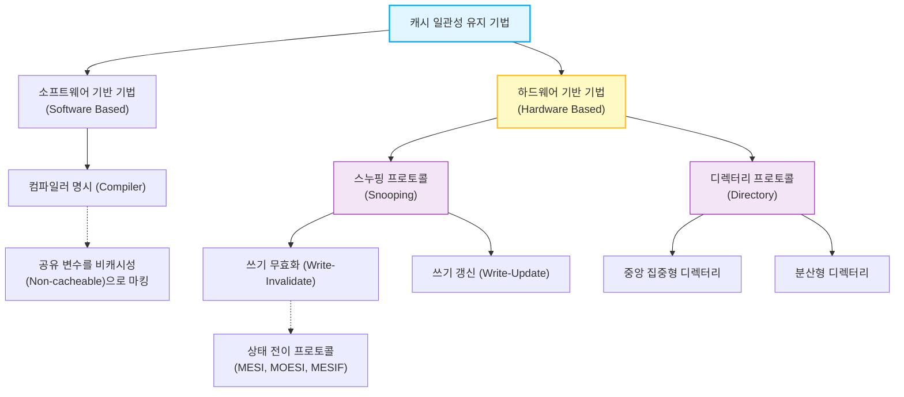

# 캐시 일관성 유지 기법 (Cache Coherence Techniques)

---

## I. 멀티코어 환경의 데이터 무결성 보장, 캐시 일관성 유지 기법의 개요

* **가. [[캐시 일관성]] 유지 기법의 정의**: 다중 프로세서 시스템(SMP 등)에서 여러 코어가 동일한 메모리 블록을 각자의 캐시에 복사하여 사용할 때 발생하는 데이터 불일치(Incoherence) 문제를 해결하고 동기화하는 H/W 및 S/W적 메커니즘
* **나. 캐시 일관성 유지 기법의 필요성 및 특징**
* **Stale Data 방지**: 한 코어가 데이터를 갱신(Write)했을 때 다른 코어가 구형 데이터(Stale Data)를 읽는 논리적 오류 방지
* **투명성 제공**: 하드웨어 기반 [[프로토콜]](스누핑, 디렉터리)을 통해 응용 프로그램 수정 없이 자동으로 일관성 보장
* **성능 최적화**: 멀티코어 확장 시 발생하는 인터커넥트 병목 및 버스 트래픽을 최소화하기 위한 상태 관리 프로토콜(MESI 등) 필수 적용

---

## II. 캐시 일관성 유지 기법의 분류 및 핵심 요소기술

### 가. 캐시 일관성 유지 기법의 분류 체계 개념도

* 현대의 범용 프로세서는 운영체제나 소프트웨어의 부담을 줄이기 위해, 별도의 H/W 컨트롤러가 버스나 디렉터리를 감시하는 하드웨어 기반 기법을 표준으로 채택함

### 나. 캐시 일관성 유지를 위한 핵심 기술 및 기법

| 구분 | 요소기술(키워드) | 세부 설명 |
| --- | --- | --- |
| **S/W 기법** | 컴파일러 지시어 | 공유 데이터에 대해 캐싱을 비활성화(Bypass)하도록 컴파일 시 명시하여 원천적 불일치 차단 |
| **H/W 기반** | 스누핑 (Snooping) | 각 코어의 캐시 컨트롤러가 공유 버스(Bus)의 트랜잭션을 항상 감시(Snoop)하여 일관성 유지 |
| **H/W 기반** | 디렉터리 (Directory) | 캐시 라인별 공유 상태와 소유자 정보를 별도의 디렉터리 메모리에 기록하고 중앙/분산 제어 |
| **갱신 정책** | 쓰기 무효화 (Write-Invalidate) | 데이터 갱신 시 버스에 무효화 신호를 보내 타 코어의 복사본 캐시 라인을 Invalid 상태로 변경 |
| **갱신 정책** | 쓰기 갱신 (Write-Update) | 데이터 갱신 시 새로운 데이터 값을 버스에 브로드캐스트하여 타 코어의 캐시를 즉시 동시 업데이트 |
| **상태 관리** | [[MESI 프로토콜]] | 캐시 상태를 Modified(수정됨), Exclusive(독점), Shared(공유됨), Invalid(무효) 4가지로 전이 관리 |
| **상태 관리** | MOESI 프로토콜 | MESI에 **Owner(소유자)** 상태를 추가하여, 수정된 데이터를 메인 메모리 기록 없이 다른 캐시에 직접 전달 |
| **상태 관리** | MESIF 프로토콜 | MESI에 **Forward(전달자)** 상태를 추가하여, 공유 데이터를 가진 캐시 중 하나만 응답하게 하여 트래픽 최소화 |

---

## III. 하드웨어 기반 유지 기법 비교 및 최신 동향

### 가. 하드웨어 기반 유지 기법(스누핑 vs 디렉터리) 비교

| 비교 항목 | 스누핑 프로토콜 (Snooping) | 디렉터리 프로토콜 (Directory) |
| --- | --- | --- |
| **동작 주체** | 각 코어의 로컬 캐시 컨트롤러 (분산 처리) | 전담 디렉터리 컨트롤러 (집중 또는 분산) |
| **통신 방식** | 공유 버스 기반의 **브로드캐스트(Broadcast)** | 점대점([[Point-to-Point]]) 네트워크를 통한 특정 노드 통신 |
| **버스 트래픽** | 트랜잭션마다 모든 코어에 신호 전송 (트래픽 큼) | 관련 상태 정보를 가진 노드에만 전송 (트래픽 작음) |
| **확장성** | 낮음 (수십 개 수준의 코어 환경에 적합) | 높음 (수백 개 이상 매니코어(Many-Core) 환경에 적합) |
| **구현 비용** | 구조가 단순하여 구현 비용 저렴 (대중적 채택) | 별도의 디렉터리 메모리 및 라우팅 로직 필요 (고비용) |

### 나. 캐시 일관성 유지 기법의 최신 발전 동향

* **이기종 컴퓨팅 캐시 일관성 ([[CXL]].cache)**: 기존 [[CPU]] 간의 일관성을 넘어 CPU-[[GPU]], CPU-[[NPU]](가속기) 간의 [[캐시 메모리]] 일관성을 하드웨어적으로 유지해주는 **CXL(Compute Express Link)** 개방형 표준 프로토콜 도입 본격화
* **디렉터리 기반 스누핑 하이브리드 프로토콜**: 단일 칩 내(On-Chip) 코어 간 통신은 스누핑으로 처리하고, 멀티 소켓(Multi-Socket) 칩 간 통신은 디렉터리 방식을 사용하여 대역폭 한계와 확장성 문제를 동시에 해결하는 혼합형 아키텍처 채택 증가

---

### 🔗 연관 토픽

- **소속 도메인**: [[00_컴퓨터구조_MOC|💻 컴퓨터구조]]
- **세부 분류**: `1. CPU 프로세서 & 마이크로아키텍처`
- **핵심 연관 토픽**:
  - [[CXL|CXL (Compute Express Link)]]
  - [[캐시 메모리]]
  - [[캐시 일관성|캐시 일관성(Cache Coherence)]]
  - [[MESI 프로토콜|MESI 프로토콜 (MESI Protocol)]]
  - [[CPU]]
