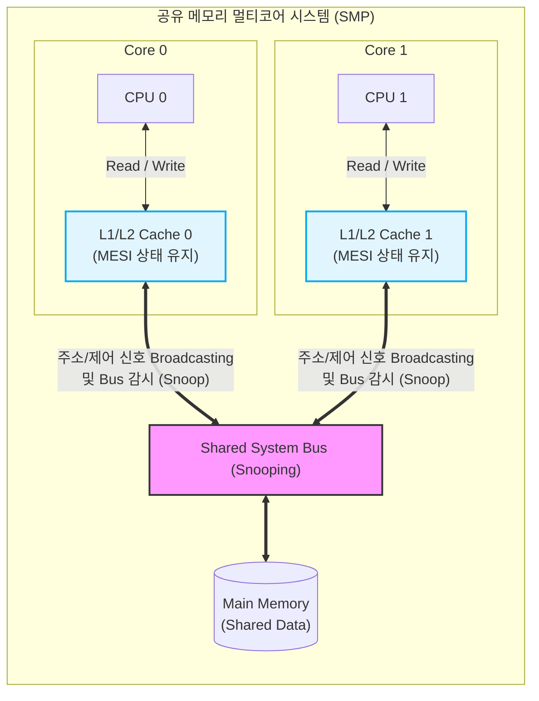

# 캐시 일관성 (Cache Coherence)

---

## I. 멀티코어 시스템의 데이터 무결성 보장, 캐시 일관성의 개요

* **가. 캐시 일관성(Cache Coherence)의 정의**: 다중 프로세서(Multi-Processor) 환경에서 각 코어의 개별 로컬 캐시 메모리와 공유 주기억장치 간에 저장된 동일한 데이터 복사본들이 항상 일치된 값을 유지하도록 보장하는 동기화 메커니즘
* **나. 캐시 일관성의 등장배경 및 특징**
* **등장배경**: 공유 메모리 아키텍처(SMP)에서 다수의 프로세서가 동일한 메모리 주소의 데이터를 각자의 캐시로 가져와 독립적으로 갱신할 때 발생하는 데이터 불일치(Stale Data) 문제 해결 필요
* **특징**: 소프트웨어 개입 없이 하드웨어 기반의 프로토콜로 자동 처리, 버스(Bus) 트래픽 통제 및 코어 확장성(Scalability) 확보가 핵심 설계 요소

---

## II. 캐시 일관성의 개념도 및 핵심 기술 요소

### 가. 캐시 일관성의 동작 아키텍처 (스누핑 방식 기반)

* 각 코어의 캐시 컨트롤러는 공유 버스(Shared Bus)를 지속적으로 감시(Snooping)하며, 다른 코어가 공유 데이터에 쓰기 연산을 수행할 경우 자신의 캐시 데이터를 무효화(Invalidate)하거나 갱신(Update)함

### 나. 캐시 일관성의 핵심 기술 요소

| 구분 | 요소기술(키워드) | 세부 설명 |
| --- | --- | --- |
| **일관성 [[프로토콜]]** | 스누핑 프로토콜 (Snooping) | 모든 캐시가 공유 버스를 감시하여 상태 변화를 파악하는 분산 제어 방식 (소규모 코어 적합) |
| **일관성 프로토콜** | 디렉터리 프로토콜 (Directory) | 중앙 집중 또는 분산된 디렉터리가 각 캐시 라인의 상태 정보를 기록하고 제어 (대규모 코어 적합) |
| **쓰기 정책** | 쓰기 무효화 (Write-Invalidate) | 한 프로세서가 데이터를 갱신할 때, 다른 캐시에 있는 동일 데이터 복사본을 모두 무효(Invalid) 상태로 변경 |
| **쓰기 정책** | 쓰기 갱신 (Write-Update) | 한 프로세서가 데이터를 갱신할 때, 복사본을 가진 모든 캐시에 새로운 데이터를 전송하여 동시 업데이트 |
| **상태 전이 (MESI)** | Modified (M) 상태 | 캐시에 존재하는 데이터가 수정되었으며, 메인 메모리의 값과 불일치하는 유일한 최신 상태 |
| **상태 전이 (MESI)** | Exclusive (E) 상태 | 캐시에 존재하는 데이터가 메인 메모리와 일치하며, 현재 해당 캐시에만 독점적으로 존재하는 상태 |
| **상태 전이 (MESI)** | Shared (S) 상태 | 캐시에 존재하는 데이터가 메인 메모리와 일치하며, 여러 캐시 메모리에 복사본이 공유되어 있는 상태 |
| **상태 전이 (MESI)** | Invalid (I) 상태 | 다른 코어의 쓰기 연산으로 인해 현재 캐시에 저장된 데이터가 무효화되어 사용할 수 없는 상태 |

---

## III. 캐시 일관성 프로토콜 비교 및 최신 동향

### 가. 스누핑(Snooping)과 디렉터리(Directory) 프로토콜 비교

| 비교 항목 | 스누핑 프로토콜 (Snooping) | 디렉터리 프로토콜 (Directory) |
| --- | --- | --- |
| **동작 원리** | 모든 캐시가 공유 버스를 지속적으로 감시 (Broadcast) | 디렉터리가 캐시 데이터의 상태와 소유권 위치를 직접 관리 |
| **상태 관리 주체** | 각 코어의 캐시 컨트롤러 (분산형) | 디렉터리 컨트롤러 (집중/분산형) |
| **시스템 확장성** | 버스 대역폭 한계로 확장성 낮음 (수십 개 코어 이하) | 브로드캐스트가 불필요하여 확장성 높음 (수백 개 이상 코어) |
| **네트워크 트래픽** | [[트랜잭션]] 발생 시 버스 트래픽 매우 높음 | 상태가 변경되는 특정 노드와만 통신하여 트래픽 낮음 |
| **하드웨어 복잡도** | 버스 구조에서 구현이 비교적 단순함 | 디렉터리 유지 및 복잡한 메시지 라우팅 회로 필요 (비용 높음) |

### 나. 캐시 일관성의 최근 발전 동향

* **MOESI 및 MESIF 프로토콜로의 확장**: MESI의 상태 전이 한계를 극복하기 위해 AMD는 Owner(O) 상태를 추가한 MOESI 프로토콜을, Intel은 Forward(F) 상태를 추가한 MESIF 프로토콜을 도입하여 캐시 간 직접 데이터 전송 효율을 극대화
* **[[CXL]](Compute Express Link) 기반 이기종 캐시 일관성**: [[CPU]] 뿐만 아니라 [[GPU]], DPU, AI 가속기 등 이기종 디바이스 간의 메모리 공유 및 캐시 일관성 유지를 위해 PCIe 5.0 기반의 개방형 인터커넥트 표준인 CXL.cache 기술 도입 가속화

---

### 🔗 연관 토픽

- **소속 도메인**: [[00_컴퓨터구조_MOC|💻 컴퓨터구조]]
- **세부 분류**: `1. CPU 프로세서 & 마이크로아키텍처`
- **핵심 연관 토픽**:
  - [[CXL|CXL (Compute Express Link)]]
  - [[중앙처리장치|중앙처리장치 (CPU Central Processing Unit)]]
  - [[지능형 반도체]]
  - [[캐시 일관성 유지 기법|캐시 일관성(Cache Coherence) 유지 기법]]
  - [[CPU]]
