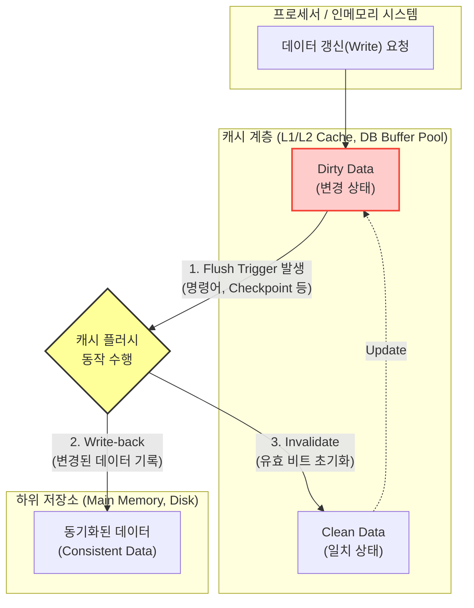

# 캐시 플러시 (Cache Flush)

---

## I. 데이터 일관성 및 영속성 보장을 위한 캐시 플러시의 개요

* **가. 캐시 플러시(Cache Flush)의 정의**: 캐시 메모리에 적재된 변경된 데이터(Dirty Data)를 메인 메모리나 디스크 등 하위 저장소로 동기화(Write-back)하거나, 기존 캐시 데이터를 무효화(Invalidate)하여 시스템의 데이터 일관성과 무결성을 확보하는 메커니즘
* **나. 캐시 플러시의 필요성 및 특징**
* **데이터 일관성 유지**: 지연 쓰기(Write-Back) 정책을 사용하는 시스템에서 캐시와 하위 기억장치 간의 데이터 불일치 해소
* **공간 확보 및 초기화**: 캐시 오염을 제거하거나 컨텍스트 스위칭(Context Switching), 보안을 위해 캐시 라인을 강제로 비워 새로운 데이터를 적재할 공간 확보
* **보안적 양면성**: 멜트다운(Meltdown), 스펙터(Spectre) 등 하드웨어 [[부채널 공격]](Side-Channel Attack)의 데이터 추출 매개체로 악용될 수 있어 제어 중요성 증대

---

## II. 캐시 플러시의 개념도 및 핵심 구성 요소

### 가. 캐시 플러시의 아키텍처 및 동작 원리

* 프로세서나 [[DBMS]]의 버퍼 관리자는 특정 조건(임계치 도달, 명시적 명령어)이 발생하면 Dirty 상태의 캐시 블록을 하위 메모리에 반영(Write-back)하고, 해당 캐시 라인을 무효화(Invalidate)하여 정합성을 맞춤

### 나. 캐시 플러시의 핵심 기술 및 구성 요소

| 분류 | 요소기술(키워드) | 세부 설명 |
| --- | --- | --- |
| **플러시 대상** | 더티 블록 (Dirty Block) | 캐시에 적재된 후 변경 작업이 발생하여 하위 저장소의 원본과 값이 달라진 데이터 블록 |
| **동작 메커니즘** | 쓰기 동기화 (Write-Back) | 더티 블록의 데이터를 메인 메모리나 디스크에 기록하여 영속성(Persistence)을 확보하는 과정 |
| **동작 메커니즘** | 무효화 (Invalidation) | 캐시 라인의 유효 비트(Valid Bit)를 0으로 설정하여, 다음 접근 시 반드시 캐시 미스를 유도 |
| **트리거 방식** | 명시적 (Explicit) 플러시 | S/W 또는 사용자가 `CLFLUSH` (x86), [[CDN]] `Purge` 요청 등을 통해 의도적으로 즉각 수행 |
| **트리거 방식** | 묵시적 (Implicit) 플러시 | 캐시 공간 임계치 초과(Eviction), DB Checkpoint 발생 등 시스템에 의해 자동으로 수행 |
| **적용 영역** | DB 버퍼 플러시 (Buffer) | DBMS에서 Checkpoint 발생 시 버퍼 캐시의 더티 페이지를 데이터 파일(디스크)로 일괄 기록 |
| **적용 영역** | TLB 플러시 (TLB Shootdown) | 멀티 프로세서 환경에서 페이지 테이블 변경 시, 다른 코어의 TLB(변환 색인 버퍼)를 동기화 |
| **보안 취약점** | Flush+Reload 공격 | 악성 프로세스가 캐시를 강제 플러시한 후, 타겟 프로세스의 실행에 따른 캐시 적중 시간을 측정해 비밀 데이터를 유추하는 부채널 공격 |

---

## III. 캐시 플러시와 캐시 교체 비교 및 최신 동향

### 가. 캐시 플러시와 캐시 교체(Cache Replacement/Eviction) 비교

| 비교 항목 | 캐시 플러시 (Cache Flush) | 캐시 교체 (Cache Replacement) |
| --- | --- | --- |
| **주요 목적** | 데이터 **일관성 및 동기화** 보장, 초기화 | 새로운 데이터 적재를 위한 **여유 공간 확보** |
| **발생 시점** | 동기화 이벤트(Checkpoint), 명시적 명령어 입력 시 | 캐시 공간이 가득 차서 새로운 캐스 미스 발생 시 |
| **대상 선정** | 동기화가 필요한 특정 블록 전체 또는 더티 블록 | 교체 [[알고리즘]]([[LRU]], [[LFU]], [[FIFO]] 등)에 의해 선정된 희생양(Victim) |
| **시스템 오버헤드** | 일괄(Batch) 수행 시 대규모 I/O 스파이크 발생 | 단일 블록 단위로 발생하여 I/O 분산 |

### 나. 캐시 플러시 관련 최신 이슈 및 성능 최적화 동향

* **플러시 성능 최적화**: 대량의 캐시 플러시 시 발생하는 시스템 멈춤(Hang) 및 I/O 병목을 해결하기 위해, 비동기적(Asynchronous) 백그라운드 플러시 및 점진적(Trickle) 플러시 아키텍처 도입
* **보안 방어 메커니즘 강화**: Flush+Reload 등 캐시 부채널 공격을 방어하기 위해 하드웨어 트랜잭셔널 메모리(TSX) 활용, 특정 권한 밖에서의 `CLFLUSH` 명령어 실행 제한, 동적 캐시 [[파티셔닝]] 기술 등이 최신 프로세서에 적용 중

---

### 🔗 연관 토픽

- **소속 도메인**: [[00_컴퓨터구조_MOC|💻 컴퓨터구조]]
- **세부 분류**: `2. 캐시 & 메모리 계층 구조 · 스토리지`
- **핵심 연관 토픽**:
  - [[LRU]]
  - [[가상 메모리]]
  - [[메모리 관리]]
  - [[FIFO]]
  - [[LFU]]
