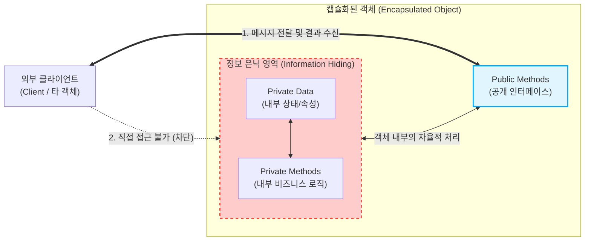

# 캡슐화 (Encapsulation)

---

## I. 객체지향 설계의 핵심, 캡슐화의 개요

* **가. 캡슐화(Encapsulation)의 정의**: 데이터(속성)와 데이터를 조작하는 연산(메서드)을 하나의 논리적 단위([[클래스]]/객체)로 묶고, 내부의 세부 구현을 외부로부터 감추는 [[객체지향]] 프로그래밍(OOP) 핵심 설계 기법
* **나. 캡슐화의 필요성 및 특징**
* **[[무결성]] 보장**: 정보 은닉(Information Hiding)을 통해 외부의 비정상적인 접근이나 의도치 않은 상태 변질을 차단
* **[[응집도]] 및 [[결합도]] 최적화**: 관련된 데이터와 로직을 묶어 모듈 내 응집도(Cohesion)를 높이고, 외부 모듈과의 결합도(Coupling)를 최소화
* **유지보수성 향상**: 내부 구현이 변경되더라도 외부에 노출된 인터페이스가 동일하면 외부 코드에 미치는 파급 효과(Ripple Effect)를 차단

---

## II. 캡슐화의 개념도 및 핵심 구성 요소

### 가. 캡슐화의 아키텍처 및 동작 원리

* 객체는 자신의 데이터(Private)를 스스로 관리하며, 외부 클라이언트는 내부 구조를 알 필요 없이 제공된 공개 인터페이스(Public)를 통해서만 메시지를 전달하고 상호작용함

### 나. 캡슐화의 핵심 기술 및 구성 요소

| 구분 | 요소기술(키워드) | 세부 설명 |
| --- | --- | --- |
| **구현 메커니즘** | 접근 제어자 (Access Modifier) | `public`, `private`, `protected`, `default` 등을 통해 클래스 멤버에 대한 가시성 및 접근 권한 통제 |
| **구현 메커니즘** | 인터페이스 (Interface) | 객체 외부와 통신하기 위한 API 역할 수행 (Getter, Setter 및 비즈니스 공개 메서드) |
| **설계 원칙** | 정보 은닉 (Information Hiding) | 객체의 구체적인 자료구조나 내부 상태, 알고리즘을 외부로부터 숨기는 방어적 설계 원칙 |
| **설계 원칙** | Tell, Don't Ask | 객체의 데이터를 꺼내서 외부에서 처리하지 말고, 객체 스스로 행위를 수행하도록 메시지를 던지는 설계 방식 |
| **품질 속성** | 높은 응집도 (High Cohesion) | 클래스 내부의 데이터와 메서드들이 하나의 공통 목적을 위해 강하게 연관되어 있는 상태 |
| **품질 속성** | 낮은 결합도 (Low Coupling) | 외부 모듈이 객체의 내부 구현에 의존하지 않게 함으로써 시스템의 유연성과 재사용성 확보 |
| **설계 패턴** | 팩토리 패턴 (Factory Pattern) | 객체 생성의 복잡한 로직을 캡슐화하여, 클라이언트에게 생성 인터페이스만 제공하는 [[디자인 패턴]] |

---

## III. 캡슐화와 정보 은닉 비교 및 설계 지향점

### 가. 캡슐화(Encapsulation)와 정보 은닉(Information Hiding) 비교

| 비교 항목 | 캡슐화 (Encapsulation) | 정보 은닉 (Information Hiding) |
| --- | --- | --- |
| **관점 및 성격** | **구조적/물리적 관점** (데이터와 메서드의 패키징) | **논리적/보안 관점** (내부 상태 및 복잡성 보호) |
| **핵심 목적** | 관련된 요소를 묶어 **[[모듈화]] 및 재사용성 향상** | 의존성을 줄여 **변경의 파급 효과(결합도) 최소화** |
| **구현 수단** | 클래스(Class), 객체(Object), 캡슐화 단위 | 접근 제어자(Private 등), 인터페이스(Interface) 분리 |
| **상호 관계** | 정보 은닉을 달성하기 위한 구체적인 **실행 메커니즘** | 캡슐화를 통해 달성하고자 하는 궁극적인 **설계 목표** |

### 나. 성공적인 캡슐화를 위한 설계 지향점

* **무분별한 Getter/Setter 남용 지양**: 모든 속성에 Getter/Setter를 열어두면 캡슐화가 훼손되고 수동적인 데이터 구조체(C언어의 struct)로 전락하므로, 상태 변경은 도메인 의미를 담은 메서드로 래핑해야 함
* **자율적인 객체 설계**: 로직을 외부 서비스(Service) 클래스에 집중시키는 빈약한 도메인 모델(Anemic Domain Model)을 피하고, 데이터와 책임을 함께 가지는 풍부한 도메인 모델(Rich Domain Model)로 객체의 자율성을 보장해야 함

---

### 🔗 연관 토픽

- **소속 도메인**: [[00_소프트웨어공학_MOC|🏗️ 소프트웨어공학]]
- **세부 분류**: `4. 아키텍처 스타일 & 객체지향 설계 원리`
- **핵심 연관 토픽**:
  - [[모듈화|모듈화 (Modularity)]]
  - [[결합도]]
  - [[객체지향]]
  - [[클래스]]
  - [[응집도]]
