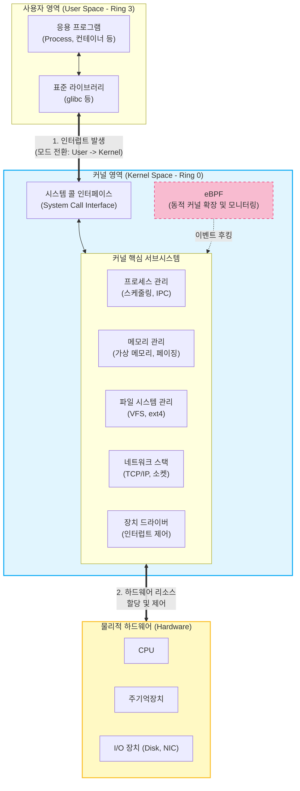

# 커널 (Kernel)

---

## I. 운영체제의 심장이자 하드웨어 추상화 계층, 커널의 개요

* **가. 커널(Kernel)의 정의**: 컴퓨터 [[OS(운영체제)|운영체제]](OS)의 핵심 컴포넌트로, 응용 프로그램(Software)과 물리적 하드웨어(Hardware) 간의 통신을 중재하고 시스템의 모든 자원을 할당·관리하는 제어 프로그램
* **나. 커널의 등장 배경 및 특징**
* **하드웨어 [[추상화]]**: 복잡한 물리적 하드웨어의 구조를 숨기고, 응용 프로그램에 일관된 시스템 콜(System Call) 인터페이스 제공
* **자원 관리 및 보호**: [[CPU]], 메모리 등 제한된 자원을 시분할 및 가상화하여 효율적으로 스케줄링하고 분배
* **보안과 격리**: 사용자 모드(User Mode, Ring 3)와 커널 모드(Kernel Mode, Ring 0)를 분리하여 시스템 코어를 악의적 접근이나 장애로부터 보호

---

## II. 커널의 아키텍처 및 핵심 구성 요소

### 가. 커널의 개념도 및 동작 원리

* 사용자 영역의 애플리케이션은 시스템 콜([[인터럽트]])을 통해 커널 모드로 전환되며, 커널은 내부 서브시스템을 거쳐 물리적 하드웨어를 제어하고 결과를 반환함. 최근에는 eBPF를 통해 커널의 소스 수정 없이 동적 확장을 지원함

### 나. 커널의 핵심 기술 및 구성 요소

| 구분 | 요소기술(키워드) | 세부 설명 |
| --- | --- | --- |
| **인터페이스** | 시스템 콜 (System Call) | 사용자 프로세스가 커널의 서비스를 요청하기 위해 호출하는 프로그래밍 인터페이스 |
| **자원 관리** | [[프로세스]] [[스케줄링]] (CFS) | 여러 프로세스 간의 CPU 사용 시간을 공정하게 분배(Completely Fair Scheduler 등) |
| **자원 관리** | [[가상 메모리]] (Virtual Memory) | 물리 메모리의 한계를 극복하기 위해 페이징(Paging) 및 세그먼테이션을 통해 주소 공간 제공 |
| **데이터 관리** | 가상 파일 시스템 (VFS) | 다양한 파일 시스템(ext4, XFS 등)을 동일한 인터페이스로 접근할 수 있게 해주는 추상화 계층 |
| **데이터 관리** | 장치 드라이버 (Device Driver) | 디스크, 네트워크 카드 등 개별 하드웨어 장치를 제어하고 커널과 통신하는 소프트웨어 모듈 |
| **통신 메커니즘** | IPC (Inter-Process Comm.) | 공유 메모리, 메시지 큐, 파이프 등을 통해 프로세스 간 데이터 교환 및 동기화 수행 |
| **네트워크** | 네트워크 스택 (Network [[Stack]]) | 소켓 통신 및 [[TCP]]/IP [[프로토콜]] 계층 처리를 통한 네트워크 패킷 송수신 제어 |
| **최신 기술** | eBPF (Extended BPF) | 커널 소스 수정 없이 커널 공간 안에서 안전하게 [[샌드박스]] 프로그램을 실행하는 최신 확장 기술 |

---

## III. 커널 아키텍처 모델 비교 및 최신 동향

### 가. 주요 커널 아키텍처 모델 비교

| 비교 항목 | 모놀리식 커널 (Monolithic) | 마이크로 커널 (Microkernel) | 하이브리드 커널 (Hybrid) |
| --- | --- | --- | --- |
| **구조 특징** | 모든 커널 서비스가 단일 메모리 공간에서 실행 | 최소 핵심 기능(스케줄링, IPC)만 커널에, 나머지는 사용자 영역 서버로 분리 | 모놀리식의 성능과 마이크로 커널의 구조적 장점을 결합 |
| **성능(속도)** | 시스템 콜 시 모드 전환 오버헤드가 적어 **가장 빠름** | 서비스 간 IPC 통신으로 인한 **오버헤드 큼 (느림)** | 모놀리식과 유사한 수준의 **빠른 성능 보장** |
| **안정성/확장성** | 단일 버그가 시스템 전체 장애로 직결 (안정성 낮음) | 특정 서비스 장애가 전체에 영향을 주지 않음 (안정성 높음) | 핵심 모듈은 보호하고 드라이버 등은 유연하게 확장 |
| **대표 사례** | Linux, Unix (전통적 구조) | QNX, Mach, L4 | Windows NT, macOS (XNU) |

### 나. 커널 기술의 최근 발전 동향

* **eBPF 기반의 [[클라우드 네이티브]] 최적화**: 마이크로서비스 및 [[쿠버네티스]] 환경에서 기존 커널 네트워크(iptables 등)의 오버헤드를 극복하고, 고성능 로드밸런싱, 보안, 옵저버빌리티(Observability)를 제공하기 위해 eBPF(Cilium 등) 적극 도입
* **유니커널(Unikernel)의 부상**: [[컨테이너]] 환경의 초경량화 요구에 따라, 애플리케이션과 실행에 필요한 최소한의 커널 기능만을 단일 이미지로 묶어 부팅 속도를 극대화하고 공격 표면(Attack Surface)을 최소화하는 기술 연구 확대
* **메모리 안전성 확보 (Rust 도입)**: 커널 취약점의 대다수를 차지하는 C언어의 메모리 오류(Buffer Overflow 등)를 원천 차단하기 위해, Linux 6.1 버전부터 Rust 언어를 커널 공식 언어로 채택 및 점진적 포팅 진행 중

---

### 🔗 연관 토픽

- **소속 도메인**: [[00_운영체제_MOC|⚙️ 운영체제]]
- **세부 분류**: `1. 프로세스 & 스레드 관리`
- **핵심 연관 토픽**:
  - [[프로세스]]
  - [[OS(운영체제)]]
  - [[스케줄링]]
  - [[인터럽트|인터럽트 (Interrupt)]]
  - [[컨테이너|컨테이너 (Container)]]
